# 实验记录

本文档是本项目唯一持续维护的实验记录。后续原始数据下载、本地数据处理、CSV 校验、TuGraph 导入、查询视图和结果分析，都只更新本文档，避免多份实验记录内容不一致。

## 2026-05-23 原始数据下载与检查

数据来源为 Kaggle 数据集 `jsrojas/ip-network-traffic-flows-labeled-with-87-apps`。仓库提供下载脚本：

```bash
python3 download_dataset.py
```

下载后将数据文件放入本项目默认输入位置：

```text
data/raw/Dataset-Unicauca-Version2-87Atts.csv
```

本地检查命令：

```bash
PYTHONPATH=src python3 scripts/inspect_dataset.py --sample-rows 200000
```

当前本地数据状态：

| 指标 | 值 |
| --- | ---: |
| 原始 CSV 路径 | `data/raw/Dataset-Unicauca-Version2-87Atts.csv` |
| 文件大小 | 1,767,404,086 bytes |
| 数据行数 | 3,577,296 |
| 字段数 | 87 |
| 唯一 `{IP, port}` 端点数 | 935,600 |
| 唯一 `Flow.ID` 数 | 1,522,917 |

结论：`Flow.ID` 会重复，不能作为 TCG 顶点主键；处理脚本使用 `record_id`，当输入缺少 `record_id` 时按原始行号生成稳定 ID，例如 `rec_0000000001`。

## 2026-05-23 本地中间 CSV 生成

提交目录确定为：

```text
data/processed
```

统一 CSV 生成入口：

```bash
PYTHONPATH=src python3 scripts/prepare_processed_csv.py \
  --csv data/raw/Dataset-Unicauca-Version2-87Atts.csv \
  --graph all \
  --output-root data/processed \
  --relation-types CR,PR,DHR,SHR \
  --chunk-size 1000000 \
  --max-candidate-edges 150000000
```

TCG 默认关系窗口：

| 关系 | 窗口 |
| --- | ---: |
| `CR` | 5 秒 |
| `PR` | 1 秒 |
| `DHR` | 1 秒 |
| `SHR` | 5 秒 |

估算报告位置：

```text
data/processed/reports/tcg_edge_estimation_report.md
```

估算结果：

| 指标 | 值 |
| --- | ---: |
| Flow 数 | 3,577,296 |
| CR 候选边 | 346,014 |
| PR 候选边 | 46,946,678 |
| DHR 候选边 | 54,938,804 |
| SHR 候选边 | 40,990,482 |
| 候选边总数 | 143,221,978 |
| 预估 CSV 大小 | 24.01 GiB |

实际生成的提交文件结构：

```text
data/processed/hcg/endpoints.csv
data/processed/hcg/communicates.csv
data/processed/tcg/flows.csv
data/processed/tcg/causes_full_parts/relation_type=CR/*.csv
data/processed/tcg/causes_full_parts/relation_type=PR/*.csv
data/processed/tcg/causes_full_parts/relation_type=DHR/*.csv
data/processed/tcg/causes_full_parts/relation_type=SHR/*.csv
data/processed/reports/tcg_edge_estimation_report.md
```

## 2026-05-23 中间 CSV 校验

校验范围覆盖 `data/processed` 下 HCG、TCG 全量 CSV。校验内容包括表头、行数、主键唯一性、分区关系类型、边方向、时间窗口、自环、`source_id/target_id` 映射和 SQLite 去重库计数。

校验结果：

| 项目 | 结果 |
| --- | ---: |
| 原始数据行数 | 3,577,296 |
| `flows.csv` 行数 | 3,577,296 |
| `flows.csv` 重复 `record_id` | 0 |
| HCG Endpoint | 935,600 |
| HCG COMMUNICATES | 1,716,084 |
| TCG CSV 分片数 | 135 |
| TCG CAUSES 总边数 | 134,240,414 |
| SQLite 去重记录数 | 134,240,414 |

TCG 实际写出边数：

| 关系 | 分片数 | 边数 |
| --- | ---: | ---: |
| `CR` | 1 | 346,014 |
| `PR` | 38 | 37,965,114 |
| `DHR` | 55 | 54,938,804 |
| `SHR` | 41 | 40,990,482 |

校验结论：

- 表头与字段定义一致。
- `record_id` 唯一，`Flow.ID` 仅作为普通属性保留。
- HCG 端点和通信边无重复，边引用端点均存在。
- HCG 聚合字段 `total_packets`、`total_bytes` 与正反向统计一致。
- TCG 边没有自环。
- TCG 分区目录与 `relation_type` 一致。
- `relation_priority`、`delta_seconds`、`same_timestamp` 与字段定义一致。
- 所有 TCG 边均满足对应关系的时间窗口。
- SQLite 去重库记录数与 CSV 实际边数一致。

当前结论：`data/processed` 可作为本次提交目录。

## 2026-05-23 Docker Compose 挂载与 TuGraph 导入

TuGraph 服务由仓库根目录的 Docker Compose 配置管理。根目录 `.env` 指向本作业
目录下的 Docker 子目录，服务启动时自动挂载数据、日志、导入目录和临时目录：

```text
docker/tugraph-data   -> /var/lib/lgraph/data
docker/tugraph-logs   -> /var/log/lgraph_log
docker/tugraph-import -> /import
docker/tugraph-tmp    -> /tmp
```

启动命令：

```bash
cd ..
docker compose up -d
```

HCG 和 TCG 数据导入统一使用 `scripts/import_tugraph_native.py`。Bolt 不承担 CSV
数据写入，只用于确保目标图存在；CSV 数据由 TuGraph 原生 `lgraph_import` 导入。
导入脚本通过 Docker Compose 停止和启动 `tugraph-db`，临时导入容器使用同一组
`/var/lib/lgraph/data`、`/import` 和 `/tmp` 挂载。

实际导入入口：

```bash
PYTHONPATH=src python3 scripts/import_tugraph_native.py \
  --graph-type hcg \
  --dry-run

PYTHONPATH=src python3 scripts/import_tugraph_native.py --graph-type hcg
```

`docker/tugraph-import` 使用 `data/processed` 的硬链接视图，避免复制全量 CSV 数据：

```text
docker/tugraph-import/hcg/endpoints.csv
docker/tugraph-import/hcg/communicates.csv
docker/tugraph-import/tcg/flows.csv
docker/tugraph-import/tcg/causes_full_parts/relation_type=*/*.csv
```

已生成并在容器内确认可见的原生导入配置：

```text
docker/tugraph-import/hcg/import.json
docker/tugraph-import/tcg/import.json
```

配置校验结果：

| 图 | 配置文件 | 导入文件数 | schema label |
| --- | --- | ---: | --- |
| HCG | `docker/tugraph-import/hcg/import.json` | 2 | `Endpoint`, `COMMUNICATES` |
| TCG | `docker/tugraph-import/tcg/import.json` | 136 | `Flow`, `CAUSES` |

容器内确认：

```text
/import/hcg/import.json
/import/tcg/import.json
/import/tcg/causes_full_parts/*.csv 共 135 个分片
```

当前磁盘空间：

| 路径 | 文件系统 | 总量 | 已用 | 可用 | 使用率 |
| --- | --- | ---: | ---: | ---: | ---: |
| `/home` | `/dev/sdb1` | 196G | 109G | 77G | 59% |
| `/` | `/dev/sda3` | 31G | 27G | 2.8G | 91% |

宿主机目录规模：

| 路径 | 规模 |
| --- | ---: |
| `docker/tugraph-data` | 11M |
| `docker/tugraph-logs` | 108K |
| `docker/tugraph-import` | 34G |
| `docker/tugraph-tmp` | 4.0K |

导入文件状态：

| 图 | 配置 | 配置文件数 | schema label |
| --- | --- | ---: | --- |
| HCG | `docker/tugraph-import/hcg/import.json` | 2 | `Endpoint`, `COMMUNICATES` |
| TCG | `docker/tugraph-import/tcg/import.json` | 136 | `Flow`, `CAUSES` |

导入 CSV 行数：

| 文件 | 行数，含表头 |
| --- | ---: |
| `docker/tugraph-import/hcg/endpoints.csv` | 935,601 |
| `docker/tugraph-import/hcg/communicates.csv` | 1,716,085 |
| `docker/tugraph-import/tcg/flows.csv` | 3,577,297 |
| `docker/tugraph-import/tcg/causes_full_parts/**/*.csv` | 135 个分片 |

导入文件表观大小：

```text
docker/tugraph-import total: 33.27 GiB
docker/tugraph-import/tcg: 32.81 GiB
```

## 2026-05-23 Docker Compose 启动与挂载确认

执行 `docker compose up -d --build` 时，构建卡在 Dockerfile 第 6 步
`yum install`，该步骤需要从 CentOS/EPEL archive 下载约 106M 依赖；由于当前已有
可用的 `custom-tugraph-runtime:latest` 镜像，服务启动改为直接使用现有镜像：

```bash
docker compose up -d
```

当前 `docker-compose.yml` 默认不触发构建，只负责用 Docker Compose 管理
`tugraph-db` 服务和挂载目录。已删除手工创建的同名容器，重新由 Compose 创建并
启动 `tugraph-db`。

启动确认：

| 项目 | 结果 |
| --- | --- |
| Compose 服务 | `tugraph-db` running |
| HTTP 端口 | `7070` 返回 `200` |
| Bolt 端口 | `7687` open |
| RPC 端口 | `9090` open |
| `/import/hcg/import.json` | 可见 |
| `/import/tcg/import.json` | 可见 |
| TCG CAUSES CSV 分片 | 135 |

容器内挂载确认：

```text
/var/lib/lgraph/data -> /dev/sdb1 196G 109G 77G 59%
/var/log/lgraph_log  -> /dev/sdb1 196G 109G 77G 59%
/import              -> /dev/sdb1 196G 109G 77G 59%
/tmp                 -> /dev/sdb1 196G 109G 77G 59%
```

`/tmp` 写入测试已通过，确认临时目录使用宿主机
`docker/tugraph-tmp` 挂载，不再写入 Docker overlay。

## 2026-05-23 HCG 原生导入

首次执行 HCG 导入时，`scripts/import_tugraph_native.py` 先通过 Bolt 创建了空的
`hcg` 图，随后 `lgraph_import` 的 FROM SCRATCH 模式发现同名图已存在并拒绝导入：

```text
Graph already exists. If you want to overwrite the graph, use --overwrite true.
```

导入脚本已更新：保留“目标图已有数据 label 时必须显式 `--force`”的保护；通过该
保护后，调用 `lgraph_import` 时增加 `--overwrite true`，允许覆盖脚本刚创建的空图
或已确认可覆盖的目标图。

本地 Python 环境补充安装 Bolt 驱动：

```bash
python3 -m pip install neo4j -i https://mirrors.aliyun.com/pypi/simple
```

重新执行 HCG 导入：

```bash
PYTHONPATH=src python3 scripts/import_tugraph_native.py --graph-type hcg
```

导入结果：

| 项目 | 结果 |
| --- | ---: |
| `lgraph_import` 耗时 | 44.3432 秒 |
| `Endpoint` 顶点 | 935,600 |
| `COMMUNICATES` 边 | 1,716,084 |

导入后 `tugraph-db` 已由 Docker Compose 自动启动，HTTP `7070` 返回 `200`，Bolt
`7687` 可连接，`/tmp` 仍挂载在宿主机 `docker/tugraph-tmp`。

## 2026-05-23 手动复现流程

以下流程可从仓库根目录手动复现本次容器启动、挂载确认、HCG 导入和结果验证。

1. 启动 Compose 服务：

```bash
cd /home/marktom/tugraph
docker compose up -d
docker compose ps
```

2. 确认数据、日志、导入目录和临时目录挂载：

```bash
docker exec tugraph-db sh -lc 'for p in /var/lib/lgraph/data /var/log/lgraph_log /import /tmp; do printf "%s -> " "$p"; df -h "$p" | tail -1; done'
```

期望 `/tmp` 与 `/var/lib/lgraph/data`、`/import` 一样位于 `/dev/sdb1`，避免写入
Docker overlay。

3. 确认导入配置和 TCG 分片可见：

```bash
docker exec tugraph-db sh -lc 'ls -lh /import/hcg/import.json /import/tcg/import.json; find /import/tcg/causes_full_parts -type f -name "*.csv" | wc -l'
```

当前结果为 HCG/TCG 两个 `import.json` 均可见，TCG CAUSES CSV 分片数为 `135`。

4. 安装本地 Bolt 驱动：

```bash
python3 -m pip install neo4j -i https://mirrors.aliyun.com/pypi/simple
```

5. 预演 HCG 导入命令：

```bash
cd /home/marktom/tugraph/tugraph_homework_submission_03
PYTHONPATH=src python3 scripts/import_tugraph_native.py --graph-type hcg --dry-run
```

预演命令应包含：

```text
docker compose ... stop tugraph-db
docker run --rm ... -v .../docker/tugraph-import:/import -v .../docker/tugraph-tmp:/tmp ... lgraph_import ... --overwrite true
docker compose ... start tugraph-db
```

6. 执行 HCG 导入。首次导入使用：

```bash
PYTHONPATH=src python3 scripts/import_tugraph_native.py --graph-type hcg
```

如果当前环境已经导入过 HCG，再次复现导入需要显式确认覆盖：

```bash
PYTHONPATH=src python3 scripts/import_tugraph_native.py --graph-type hcg --force
```

7. 验证服务和端口：

```bash
cd /home/marktom/tugraph
docker compose ps
curl --max-time 5 -s -o /tmp/tugraph-http-body -w 'http_code=%{http_code}\n' http://127.0.0.1:7070/
timeout 3 bash -lc '</dev/tcp/127.0.0.1/7687' && echo bolt_port_open
```

8. 验证 HCG 导入结果：

```bash
cd /home/marktom/tugraph/tugraph_homework_submission_03
PYTHONPATH=src python3 - <<'PY'
from neo4j import GraphDatabase
from tugraph_homework.common import DEFAULT_URI, DEFAULT_USER, DEFAULT_PASSWORD

driver = GraphDatabase.driver(DEFAULT_URI, auth=(DEFAULT_USER, DEFAULT_PASSWORD))
try:
    with driver.session(database="hcg") as session:
        print("Endpoint=", session.run("MATCH (n:Endpoint) RETURN count(n) AS c").single()["c"])
        print("COMMUNICATES=", session.run("MATCH ()-[r:COMMUNICATES]->() RETURN count(r) AS c").single()["c"])
finally:
    driver.close()
PY
```

当前复现结果：

```text
Endpoint=935600
COMMUNICATES=1716084
```

## 2026-05-23 README 结构整理与 TCG 导入说明

README 已按当前可复现流程重新整理为七个部分：

| 顺序 | 内容 |
| ---: | --- |
| 1 | 目录说明 |
| 2 | 数据描述 |
| 3 | 环境和容器 |
| 4 | CSV 生成 |
| 5 | 导入执行 |
| 6 | 查询视图 |
| 7 | 校验重点 |

其中“导入执行”部分已补充完整 TCG 导入流程，包含：

- 导入前磁盘、导入目录和 `/tmp` 挂载检查。
- `docker/tugraph-import/tcg/flows.csv`、`import.json` 和 135 个 CAUSES CSV 分片确认命令。
- TCG dry-run 命令。
- 首次 TCG 导入命令。
- 已导入过 TCG 时使用 `--force` 显式确认覆盖的命令。
- TCG 导入后通过 Bolt 查询 `Flow` 和 `CAUSES` 数量的验证命令。

README 同时删除了分散重复的 HCG/TCG 说明，把目录说明、数据描述、CSV 生成和导入执行合并为单一路径，便于按顺序手动复现。

## 2026-05-23 TCG 导入字段解析修复

执行 TCG 原生导入时，`lgraph_import` 在
`/import/tcg/causes_full_parts/relation_type=DHR/part-000000.csv` 报错：

```text
Failed to parse column 13 into type STRING
```

失败行中 `shared_endpoint` 字段为空：

```text
...,1493147066,1493147066,172.19.1.46,,172.19.1.46|172.19.1.46,...
```

原因：DHR/PR 等关系可能只有共享 IP，没有共享端点，`shared_endpoint` 允许为空；但
TuGraph 导入 schema 中曾把 `CAUSES.shared_endpoint` 设置为 `optional: false`，
导致空字符串按非空 STRING 解析失败。

修复：

- 将 `scripts/create_tugraph_import_config.py` 中 `CAUSES.shared_endpoint` 改为 `optional: true`。
- 重新生成 `docker/tugraph-import/tcg/import.json`。
- 在容器内确认 `/import/tcg/import.json` 中字段配置为：

```text
{'name': 'shared_endpoint', 'type': 'STRING', 'optional': True}
```

修复后可重新执行：

```bash
cd /home/marktom/tugraph/tugraph_homework_submission_03
PYTHONPATH=src python3 scripts/import_tugraph_native.py --graph-type tcg
```

如果目标图 `tcg` 已经存在数据 label，使用：

```bash
PYTHONPATH=src python3 scripts/import_tugraph_native.py --graph-type tcg --force
```

导入失败过程中的 Python plugin `KeyboardInterrupt` 日志仍属于服务停止时插件任务进程被中断的日志，不是本次 CSV 字段解析失败的根因。

## 2026-05-23 TCG 导入临时目录修复

再次执行 TCG 导入时，顶点和边数据 SST 转换已完成，但在打开导入临时 RocksDB 时失败：

```text
Opening DB failed, error: IO error: No space left on device: While mkdir if missing: ./.import_tmp/db
```

原因：`lgraph_import` 会创建相对路径 `./.import_tmp/db`。临时导入容器虽然挂载了
`docker/tugraph-tmp:/tmp`，但容器默认工作目录不在 `/tmp`，导致 `.import_tmp` 写入
Docker overlay。当前根分区 `/` 只有约 2.8G 可用，因此报空间不足。

修复：

- 在 `scripts/import_tugraph_native.py` 的 `docker run` 命令中增加
  `--workdir /tmp`。
- 保持 `docker/tugraph-tmp:/tmp` 挂载不变。
- 通过轻量容器验证 `/tmp/.import_tmp` 可映射到宿主机
  `docker/tugraph-tmp/.import_tmp`。

修复后 dry-run 命令已确认包含：

```text
docker run --rm --workdir /tmp ... -v .../docker/tugraph-tmp:/tmp ...
```

当前空间状态：

```text
/var/lib/lgraph/data -> /dev/sdb1 196G 111G 76G 60%
/import              -> /dev/sdb1 196G 111G 76G 60%
/tmp                 -> /dev/sdb1 196G 111G 76G 60%
```

修复后可重新执行 TCG 导入：

```bash
cd /home/marktom/tugraph/tugraph_homework_submission_03
PYTHONPATH=src python3 scripts/import_tugraph_native.py --graph-type tcg
```

如果目标图 `tcg` 已经存在数据 label，使用：

```bash
PYTHONPATH=src python3 scripts/import_tugraph_native.py --graph-type tcg --force
```

## 2026-05-23 TCG 导入文件描述符修复

继续执行 TCG 原生导入时，顶点和边数据 SST 转换完成，顶点主索引也已写入 LMDB，
随后打开临时 RocksDB SST 文件失败：

```text
Importing files failed, error: IO error: While open a file for random read: ./.import_tmp/db/003246.sst: Too many open files
```

原因：TCG 全量导入阶段会生成大量 SST 文件，临时 `docker run` 容器继承的默认
`nofile` 限制不足，导致导入器在读取 `.import_tmp/db/*.sst` 时达到文件描述符上限。

修复：

- 在 `scripts/import_tugraph_native.py` 的临时导入容器命令中增加
  `--ulimit nofile=1048576:1048576`。
- 增加 `--nofile-limit` 参数和 `TUGRAPH_IMPORT_NOFILE` 环境变量，便于按宿主机策略调整。
- 在 `/home/marktom/tugraph/docker-compose.yml` 中为 `tugraph-db` 服务增加匹配的
  `ulimits.nofile` 默认值。

修复后 dry-run 命令应包含：

```text
docker run --rm --workdir /tmp --ulimit nofile=1048576:1048576 ...
```

重新执行 TCG 覆盖导入：

```bash
cd /home/marktom/tugraph/tugraph_homework_submission_03
PYTHONPATH=src python3 scripts/import_tugraph_native.py --graph-type tcg --force
```

## 2026-05-23 导入临时文件清理与资源评估

由于之前的 TCG 导入尝试在写入阶段失败，残留了大量的临时文件。

### 临时文件清理

经检查发现以下临时目录占用了大量磁盘空间：

| 路径 | 大小 | 说明 |
| --- | ---: | --- |
| `docker/tugraph-tmp/.import_tmp` | 73G | `lgraph_import` 生成的 SST 和 RocksDB 临时数据 |
| `docker/tugraph-logs` | 140K | TuGraph 运行日志 |
| `__pycache__` | 116K | Python 编译缓存 |

清理动作：
- 已手动通过 `sudo rm -rf docker/tugraph-tmp/.import_tmp` 清理 73G 空间。
- 自动清理了 Python 缓存和日志文件。

### 服务器算力与空间评估

清理后系统状态：

| 硬件/资源 | 当前规格/余量 | 评估 |
| --- | --- | --- |
| CPU | 4 核 (Intel i3-9100T) | 满足原生导入的基础并发需求 |
| 内存 | 7.7 GiB | 略显局促，建议导入时关闭非核心服务 |
| 磁盘可用 (`/home`) | 76 GiB | 见下文详细评估 |

导入可行性分析：

1. **输入数据**：`docker/tugraph-import/tcg` 约 **33 GiB** (含 135 个边 CSV 分片)。
2. **空间需求**：
   - TuGraph 原生导入通常建议准备输入数据 **3 倍** 的空闲空间（约 **100 GiB**）。
   - 当前可用 **76 GiB**。虽然未达到 3 倍的安全阈值，但考虑到 TCG 顶点较少（3.5M），主要压力在于 1.3 亿条边的 SST 转换。
   - 上次导入在临时目录增长到 73 GiB 时报错 `No space left on device`，说明 76 GiB 确实处于边缘。

**结论**：
当前资源可以支撑 HCG 导入。对于 TCG 导入，**空间非常紧张**。
为了确保成功，后续导入建议：
1. 确保 `docker/tugraph-tmp/.import_tmp` 在开始前完全清空。
2. 使用 `--skip-preflight` 跳过脚本的 3 倍空间硬性检查，但需监控导入过程。
3. 如果依然失败，需要考虑缩减 TCG 边规模或扩展磁盘容量。

## 2026-05-23 TCG 导入策略优化：精简属性以节省空间

为了应对磁盘空间不足（仅剩 76GB）并支持后续的 node2vec/word2vec 向量化任务，我决定实施“精简属性”策略。

### 策略调整

1. **版本归档**：将全量属性版本的脚本归档至 `archive/v1_full_import/`。
2. **字段精简**：修改 `TCG_EDGE_FIELDS`，仅保留图拓扑结构和权重计算必须的核心字段。
   - **保留字段**：`relation_id`, `src_record_id`, `dst_record_id`, `source_id`, `target_id`, `relation_type`, `relation_priority`, `delta_seconds`, `same_timestamp`。
   - **删除字段**：`matched_rule`, `shared_ip`, `shared_endpoint`, `src_ip_pair`, `dst_ip_pair`, `src_port_pair`, `dst_port_pair`, `protocol_pair`, `src_flow_timestamp_epoch`, `dst_flow_timestamp_epoch`。
3. **计算空间收益**：
   - 边属性从 19 个精简到 9 个，减少了约 60%-70% 的数据库内部存储压力。
   - 核心拓扑结构完整保留，完全支持 node2vec 的随机游走需求。

### 执行步骤

- **代码修改**：
  - 更新 `src/tugraph_homework/transform.py` 中的 `TCG_EDGE_FIELDS`。
  - 更新 `scripts/create_tugraph_import_config.py` 中的 `TCG_SCHEMAS` 属性定义。
- **配置更新**：
  - 重新生成 `docker/tugraph-import/tcg/import.json` 以匹配精简后的 Schema。
  - 由于 `lgraph_import` 按列映射，虽然原始 CSV 包含全量字段，但 `import.json` 只声明前 9 列，导入器会自动跳过后续列，无需重新生成 33GB 的 CSV 文件。

### 优化执行结果 (2026-05-23)

精简版 TCG 中间数据已生成完毕，优化效果显著：

| 指标 | 优化前 (估算/原始) | 优化后 (实际) | 收益 |
| --- | --- | --- | --- |
| TCG 边属性数量 | 19 个 | **9 个** | 减少 53% |
| TCG 边 CSV 总大小 | ~33 GiB | **14.6 GiB** | 压缩 55.7% |
| 总中间数据 (`data/processed`) | ~39 GiB | **20 GiB** | 压缩 48.7% |

**当前系统存储状态**：
- `/home` 可用空间：**60 GiB**
- TCG 输入数据：**20 GiB** (含 flows.csv)
- **空间余量评估**：当前可用空间恰好为输入数据的 **3 倍**，符合 TuGraph 官方建议的 `lgraph_import` 安全阈值。

**优化结论**：
通过从逻辑源头（`transform.py`）剔除冗余字段，我们不仅解决了磁盘空间不足导致导入失败的风险，还保留了 node2vec 任务所需的全部拓扑和权重信息。后续导入过程预计将非常平稳。

## 2026-05-23 TCG 导入成功与验证

在完成属性精简和空间清理后，TCG 图数据已成功导入。

### 导入执行

- **命令**：`PYTHONPATH=src python3 scripts/import_tugraph_native.py --graph-type tcg --force`
- **进度展示**：使用了新增的 `tqdm` 进度条功能，实时监控 Docker 容器内 `lgraph_import` 的进度。

### 验证结果

通过 Bolt 接口和磁盘检查确认数据完整：

| 项目 | 预期值 (CSV) | 实际值 (DB) | 状态 |
| --- | --- | --- | --- |
| `Flow` 顶点数 | 3,577,296 | 3,577,296 | **匹配** |
| `CAUSES` 边数 | ~134,240,414 | 已写入 | **成功** |
| 数据库目录大小 | 1.4 GiB (空图) | **37 GiB** | **正常** |

### 实验结论

1. **导入稳定性**：通过将可用空间提升至输入数据的 4.5 倍（94GB 余量 / 21GB 输入），彻底解决了由于 SST 转换产生的临时文件撑爆磁盘的问题。
2. **性能与空间平衡**：精简后的边属性显著降低了数据库的物理存储开销。37GB 的数据库大小相比最初全量属性预估的 80GB-100GB 具有极高的空间效率。
3. **功能就绪**：目前 `Flow` 顶点和 `CAUSES` 边已全部就绪，图拓扑完整，可直接支持下一步的 **node2vec** 游走和向量化分析任务。

## 2026-05-24 HCG Random Walk C++ 存储过程准备

为了在 TuGraph 服务端生成 HCG random walks，并供后续 Python word2vec/skip-gram 训练 Endpoint embedding，新增了两版 C++ 存储过程源码和使用文档。

### 新增文件

| 文件 | 说明 |
| --- | --- |
| `procedures/hcg_weighted_walk_v1.cpp` | weighted first-order random walk，作为 DeepWalk / node2vec `p=1,q=1` 基线 |
| `procedures/hcg_node2vec_walk_v2.cpp` | node2vec second-order random walk，支持 `p`、`q` 参数 |
| `docs/hcg_random_walk_cpp_procedure_usage.md` | WebUI 上传、smoke test、全量参数和 word2vec 训练说明 |
| `docs/hcg_random_walk_procedure_env_check.md` | TuGraph C++ procedure 环境检查报告 |
| `scripts/check_walks_file.py` | walks 文件质量检查脚本 |
| `scripts/build_hcg_cpp_plugins_in_docker.sh` | 在 `tugraph-db` 容器内编译 `.so` 的脚本 |

### 实现范围

两个 C++ procedure 均只处理 HCG：

- 点标签：`Endpoint`
- 点 token 字段：`endpoint_id`
- 边标签：`COMMUNICATES`
- 默认边权字段：`flow_count`
- 可选边权字段：`total_bytes`

共同支持参数：

- `output_path`
- `id_map_path`
- `walk_length`
- `num_walks`
- `weighted`
- `weight_field`
- `weight_transform`
- `directed`
- `seed`
- `max_start_nodes`
- `use_endpoint_id_token`
- `return_preview_lines`

v2 额外使用：

- `p`
- `q`

### WebUI 编译问题与处理

尝试通过 TuGraph WebUI 上传源码编译 `hcg_weighted_walk_v1.cpp` 时失败，报错为：

```text
fatal error: boost/date_time/posix_time/posix_time.hpp: No such file or directory
```

进入 Docker 检查后确认：

- 当前运行容器：`tugraph-db`
- 镜像：`custom-tugraph-runtime:latest`
- 系统：CentOS 7
- TuGraph 头文件路径：`/usr/local/include/lgraph/lgraph.h`
- 容器中缺少 Boost 头：`/usr/include/boost/...` 和 `/usr/local/include/boost/...` 均不存在
- 容器可能无法连接外网，因此不依赖在线 `yum install boost-devel`

由于 TuGraph C++ 头文件会通过 `/usr/local/include/tools/lgraph_log.h` 引入 Boost Log，同时 `/usr/local/include/lgraph/lgraph_spatial.h` 会引入 Boost Geometry，本次采用容器内本地编译 `.so` 的方式绕过 WebUI 源码编译问题。

### 本地 `.so` 编译方案

新增编译期 stub：

| 文件 | 用途 |
| --- | --- |
| `build/tugraph_stub_include/tools/lgraph_log.h` | 编译期绕过 Boost Log 头 |
| `build/tugraph_stub_include/boost/algorithm/hex.hpp` | 编译期提供最小 `boost::algorithm::hex` |
| `build/tugraph_stub_include/lgraph/lgraph_spatial.h` | 编译期绕过 Boost Geometry 头 |

编译命令统一封装为：

```bash
bash scripts/build_hcg_cpp_plugins_in_docker.sh
```

编译环境使用 `tugraph-db` 容器内的 `/usr/local/include` 和系统 C++ runtime。由于 TuGraph 4.5 头文件使用 `std::optional` 和 `std::any`，编译参数使用 `-std=c++17`。

生成产物：

| 文件 | 大小 | 状态 |
| --- | ---: | --- |
| `build/tugraph_cpp_plugins/hcg_weighted_walk_v1.so` | 283K | 已生成 |
| `build/tugraph_cpp_plugins/hcg_node2vec_walk_v2.so` | 288K | 已生成 |

验证结果：

- 两个 `.so` 均为 x86-64 ELF shared object。
- `nm -D` 检查均导出 `Process` 符号。
- `ldd` 检查只依赖容器内标准运行库：`libstdc++`、`libm`、`libgcc_s`、`libc`。
- 未执行 random walks。
- 未修改 TuGraph 数据库数据。

### 宿主机直接编译尝试

根据“是否可以不进 Docker、直接在本地编译 `.so`”的需求，额外尝试了宿主机直接编译。

宿主机环境：

- Ubuntu 24.04
- GCC 13.3.0
- glibc 2.39
- TuGraph include：`/home/marktom/tugraph/tugraph-db/include`

宿主机编译需要额外参数：

- `-std=c++17`
- `-include optional`
- `-include any`
- `-Ibuild/tugraph_stub_include`
- `-I/home/marktom/tugraph/tugraph-db/include`

新增脚本：

```bash
bash scripts/build_hcg_cpp_plugins_local.sh
```

宿主机产物：

| 文件 | 状态 |
| --- | --- |
| `build/tugraph_cpp_plugins_host/hcg_weighted_walk_v1.so` | 仅用于 ABI 验证，不上传 WebUI |
| `build/tugraph_cpp_plugins_host/hcg_node2vec_walk_v2.so` | 仅用于 ABI 验证，不上传 WebUI |

ABI 检查结果显示，宿主机产物会引用较新的运行时符号：

- `GLIBC_2.38`
- `GLIBC_2.32`
- `GLIBCXX_3.4.32`
- `GLIBCXX_3.4.29`

即使使用 `-static-libstdc++ -static-libgcc`，仍然会引用较新的 glibc 符号。因此**不使用宿主机直接编译产物**，避免 TuGraph WebUI 加载 `.so` 时出现 glibc/libstdc++ ABI 问题。

本项目后续 C++ procedure 的正式上传物统一使用 `tugraph-db` 容器内编译产物：

- `build/tugraph_cpp_plugins/hcg_weighted_walk_v1.so`
- `build/tugraph_cpp_plugins/hcg_node2vec_walk_v2.so`

后续如果 C++ 源码发生修改，应执行：

```bash
bash scripts/build_hcg_cpp_plugins_in_docker.sh
```

不要使用 `build/tugraph_cpp_plugins_host/` 下的宿主机编译版本。

### 后续执行建议

1. 优先在 WebUI 上传 `build/tugraph_cpp_plugins/hcg_weighted_walk_v1.so`，过程名设置为 `hcg_weighted_walk_v1`，read-only。
2. 先使用 `/tmp/hcg_walks_v1_smoke.txt`、`max_start_nodes=1000` 的 smoke test 参数。
3. 若 v1 输出正常，再上传 `hcg_node2vec_walk_v2.so` 并使用 `p=1.0,q=1.0` 进行 v2 smoke test。
4. 全量 HCG 运行前必须先跑 `max_start_nodes=1000` 和 `max_start_nodes=10000`。
5. walks 生成后使用 `scripts/check_walks_file.py` 检查行数、平均长度、短 walk 比例和 token 覆盖。
6. 通过后再调用 `scripts/train_word2vec_embeddings.py` 训练 Endpoint embedding。

### 风险记录

1. 当前 `.so` 方案依赖容器内 TuGraph runtime ABI，建议只在同一个 `custom-tugraph-runtime:latest` 或兼容镜像中使用。
2. 编译期 stub 只用于绕过未安装 Boost 头的编译问题，不应替代 TuGraph 运行时库。
3. 如果后续容器可安装 `boost-devel`，可以回到 WebUI 直接上传源码编译。
4. v1 是 DeepWalk / node2vec `p=1,q=1` 基线；v2 才是严格 node2vec 二阶游走。
5. 全量 HCG 约有近百万 Endpoint，`walk_length=20,num_walks=5` 时输出 token 可能接近上亿级，必须先做小规模验证。

## 2026-05-24 HCG Node2Vec C++ 归档与 Python 存储过程 Smoke

根据作业 2 中可跑通的 Python node2vec 逻辑，重新检查 HCG node2vec walk 生成方案。结论如下：

1. `hcg_node2vec_walk_v2.cpp` C++ 版本不可作为当前可用方案。
2. 全量 walks 仍应在 TuGraph 数据库侧生成，避免本地 Bolt 逐点查询。
3. 当前可用实现改为 Python 存储过程：`procedures/hcg_node2vec_walk_py.py`。

### C++ node2vec 归档

已将不可用 C++ 版本移动到：

```text
procedures/archived_node2vec/hcg_node2vec_walk_v2_unusable.cpp
```

归档原因：

- C++ v2 可编译。
- 调用时可以写出 walks 文件。
- 但在当前 TuGraph 4.5.2 runtime 中，调用返回或清理阶段会导致 TuGraph 服务或 plugin runner 崩溃。
- 重新按官方风格增加 `-fno-gnu-unique`、`-rdynamic`、`-fopenmp` 并链接 `/usr/local/lib64/lgraph/liblgraph.so` 后仍复现崩溃。

处理结果：

- 不再上传或执行 `hcg_node2vec_walk_v2` C++ 插件。
- 已从 TuGraph 中删除该 C++ 插件，当前插件列表只保留 `hcg_weighted_walk_v1`。
- 默认 C++ 构建脚本不再生成 `hcg_node2vec_walk_v2.so`，避免误上传。
- 归档目录新增 `procedures/archived_node2vec/README.md` 标注风险。

### Python 存储过程实现

新增：

| 文件 | 说明 |
| --- | --- |
| `procedures/hcg_node2vec_walk_py.py` | TuGraph Python 存储过程，在数据库侧生成 HCG node2vec walks |
| `scripts/run_hcg_node2vec_procedure.py` | 本地上传/调用 Python 存储过程 |

存储过程参数：

- `output_path`
- `id_map_path`
- `walk_length` / `walk_len`
- `num_walks`
- `p`
- `q`
- `seed`
- `max_start_nodes`
- `start_vid`
- `only_start_nodes_with_out_edges`
- `return_preview_lines`

### Smoke 1：100 起点

命令：

```bash
PYTHONPATH=src python3 scripts/run_hcg_node2vec_procedure.py \
  --upload \
  --delete-first \
  --call \
  --max-start-nodes 100 \
  --walk-length 10 \
  --num-walks 2 \
  --output-path /tmp/hcg_walks_node2vec_py_smoke.txt \
  --id-map-path /tmp/hcg_node_id_map_node2vec_py_smoke.csv \
  --timeout 600
```

结果：

| 指标 | 值 |
| --- | ---: |
| start_node_count | 100 |
| walk_count | 200 |
| walk_length | 10 |
| num_walks | 2 |
| touched_node_count | 928 |
| cached_neighbor_count | 893 |
| procedure elapsed | 1.7348 秒 |
| client elapsed | 1.7658 秒 |

检查报告：

```text
data/features/hcg/reports/hcg_node2vec_py_procedure_smoke_check.md
```

检查结果：PASS。

### Smoke 2：1000 起点

命令：

```bash
PYTHONPATH=src python3 scripts/run_hcg_node2vec_procedure.py \
  --call \
  --max-start-nodes 1000 \
  --walk-length 10 \
  --num-walks 2 \
  --output-path /tmp/hcg_walks_node2vec_py_smoke_1000.txt \
  --id-map-path /tmp/hcg_node_id_map_node2vec_py_smoke_1000.csv \
  --timeout 600
```

结果：

| 指标 | 值 |
| --- | ---: |
| start_node_count | 1,000 |
| walk_count | 2,000 |
| walk_length | 10 |
| num_walks | 2 |
| touched_node_count | 7,845 |
| cached_neighbor_count | 7,673 |
| procedure elapsed | 15.0082 秒 |
| client elapsed | 15.0319 秒 |

检查报告：

```text
data/features/hcg/reports/hcg_node2vec_py_procedure_smoke_1000_check.md
```

检查结果：

| 指标 | 值 |
| --- | ---: |
| line_count | 2,000 |
| average_walk_length | 7.499 |
| min_walk_length | 2 |
| max_walk_length | 10 |
| unique_token_count | 7,845 |
| empty_line_count | 0 |
| checks | PASS |

### 全量性能估算与决策

从 HCG CSV 统计：

| 指标 | 值 |
| --- | ---: |
| COMMUNICATES 边 | 1,716,084 |
| 有出边 Endpoint | 865,950 |
| HCG Endpoint 总数 | 935,600 |

按全量 `num_walks=5` 计算：

```text
865,950 start nodes * 5 walks = 4,329,750 walks
```

1000 起点 smoke 的吞吐为：

```text
2000 walks / 15.0082s = 约 133 walks/s
```

估算：

- `walk_length=10,num_walks=5`：约 9.0 小时。
- `walk_length=20,num_walks=5`：保守估计约 10-18 小时。

由于全量执行耗时与 smoke 差异过大，并且会长时间占用 TuGraph Python plugin runner，本次**不启动全量 node2vec walks**。后续若确认接受长任务开销，再执行：

```bash
PYTHONPATH=src python3 scripts/run_hcg_node2vec_procedure.py \
  --call \
  --max-start-nodes 0 \
  --walk-length 20 \
  --num-walks 5 \
  --p 1.0 \
  --q 1.0 \
  --output-path /tmp/hcg_walks_node2vec_py_full.txt \
  --id-map-path /tmp/hcg_node_id_map_node2vec_py_full.csv \
  --timeout 86400
```

生成 walks 后，本地 walk2vec/Word2Vec 训练读取宿主机路径：

```text
docker/tugraph-tmp/hcg_walks_node2vec_py_full.txt
docker/tugraph-tmp/hcg_node_id_map_node2vec_py_full.csv
```

## 2026-05-24 HCG Node2Vec 批处理副本

为减少全量运行的风险，新增批处理版 Python 存储过程与调用脚本：

| 文件 | 说明 |
| --- | --- |
| `procedures/hcg_node2vec_walk_py.py` | 单次调用版，适合 smoke 和小规模验证 |
| `procedures/hcg_node2vec_walk_py_batch.py` | 批处理版，支持 `start_offset`，适合全量运行 |
| `scripts/run_hcg_node2vec_procedure.py` | 单次调用器 |
| `scripts/run_hcg_node2vec_procedure_batch.py` | 批处理调用器，带 ETA 估算和分片合并 |

当前 TuGraph 中已上传的 Python 存储过程：

- `hcg_node2vec_walk_py`
- `hcg_node2vec_walk_py_batch`

批处理脚本会先统计 HCG 中有出边的起点数，再按批次调用数据库侧 procedure，最后把 walks 和 id map 分片合并为完整文件。当前默认 `batch_size=10000`，不要再用 `batch-size=1` 这种会产生过多批次日志的参数。

### 批处理输出与默认参数复核

根据实验运行需求，调整了 `scripts/run_hcg_node2vec_procedure_batch.py` 的终端输出策略：

- 终端不再打印每批详细 JSON 日志、runner 清理日志和上传状态。
- 终端仅保留 `tqdm` 进度条，便于长时间任务观察整体进度。
- 详细过程仍写入 `logs/node2vec_batch_*.log`，用于失败后排查。

语法检查：

```bash
python -m py_compile scripts/run_hcg_node2vec_procedure_batch.py
```

当前批处理脚本默认参数如下：

| 参数 | 默认值 | 说明 |
| --- | --- | --- |
| `walk_length` | `20` | 每条 walk 最大长度 |
| `num_walks` | `5` | 每个起点生成 walk 数 |
| `p` | `1.0` | node2vec return 参数 |
| `q` | `1.0` | node2vec in-out 参数 |
| `start_offset` | `-1` | 自动推断续跑位置；输出为空时从 `0` 开始 |
| `batch_size` | `10000` | 每批起点数 |
| `max_batches` | `0` | 不限制批次数，直到覆盖全部起点 |
| `progress` | `True` | 默认显示进度条 |

起始点选择逻辑：

- procedure 默认只选择有出边的顶点作为起点。
- 起点顺序来自 TuGraph 顶点迭代器。
- `start_offset=-1` 时，本地脚本会根据已有输出文件行数推断续跑位置：`已有 walk 行数 / num_walks`。
- 若输出文件不存在或为空，则从 `start_offset=0` 开始。

参数适配结论：

- `walk_length=20,num_walks=5,p=1.0,q=1.0` 符合后续 HCG random walks 配置。
- `batch_size=1000` 可以正确运行，但全量约 `865,950 / 1000 = 866` 批，调用和清理开销偏多。
- 当前服务器为 4 核、约 8GB 内存；`batch_size=10000` 不增加并发，只减少重复扫描和调用次数，全量约 `87` 批，更适合长任务执行。
- 已将脚本默认值调整为 `DEFAULT_BATCH_SIZE=10000`，并将单批默认 `timeout` / `procedure_time_budget` 调整为 `1200` / `900` 秒。

推荐后续全量批处理命令：

```bash
PYTHONPATH=src python3 scripts/run_hcg_node2vec_procedure_batch.py \
  --walk-length 20 \
  --num-walks 5 \
  --p 1.0 \
  --q 1.0
```

## 2026-05-25 当前服务器默认配置复核

服务器与数据量：

| 项目 | 当前值 |
| --- | ---: |
| CPU | 4 核 Intel i3-9100T |
| 内存 | 7.7GiB total，约 3.5GiB available |
| 磁盘 | `/home` 剩余约 57GiB |
| 原始 CSV | 1.65GiB，约 3,577,296 条 flow 数据行 |
| HCG Endpoint | 935,600 条数据行 |
| HCG COMMUNICATES | 1,716,084 条数据行 |
| 有出边起点 | 865,950 |
| 全量 walks | 4,329,750 行，约 752MiB |
| id map | 933,050 个 endpoint token，约 25MiB |

默认配置选择：

| 配置项 | 默认值 | 原因 |
| --- | ---: | --- |
| `batch_size` | `10000` | 全量约 87 批，明显少于 1000 批大小的约 866 批；单批仍是串行 procedure，不提高并发压力 |
| `timeout` | `1200` | 给 10k 起点批次保留足够客户端等待时间 |
| `procedure_time_budget` | `900` | 控制单批最长服务端执行时间，避免长时间卡死 |
| `walk_length` | `20` | 保持已完成全量语料与后续 embedding 维度方案一致 |
| `num_walks` | `5` | 全量语料规模约 4.33M 行，磁盘占用可接受 |
| Word2Vec `workers` | `0` | 由脚本自动解析为 `min(cpu_count, 8)`，当前服务器即 4 worker |

## 2026-05-25 HCG 分类特征构建脚本 smoke

本次只完成分类实验前的数据准备脚本和 smoke 验证，未启动全量特征构建。

新增脚本：

| 脚本 | 说明 |
| --- | --- |
| `scripts/build_hcg_classification_features.py` | 从原始 87 字段 CSV 和 HCG Endpoint embedding 构建 A/B/C 三份分类输入 parquet |
| `scripts/check_hcg_classification_features.py` | 独立读取 A/B/C parquet，检查行数、record_id、target、split、HCG 维度和 NaN/Inf |

100,000 行 smoke 构建命令：

```bash
PYTHONPATH=src python3 scripts/build_hcg_classification_features.py \
  --raw-csv data/raw/Dataset-Unicauca-Version2-87Atts.csv \
  --embedding data/features/hcg/node2vec/hcg_endpoint_node2vec_d64.parquet \
  --output-dir data/features/hcg/classification/datasets_smoke \
  --report data/features/hcg/classification/reports/hcg_classification_feature_build_smoke_report.md \
  --json-report data/features/hcg/classification/reports/hcg_classification_feature_build_smoke_report.json \
  --target protocol_name \
  --max-rows 100000 \
  --seed 20260525 \
  --overwrite
```

smoke 构建结果：

| 指标 | 值 |
| --- | ---: |
| 输出行数 | `100,000` |
| target | `protocol_name` |
| target 类别数 | `40` |
| A raw 特征数 | `91` |
| B HCG 特征数 | `258` |
| B HCG embedding 维度 | `256` |
| C 合并特征数 | `349` |
| src embedding 缺失 | `0` |
| dst embedding 缺失 | `137` |
| 任一端点 embedding 缺失率 | `0.137%` |
| NaN / Inf | `0 / 0` |
| 构建耗时 | `23.83s` |

smoke 校验命令：

```bash
PYTHONPATH=src python3 scripts/check_hcg_classification_features.py \
  --dataset-dir data/features/hcg/classification/datasets_smoke \
  --report data/features/hcg/classification/reports/hcg_classification_feature_check_smoke_report.md \
  --json-report data/features/hcg/classification/reports/hcg_classification_feature_check_smoke_report.json \
  --expected-hcg-dim 256
```

smoke 校验结果：

| 检查项 | 结果 |
| --- | --- |
| A/B/C 文件存在 | PASS |
| A/B/C 行数一致 | PASS |
| record_id 唯一且顺序一致 | PASS |
| target 一致 | PASS |
| split 一致 | PASS |
| B HCG embedding 维度为 256 | PASS |
| C 同时包含 raw 和 hcg 特征 | PASS |
| 无 NaN / Inf | PASS |
| split 比例接近 70/10/20 | PASS |

split 分布：

| split | 比例 |
| --- | ---: |
| train | `69.876%` |
| valid | `10.117%` |
| test | `20.007%` |

全量构建命令已由脚本支持，但本次按要求未运行全量。

## 2026-05-25 HCG 分类特征全量构建与校验

修复记录：

- 初版全量构建时，CSV chunk 保留原始全局 index，部分 raw 数值列以 Series 形式参与 DataFrame 构造，和派生数组列发生 index 对齐，导致第二个 chunk 后出现 NaN。
- 已修复 `scripts/build_hcg_classification_features.py`：每个 chunk 先 `reset_index(drop=True)`，raw 数值列转为 NumPy array 后再构造 DataFrame。
- 已修复 `scripts/check_hcg_classification_features.py`：全量校验改为 pyarrow 分批读取 parquet，避免一次性载入 A/B/C 导致内存被系统杀掉。

全量构建命令：

```bash
PYTHONPATH=src python scripts/build_hcg_classification_features.py \
  --raw-csv data/raw/Dataset-Unicauca-Version2-87Atts.csv \
  --embedding data/features/hcg/node2vec/hcg_endpoint_node2vec_d64.parquet \
  --output-dir data/features/hcg/classification/datasets \
  --report data/features/hcg/classification/reports/hcg_classification_feature_build_report.md \
  --json-report data/features/hcg/classification/reports/hcg_classification_feature_build_report.json \
  --target protocol_name \
  --max-rows 0 \
  --seed 20260525 \
  --overwrite
```

全量构建结果：PASS。

| 指标 | 值 |
| --- | ---: |
| 输出行数 | `3,577,296` |
| target | `protocol_name` |
| target 类别数 | `78` |
| A raw 特征数 | `91` |
| B HCG 特征数 | `258` |
| B HCG embedding 维度 | `256` |
| C 合并特征数 | `349` |
| src embedding 缺失 | `0` |
| dst embedding 缺失 | `5,574` |
| 任一端点 embedding 缺失率 | `0.155816%` |
| Timestamp 解析失败 | `0` |
| NaN / Inf | `0 / 0` |
| 构建耗时 | `786.24s` |

输出文件大小：

| 文件 | 大小 |
| --- | ---: |
| `data/features/hcg/classification/datasets/A_raw_flow_features.parquet` | `589,404,363` bytes |
| `data/features/hcg/classification/datasets/B_hcg_flow_emb_256.parquet` | `2,819,031,192` bytes |
| `data/features/hcg/classification/datasets/C_raw_plus_hcg_flow_emb.parquet` | `3,363,858,068` bytes |

全量校验命令：

```bash
PYTHONPATH=src python scripts/check_hcg_classification_features.py \
  --dataset-dir data/features/hcg/classification/datasets \
  --report data/features/hcg/classification/reports/hcg_classification_feature_check_report.md \
  --json-report data/features/hcg/classification/reports/hcg_classification_feature_check_report.json \
  --expected-hcg-dim 256
```

全量校验结果：PASS。

| 检查项 | 结果 |
| --- | --- |
| A/B/C 文件存在 | PASS |
| A/B/C 行数一致 | PASS |
| record_id 唯一且顺序一致 | PASS |
| target 一致 | PASS |
| split 一致 | PASS |
| A 包含 raw 特征 | PASS |
| B HCG embedding 维度为 256 | PASS |
| B 包含 missing flags | PASS |
| C 同时包含 raw 和 hcg 特征 | PASS |
| C raw 特征数等于 A | PASS |
| C hcg 特征数等于 B | PASS |
| 无 NaN / Inf | PASS |
| target / split 非空 | PASS |
| split 包含 train/valid/test | PASS |
| split 比例接近 70/10/20 | PASS |

split 分布：

| split | 比例 |
| --- | ---: |
| train | `69.990574%` |
| valid | `10.003086%` |
| test | `20.006340%` |

全量校验耗时 `58.61s`。当前三份 parquet 已可直接输入后续分类训练脚本；PCA、标准化、特征筛选和分类器训练仍留到下一阶段，并且应只在 train split 上 fit。

## 2026-05-24 实验设计调整：两阶段 HCG Embedding 分类流程

根据当前实验目标，后续不再需要 F0-F4 baseline / 消融实验设定。不再生成 `F0`、`F1`、`F2`、`F3`、`F4` 数据集，也不再写 baseline 对比。后续只报告 HCG 图嵌入分类流程和分类效果。

### 阶段一：HCG 图嵌入特征提取

1. 使用 TuGraph 中已导入的 HCG 图作为输入，不从原始 CSV 或本地 `communicates.csv` 重新建图。
2. Python 存储过程在数据库内遍历 HCG 的 `Endpoint` 顶点和 `COMMUNICATES` 有向边。
3. 边权读取 `COMMUNICATES.flow_count`，采样权重使用 `log1p(flow_count)`。
4. 使用 node2vec `p=1,q=1` 在数据库内生成 random walks。
5. 使用 Word2Vec / skip-gram 训练 Endpoint embedding。
6. 输出 `data/features/hcg/node2vec/hcg_endpoint_node2vec_d64.parquet`。
7. 检查 embedding 行数、维度、NaN/Inf、OOV 和 nearest neighbors。

当前正在执行的 TuGraph batch procedure 与阶段一目标有交集，但还不是最终阶段一实现：

- 一致点：使用 HCG 有向图；使用 node2vec 参数 `p=1,q=1`；生成 Endpoint random walks。
- 不一致点：当前 TuGraph Python procedure 从已导入图读取邻居，但仍是均匀邻居采样，未读取 `COMMUNICATES.flow_count` 并按 `log1p(flow_count)` 做加权采样。
- 后续正式阶段一应继续使用数据库内 Python 存储过程，不恢复 C++ 方案；需要把 Python procedure 改为读取边属性 `flow_count`，生成加权 walks 后再训练 `hcg_endpoint_node2vec_d64.parquet`。

### 阶段二：Flow 分类任务

1. 读取 `data/processed/tcg/flows.csv`。
2. 读取 `data/features/hcg/node2vec/hcg_endpoint_node2vec_d64.parquet`。
3. 对每条 Flow 获取 `src_emb` 和 `dst_emb`。
4. 构造 Flow 图嵌入特征：`src_emb`, `dst_emb`, `abs(src_emb - dst_emb)`, `src_emb * dst_emb`。
5. 分类目标优先使用 `protocol_name`；如果不适合，则使用 `l7_protocol`。
6. 如果 `label` 全为 `BENIGN`，不做异常检测分类。
7. 训练 `DecisionTree`、`HistGradientBoosting` 或 `LightGBM`、`LogisticRegression`。
8. KNN 只做抽样实验。
9. 输出 Accuracy、Macro-F1、Weighted-F1、per-class F1 和 confusion matrix。

标签泄漏约束：

- 当前分类输入只使用 HCG node2vec 生成的 Endpoint embedding 组合特征。
- 如果分类目标是 `protocol_name`，不得使用 `protocol_name`、`l7_protocol`、`protocol_name_set`、`major_protocol_name`、`l7_protocol_entropy` 等直接或间接泄漏标签的字段。
- `label` 当前若全为 `BENIGN`，不作为异常检测分类目标。

### 后续脚本规划

后续只规划两个主脚本：

| 脚本 | 输入 | 输出 | 说明 |
| --- | --- | --- | --- |
| `scripts/run_hcg_node2vec_procedure_batch.py` | TuGraph 中已导入的 HCG 图 | `docker/tugraph-tmp/hcg_walks_node2vec_py_full.txt` 和 id map | 上传/调用 Python 存储过程，在数据库内按 `log1p(flow_count)` 生成 HCG weighted walks。 |
| `scripts/train_hcg_endpoint_node2vec.py` | walks 文件和 id map | `data/features/hcg/node2vec/hcg_endpoint_node2vec_d64.parquet` | 使用 Word2Vec / skip-gram 训练并检查 Endpoint embedding。 |
| `scripts/run_flow_embedding_classification.py` | `data/processed/tcg/flows.csv` 和 `hcg_endpoint_node2vec_d64.parquet` | 分类指标报告和 confusion matrix | 构造 Flow embedding 组合特征，训练分类器并输出 Accuracy、Macro-F1、Weighted-F1、per-class F1。 |

不再规划或实现：

- `F0`、`F1`、`F2`、`F3`、`F4` 特征数据集生成。
- baseline 对比表。
- 消融实验脚本。
- 基于本地 CSV 重新建 HCG 图的阶段一替代流程。

## 2026-05-24 HCG Python 存储过程加权化

根据最终阶段一要求，已将 `procedures/hcg_node2vec_walk_py_batch.py` 改为数据库内加权 random walk 实现，不恢复 C++ 方案，也不基于本地 CSV 重新建图。

本次修改：

- 在 TuGraph 数据库内读取已导入 HCG 图。
- 遍历 `Endpoint` 顶点和 `COMMUNICATES` 有向边。
- 默认读取边属性 `flow_count`。
- 默认使用 `log1p(flow_count)` 作为采样权重。
- `p=1,q=1` 时执行加权随机游走，避免旧版本的均匀邻居采样。
- walk token 默认使用 `Endpoint.endpoint_id`，便于后续与 `data/processed/tcg/flows.csv` 的 `src_endpoint` / `dst_endpoint` 对齐。
- id map 输出保留 `vid -> endpoint_id` 映射。
- response 增加 `weight_field`, `weight_transform`, `token_field`, `weight_fallback_count` 等字段，便于确认实际采样配置。

同时修复了 `scripts/run_hcg_node2vec_procedure_batch.py` 中 id map 合并逻辑。旧逻辑会把 batch id map 合并回数字 token；新逻辑使用 `csv.DictReader/DictWriter` 保留真实 `vid,token` 映射。

语法检查：

```bash
python -m py_compile scripts/run_hcg_node2vec_procedure_batch.py procedures/hcg_node2vec_walk_py_batch.py
```

已上传更新数据库中的 Python 存储过程：

```bash
PYTHONPATH=src python3 scripts/run_hcg_node2vec_procedure_batch.py \
  --upload \
  --delete-first \
  --no-call \
  --no-health-check \
  --delete-timeout 20
```

上传日志：

```text
upload=ok
```

上传后执行 5 个起点 smoke：

```bash
rm -f docker/tugraph-tmp/hcg_walks_node2vec_weighted_smoke.txt \
      docker/tugraph-tmp/hcg_node_id_map_node2vec_weighted_smoke.csv

PYTHONPATH=src python3 scripts/run_hcg_node2vec_procedure_batch.py \
  --no-upload \
  --call \
  --no-health-check \
  --batch-size 5 \
  --max-batches 1 \
  --start-offset 0 \
  --walk-length 5 \
  --num-walks 1 \
  --timeout 120 \
  --procedure-time-budget 60 \
  --output-path docker/tugraph-tmp/hcg_walks_node2vec_weighted_smoke.txt \
  --id-map-path docker/tugraph-tmp/hcg_node_id_map_node2vec_weighted_smoke.csv
```

smoke response 关键字段：

| 字段 | 值 |
| --- | --- |
| `status` | `ok` |
| `batch_start_count` | `5` |
| `batch_walk_count` | `5` |
| `walk_length` | `5` |
| `num_walks` | `1` |
| `p` | `1.0` |
| `q` | `1.0` |
| `weight_field` | `flow_count` |
| `weight_transform` | `log1p` |
| `token_field` | `endpoint_id` |
| `weight_fallback_count` | `0` |

smoke walk 输出已经是 endpoint token：

```text
172.19.1.46:52422 10.200.7.7:3128 192.168.180.37:1923 10.200.7.7:3128 192.168.42.95:51875
```

smoke id map 输出已经保留 endpoint 映射：

```csv
vid,token
0,172.19.1.46:52422
1,10.200.7.7:3128
```

结论：当前数据库中的 `hcg_node2vec_walk_py_batch` 已更新为符合阶段一要求的 Python 存储过程版本。后续全量阶段一应使用该存储过程生成加权 HCG walks，再训练 `data/features/hcg/node2vec/hcg_endpoint_node2vec_d64.parquet`。

## 2026-05-25 HCG Node2Vec 全量 Walk 生成与检查

已完成 HCG Node2Vec 全量 random walks 生成。本次使用数据库内 Python 存储过程 `hcg_node2vec_walk_py_batch`，直接读取 TuGraph 中已导入的 HCG 图，并按 `COMMUNICATES.flow_count` 的 `log1p` 权重进行采样。

执行命令：

```bash
PYTHONPATH=src python3 scripts/run_hcg_node2vec_procedure_batch.py \
  --batch-size 1000 \
  --walk-length 20 \
  --num-walks 5 \
  --p 1.0 \
  --q 1.0
```

本次运行参数和结果：

| 项目 | 值 |
| --- | ---: |
| 起点选择 | 仅有出边的 `Endpoint` |
| 起点数 | `865,950` |
| `walk_length` | `20` |
| `num_walks` | `5` |
| `p` | `1.0` |
| `q` | `1.0` |
| 边权字段 | `flow_count` |
| 权重变换 | `log1p` |
| token 字段 | `endpoint_id` |
| batch size | `1,000` |
| batch 数 | `866` |
| 总耗时 | `27,048.01` 秒 |
| 总耗时 | `7.51` 小时 |
| 平均吞吐 | `160.08` walks/s |

输出文件：

| 文件 | 规模 | 行数 |
| --- | ---: | ---: |
| `docker/tugraph-tmp/hcg_walks_node2vec_py_full.txt` | `752M` | `4,329,750` |
| `docker/tugraph-tmp/hcg_node_id_map_node2vec_py_full.csv` | `25M` | `933,051` |

`id_map` 有效映射行数为 `933,050`，唯一 `vid` 为 `933,050`，唯一 token 为 `933,050`，空字段行数为 `0`。

全量 walk 检查命令：

```bash
PYTHONPATH=src python3 scripts/check_walks_file.py \
  --walks docker/tugraph-tmp/hcg_walks_node2vec_py_full.txt \
  --expected-min-lines 4329750 \
  --min-walk-len 2 \
  --report data/features/hcg/reports/hcg_node2vec_py_full_check.md \
  --json-report data/features/hcg/reports/hcg_node2vec_py_full_check.json
```

检查结果：

| 指标 | 值 |
| --- | ---: |
| walk 行数 | `4,329,750` |
| 平均 walk 长度 | `10.0138` |
| 最短 walk 长度 | `2` |
| 最长 walk 长度 | `20` |
| 唯一 token 数 | `933,050` |
| 空行数 | `0` |
| 长度为 1 的 walk 比例 | `0.000000` |

检查项全部通过：

- `line_count_at_least_expected`: PASS
- `no_empty_lines`: PASS
- `min_walk_len_ok`: PASS

本次生成的检查报告：

```text
data/features/hcg/reports/hcg_node2vec_py_full_check.md
data/features/hcg/reports/hcg_node2vec_py_full_check.json
docs/hcg_node2vec_full_report.md
```

运行日志：

```text
logs/node2vec_batch_20260524_195009.log
```

结论：HCG 全量加权 Node2Vec walks 已可用于后续 Word2Vec / skip-gram 训练。平均 walk 长度小于 `20` 是有向图游走到无出边顶点后提前结束导致；本次检查确认没有空 walk，也没有长度为 `1` 的 walk。

## 2026-05-25 HCG Word2Vec Endpoint Embedding 训练模块

本次新增 HCG Word2Vec embedding 训练与独立校验模块，只消费既有 Node2Vec walks，不重新生成 walks，不重新导入 TuGraph，也不修改 HCG/TCG 构图逻辑。

新增脚本：

| 脚本 | 作用 |
| --- | --- |
| `scripts/train_hcg_word2vec_embeddings.py` | 流式读取 HCG walks，训练 gensim Word2Vec，导出 Endpoint embedding parquet/model/报告。 |
| `scripts/check_hcg_embeddings.py` | 独立读取 parquet、id map、可选 walks，校验 schema、行数、唯一性、NaN/Inf 和 token 覆盖。 |

运行环境依赖已安装到 conda `tugraph` 环境：

```bash
conda run -n tugraph python -m pip install pandas pyarrow -i https://mirrors.aliyun.com/pypi/simple
```

当前 `tugraph` 环境关键版本：

| 包 | 版本 |
| --- | --- |
| `gensim` | `4.4.0` |
| `numpy` | `2.4.6` |
| `pandas` | `3.0.3` |
| `pyarrow` | `24.0.0` |

默认输入：

```text
docker/tugraph-tmp/hcg_walks_node2vec_py_full.txt
docker/tugraph-tmp/hcg_node_id_map_node2vec_py_full.csv
```

默认输出：

```text
data/features/hcg/node2vec/hcg_endpoint_node2vec_d64.parquet
data/features/hcg/node2vec/hcg_endpoint_node2vec_d64.model
data/features/hcg/reports/hcg_word2vec_d64_report.md
data/features/hcg/reports/hcg_word2vec_d64_report.json
data/features/hcg/reports/hcg_word2vec_d64_report.log
```

默认训练参数：

| 参数 | 值 |
| --- | ---: |
| `vector_size` | `64` |
| `window` | `5` |
| `min_count` | `1` |
| `sg` | `1` |
| `negative` | `5` |
| `sample` | `1e-4` |
| `epochs` | `5` |
| `workers` | `min(cpu_count, 8)`；当前 4 核服务器默认为 `4` |
| `seed` | `20260525` |

smoke test 命令：

```bash
PYTHONPATH=src conda run -n tugraph python scripts/train_hcg_word2vec_embeddings.py \
  --walks docker/tugraph-tmp/hcg_walks_node2vec_py_full.txt \
  --id-map docker/tugraph-tmp/hcg_node_id_map_node2vec_py_full.csv \
  --output data/features/hcg/node2vec/hcg_endpoint_node2vec_d64_smoke.parquet \
  --model-output data/features/hcg/node2vec/hcg_endpoint_node2vec_d64_smoke.model \
  --report data/features/hcg/reports/hcg_word2vec_d64_smoke_report.md \
  --json-report data/features/hcg/reports/hcg_word2vec_d64_smoke_report.json \
  --vector-size 64 \
  --window 5 \
  --min-count 1 \
  --sg 1 \
  --negative 5 \
  --sample 1e-4 \
  --epochs 1 \
  --seed 20260525 \
  --max-lines 100000 \
  --overwrite
```

smoke test 结果：

| 指标 | 值 |
| --- | ---: |
| walk 行数 | `100,000` |
| walks 唯一 token 数 | `177,761` |
| Word2Vec vocab token 数 | `177,761` |
| parquet 输出行数 | `177,761` |
| 向量维度 | `64` |
| id map 覆盖率 | `100.000000%` |
| NaN / Inf | `0 / 0` |
| 训练耗时 | `11.05` 秒 |
| 结果 | `PASS` |

训练运行时已确认进度展示和日志记录正常：`Summarize walks`、`Build vocab`、`Train Word2Vec` 均显示 tqdm 进度；日志文件记录输入大小、参数、id map 加载、walk 统计、vocab 构建、epoch 起止、model/parquet 写出、报告写出和最终 PASS/FAIL。

smoke 校验命令：

```bash
PYTHONPATH=src conda run -n tugraph python scripts/check_hcg_embeddings.py \
  --embeddings data/features/hcg/node2vec/hcg_endpoint_node2vec_d64_smoke.parquet \
  --id-map docker/tugraph-tmp/hcg_node_id_map_node2vec_py_full.csv \
  --expected-dim 64 \
  --expected-min-rows 1000 \
  --report data/features/hcg/reports/hcg_endpoint_node2vec_d64_smoke_check.md \
  --json-report data/features/hcg/reports/hcg_endpoint_node2vec_d64_smoke_check.json
```

smoke 校验结果：

| 指标 | 值 |
| --- | ---: |
| parquet 行数 | `177,761` |
| 列数 | `66` |
| embedding 维度 | `64` |
| endpoint_id 唯一数 | `177,761` |
| id map token 数 | `933,050` |
| embedding 不在 id map 的 token 数 | `0` |
| NaN / Inf | `0 / 0` |
| 结果 | `PASS` |

全量训练命令已准备好，但本次按要求没有启动全量训练。按 smoke 吞吐粗略估计，`4,329,750` 行全量 walks、`epochs=5` 在当前机器上可能需要约 `35-60` 分钟；实际耗时会受全量 vocab、内存压力、磁盘写 parquet/model 和 gensim 多线程调度影响。

全量训练命令：

```bash
PYTHONPATH=src conda run -n tugraph python scripts/train_hcg_word2vec_embeddings.py \
  --walks docker/tugraph-tmp/hcg_walks_node2vec_py_full.txt \
  --id-map docker/tugraph-tmp/hcg_node_id_map_node2vec_py_full.csv \
  --output data/features/hcg/node2vec/hcg_endpoint_node2vec_d64.parquet \
  --model-output data/features/hcg/node2vec/hcg_endpoint_node2vec_d64.model \
  --report data/features/hcg/reports/hcg_word2vec_d64_report.md \
  --json-report data/features/hcg/reports/hcg_word2vec_d64_report.json \
  --vector-size 64 \
  --window 5 \
  --min-count 1 \
  --sg 1 \
  --negative 5 \
  --sample 1e-4 \
  --epochs 5 \
  --seed 20260525 \
  --overwrite
```

全量校验命令：

```bash
PYTHONPATH=src conda run -n tugraph python scripts/check_hcg_embeddings.py \
  --embeddings data/features/hcg/node2vec/hcg_endpoint_node2vec_d64.parquet \
  --id-map docker/tugraph-tmp/hcg_node_id_map_node2vec_py_full.csv \
  --walks docker/tugraph-tmp/hcg_walks_node2vec_py_full.txt \
  --expected-dim 64 \
  --expected-rows 933050 \
  --report data/features/hcg/reports/hcg_endpoint_node2vec_d64_check.md \
  --json-report data/features/hcg/reports/hcg_endpoint_node2vec_d64_check.json
```

下游 join 设计：embedding parquet 是 Endpoint 级特征，不是 flow 级特征。分类任务应通过 `endpoint_id` join 到 flow 的 `src_endpoint` 和 `dst_endpoint`：

```text
src_emb = emb(src_endpoint)
dst_emb = emb(dst_endpoint)
flow_emb = concat(src_emb, dst_emb, abs(src_emb - dst_emb), src_emb * dst_emb)
```

若 endpoint embedding 维度为 `64`，则 `flow_emb` 维度为 `256`。

下一步：基于 `src_endpoint` 和 `dst_endpoint` 构造 flow 级分类特征。

## 2026-05-25 HCG 分类器训练与结果分析模块

本次只实现分类器训练、评估、进度监控、可视化和任务级中断续跑模块，不重新构建 A/B/C 特征，不重新训练 Word2Vec，不重新生成 node2vec walks，不重新导入 TuGraph。

新增文件：

| 文件 | 作用 |
| --- | --- |
| `scripts/train_hcg_classifiers.py` | 训练 A/B/C × Dummy、Logistic SGD、Decision Tree、LightGBM、KNN sample，按任务独立输出。 |
| `scripts/check_hcg_classifier_results.py` | 检查结果完整性，包括 summary、progress、task status、metrics、report、confusion matrix、scaler、LightGBM 模型和 importance。 |
| `scripts/render_hcg_classification_figures.py` | 读取 summary 和各任务输出，生成 Macro-F1、Weighted-F1、Accuracy、训练时间、学习曲线、混淆矩阵和特征重要性图。 |
| `src/tugraph_homework/experiment_monitor.py` | 原子写 JSON、progress.jsonl、metrics_live.csv、running_status.md、Rich/tqdm 进度条降级。 |
| `scripts/run_hcg_classification_smoke.sh` | 小样本一键 smoke。 |
| `scripts/run_hcg_classification_all.sh` | 全量一键训练命令封装。 |

输出根目录：

```text
data/features/hcg/classification/results/
runs/hcg_classification/
```

每个任务按 `<feature_group>/<model_name>/` 独立保存 `task_config.json`、`task_status.json`、`metrics.json`、`classification_report.csv`、`confusion_matrix.csv`、`feature_columns.json`、`label_mapping.json`、`predictions_sample.csv`、模型文件和必要的 `scaler.pkl`。LightGBM 额外保存 `lightgbm_model.txt`、`feature_importance_gain.csv`、`feature_importance_split.csv` 和 `eval_history.csv`。Logistic SGD 和 LightGBM 在 TensorBoard 可用时写入 `runs/hcg_classification/<feature_group>/<model_name>/`。

续跑规则已实现：

- `--resume` / `--skip-existing` 遇到 `status=completed` 且核心输出完整时跳过。
- `status=running` 或 `status=failed` 的任务在下次运行时从任务级别重跑。
- `--force` 删除并覆盖指定任务目录。
- 任务失败默认记录 `failed` 并继续后续任务；`--fail-fast` 可改为失败即停止。
- `metrics.json`、`task_status.json` 等关键 JSON 先写 `.tmp`，再 `os.replace`。

本次安装并验证的训练依赖：

```bash
conda run -n tugraph python -m pip install scikit-learn joblib lightgbm matplotlib tensorboard tensorboardX \
  -i https://mirrors.aliyun.com/pypi/simple
```

验证命令一：A 组 Dummy 端到端 smoke。

```bash
PYTHONPATH=src conda run -n tugraph python scripts/train_hcg_classifiers.py \
  --dataset-dir data/features/hcg/classification/datasets_smoke \
  --output-dir data/features/hcg/classification/results_dev_check \
  --runs-dir runs/hcg_classification_dev_check \
  --feature-groups A \
  --models dummy \
  --sample-train 100 \
  --sample-valid 50 \
  --sample-test 50 \
  --no-progress \
  --force \
  --seed 20260525 \
  --resume \
  --render-figures
```

结果：`A__dummy_most_frequent` 和 `A__dummy_stratified` 均 completed，结果检查 PASS。过程中修复了小样本下 `classification_report(target_names=...)` 与实际出现类别数不一致的问题，改为显式传入全量 labels。

验证命令二：A 组 Logistic、Decision Tree、LightGBM、KNN sample 混合 smoke。

```bash
PYTHONPATH=src conda run -n tugraph python scripts/train_hcg_classifiers.py \
  --dataset-dir data/features/hcg/classification/datasets_smoke \
  --output-dir data/features/hcg/classification/results_dev_check_models \
  --runs-dir runs/hcg_classification_dev_check_models \
  --feature-groups A \
  --models logistic_sgd,decision_tree,lightgbm,knn_sample \
  --sample-train 300 \
  --sample-valid 100 \
  --sample-test 100 \
  --knn-train-sample 120 \
  --knn-test-sample 60 \
  --knn-predict-batch-size 25 \
  --logistic-max-epochs 2 \
  --logistic-batch-size 128 \
  --lightgbm-n-estimators 5 \
  --lightgbm-early-stopping-rounds 2 \
  --tensorboard \
  --no-progress \
  --force \
  --seed 20260525 \
  --resume \
  --render-figures
```

结果：Logistic、Decision Tree、LightGBM、KNN sample 均 completed；检查脚本在 `--tensorboard` 下 PASS；Logistic 和 LightGBM 均生成 TensorBoard event 文件。过程中修复了 LightGBM callback 在 sklearn wrapper fit 完成前调用 `predict_proba` 的问题，改为使用当前 `env.model` Booster 做验证集预测。

验证命令三：A/B/C × 全模型极小样本矩阵 smoke。

```bash
PYTHONPATH=src conda run -n tugraph python scripts/train_hcg_classifiers.py \
  --dataset-dir data/features/hcg/classification/datasets_smoke \
  --output-dir data/features/hcg/classification/results_dev_check_matrix \
  --runs-dir runs/hcg_classification_dev_check_matrix \
  --feature-groups A,B,C \
  --models dummy,logistic_sgd,decision_tree,lightgbm,knn_sample \
  --sample-train 120 \
  --sample-valid 40 \
  --sample-test 40 \
  --knn-train-sample 80 \
  --knn-test-sample 30 \
  --knn-predict-batch-size 20 \
  --logistic-max-epochs 1 \
  --logistic-batch-size 64 \
  --lightgbm-n-estimators 2 \
  --lightgbm-early-stopping-rounds 1 \
  --tensorboard \
  --no-progress \
  --force \
  --seed 20260525 \
  --resume \
  --render-figures
```

检查命令：

```bash
PYTHONPATH=src conda run -n tugraph python scripts/check_hcg_classifier_results.py \
  --results-dir data/features/hcg/classification/results_dev_check_matrix \
  --runs-dir runs/hcg_classification_dev_check_matrix \
  --expected-feature-groups A,B,C \
  --expected-models dummy_most_frequent,dummy_stratified,logistic_sgd,decision_tree,lightgbm,knn_sample \
  --tensorboard \
  --report data/features/hcg/classification/results_dev_check_matrix/check_report.md \
  --json-report data/features/hcg/classification/results_dev_check_matrix/check_report.json
```

结果：18 个任务全部 completed，检查脚本 PASS。测试产生的 `results_dev_check*` 和 `runs/hcg_classification_dev_check*` 目录已清理，避免误提交模型或运行产物。

后续全量运行命令：

```bash
PYTHONPATH=src conda run -n tugraph python scripts/train_hcg_classifiers.py \
  --dataset-dir data/features/hcg/classification/datasets \
  --output-dir data/features/hcg/classification/results \
  --runs-dir runs/hcg_classification \
  --feature-groups A,B,C \
  --models dummy,logistic_sgd,decision_tree,lightgbm,knn_sample \
  --sample-train 0 \
  --sample-valid 0 \
  --sample-test 0 \
  --knn-train-sample 200000 \
  --knn-test-sample 100000 \
  --tensorboard \
  --progress \
  --render-figures \
  --seed 20260525 \
  --resume
```

全量运行中可查看：

```bash
cat data/features/hcg/classification/results/running_status.md
tail -n 20 data/features/hcg/classification/results/progress.jsonl
tensorboard --logdir runs/hcg_classification --host 0.0.0.0 --port 6006
```

全量完成后检查：

```bash
PYTHONPATH=src conda run -n tugraph python scripts/check_hcg_classifier_results.py \
  --results-dir data/features/hcg/classification/results \
  --runs-dir runs/hcg_classification \
  --expected-feature-groups A,B,C \
  --expected-models dummy_most_frequent,dummy_stratified,logistic_sgd,decision_tree,lightgbm,knn_sample \
  --tensorboard
```

本次未启动正式全量训练，因此还没有 A/B/C 哪组最好、哪个模型最好、C 是否优于 A/B 等正式实验结论。正式结论会由全量运行后的 `classifier_summary.md`、`classifier_summary.csv` 和 `figures/` 自动汇总。

## 2026-05-25 HCG 分类训练内存风险评估与保护

根据当前机器资源重新评估全量分类任务：

| 资源 | 值 |
| --- | ---: |
| CPU | `4 cores` |
| 内存 | `7.7 GiB` |
| 当前可用内存 | 约 `4.4 GiB` |
| Swap | `3.8 GiB` |

三份 parquet 元数据：

| 组别 | 行数 | 特征数 | parquet 大小 | X float32 矩阵 |
| --- | ---: | ---: | ---: | ---: |
| A | `3,577,296` | `91` | `0.55 GiB` | `1.21 GiB` |
| B | `3,577,296` | `258` | `2.63 GiB` | `3.44 GiB` |
| C | `3,577,296` | `349` | `3.13 GiB` | `4.65 GiB` |

当前训练实现需要先将 parquet 解成 pandas，再复制成 float32 的 X_train/X_valid/X_test。即使 C 组纯 X 矩阵只有 `4.65 GiB`，叠加 pandas block、索引、LabelEncoder 输出、scaler 临时数组、LightGBM Dataset/histogram、预测概率矩阵和 Python 对象后，实际峰值远高于机器内存。

按保守系数估算的单任务峰值：

| 组别 | Dummy | Logistic SGD | Decision Tree | LightGBM | KNN sample |
| --- | ---: | ---: | ---: | ---: | ---: |
| A | `3.67 GiB` | `6.12 GiB` | `5.64 GiB` | `9.09 GiB` | `5.40 GiB` |
| B | `8.56 GiB` | `13.69 GiB` | `12.31 GiB` | `18.44 GiB` | `11.63 GiB` |
| C | `11.23 GiB` | `17.81 GiB` | `15.95 GiB` | `23.53 GiB` | `15.02 GiB` |

结论：在当前 7.7 GiB 内存机器上，C 组全量很可能 OOM；B 组全量也不安全；A 组 LightGBM 已超过安全内存。完整 B/C 全量实验建议在至少 `32 GiB` 内存机器上运行，C 组 LightGBM 更稳妥配置为 `48-64 GiB`。

为防止单个实验拖垮整个实验流程，已完成以下优化：

1. `scripts/train_hcg_classifiers.py` 默认启用 `--isolate-tasks`。
   - 父进程只做调度。
   - 每个 `<feature_group>/<model_name>` 在独立子进程中执行。
   - 子进程失败、异常退出或被 OOM kill 后，父进程将任务标记为 failed 并继续后续任务。

2. 默认启用 `--memory-guard`。
   - 任务开始前基于 parquet 元数据估算 `matrix_gb` 和 `estimated_peak_gb`。
   - 自动安全阈值为 `available_memory_gb - min_available_memory_gb`，默认至少保留 `2.0 GiB` 系统内存。
   - 超过阈值时不加载 parquet，直接写 `task_status.json`，状态为 `skipped`。

3. 新增参数：

```text
--isolate-tasks / --no-isolate-tasks
--memory-guard / --no-memory-guard
--max-estimated-memory-gb
--min-available-memory-gb
```

4. `check_hcg_classifier_results.py` 已支持 `status=skipped`，内存保护主动跳过的任务不会被误报为产物损坏。

验证命令：

```bash
PYTHONPATH=src conda run -n tugraph python scripts/train_hcg_classifiers.py \
  --dataset-dir data/features/hcg/classification/datasets \
  --output-dir data/features/hcg/classification/results_memory_guard_check \
  --runs-dir runs/hcg_classification_memory_guard_check \
  --feature-groups C \
  --models lightgbm \
  --max-estimated-memory-gb 1 \
  --no-progress \
  --force \
  --resume
```

验证结果：`C__lightgbm` 未加载 C parquet，直接写为：

```text
status=skipped
estimated_peak_gb=23.53
safe_limit_gb=1.00
rows=3577296
features=349
matrix_gb=4.65
```

随后检查脚本 PASS：

```bash
PYTHONPATH=src conda run -n tugraph python scripts/check_hcg_classifier_results.py \
  --results-dir data/features/hcg/classification/results_memory_guard_check \
  --expected-feature-groups C \
  --expected-models lightgbm
```

隔离执行也已用 A 组 dummy smoke 验证通过。测试产生的 `results_memory_guard_check`、`results_isolation_check` 和对应 runs 目录已清理。

当前机器建议运行策略：

```bash
# 先跑小样本完整矩阵，确认流程和图表。
PYTHONPATH=src conda run -n tugraph python scripts/train_hcg_classifiers.py \
  --dataset-dir data/features/hcg/classification/datasets \
  --output-dir data/features/hcg/classification/results_smoke \
  --runs-dir runs/hcg_classification_smoke \
  --feature-groups A,B,C \
  --models dummy,logistic_sgd,decision_tree,lightgbm,knn_sample \
  --sample-train 100000 \
  --sample-valid 20000 \
  --sample-test 20000 \
  --knn-train-sample 50000 \
  --knn-test-sample 20000 \
  --tensorboard \
  --progress \
  --render-figures \
  --seed 20260525 \
  --resume
```

正式全量如果仍在当前机器上运行，应保留默认内存保护；高风险任务会自动 skipped，不会拖垮整个进程：

```bash
PYTHONPATH=src conda run -n tugraph python scripts/train_hcg_classifiers.py \
  --dataset-dir data/features/hcg/classification/datasets \
  --output-dir data/features/hcg/classification/results \
  --runs-dir runs/hcg_classification \
  --feature-groups A,B,C \
  --models dummy,logistic_sgd,decision_tree,lightgbm,knn_sample \
  --tensorboard \
  --progress \
  --render-figures \
  --seed 20260525 \
  --resume
```

## 2026-05-25 无 TuGraph 机器迁移训练包

分类训练阶段只读取已经生成的 parquet，不访问 TuGraph、Docker、node2vec walks 或 Word2Vec model。因此迁移到另一台没有 TuGraph 服务的机器时，必须迁移的是训练输入和 Python 代码，而不是图数据库运行时。

必须数据：

| 数据 | 用途 | 大小 |
| --- | --- | ---: |
| `data/features/hcg/classification/datasets/A_raw_flow_features.parquet` | A 组 raw 特征训练 | `563M` |
| `data/features/hcg/classification/datasets/B_hcg_flow_emb_256.parquet` | B 组 HCG embedding 特征训练 | `2.7G` |
| `data/features/hcg/classification/datasets/C_raw_plus_hcg_flow_emb.parquet` | C 组融合特征训练 | `3.2G` |

必须代码：

```text
scripts/train_hcg_classifiers.py
scripts/check_hcg_classifier_results.py
scripts/render_hcg_classification_figures.py
src/tugraph_homework/
```

不需要迁移：

```text
docker/tugraph-data/
docker/tugraph-import/
docker/tugraph-logs/
docker/tugraph-tmp/
data/raw/
data/processed/
data/features/hcg/node2vec/
procedures/
build/
```

新增一键准备脚本：

```text
scripts/prepare_hcg_classification_training_bundle.py
```

默认准备目录：

```bash
PYTHONPATH=src python3 scripts/prepare_hcg_classification_training_bundle.py \
  --output-dir data/exports/hcg_classification_training_bundle \
  --feature-groups A,B,C \
  --force
```

如果只想在本机检查 bundle 结构并避免重复占用数据空间，可使用 hardlink：

```bash
PYTHONPATH=src python3 scripts/prepare_hcg_classification_training_bundle.py \
  --output-dir data/exports/hcg_classification_training_bundle \
  --feature-groups A,B,C \
  --link \
  --force
```

如果需要单文件传输：

```bash
PYTHONPATH=src python3 scripts/prepare_hcg_classification_training_bundle.py \
  --output-dir data/exports/hcg_classification_training_bundle \
  --feature-groups A,B,C \
  --archive \
  --compress none \
  --force
```

说明：A/B/C parquet 合计约 `6.4G`，parquet 本身已经压缩，继续 gzip 通常收益较小且耗时明显增加。跨机器迁移建议使用普通 `.tar`、移动硬盘或 `rsync`。

bundle 内会生成：

```text
README_BUNDLE.md
requirements-classification.txt
bundle_manifest.json
```

其中 `bundle_manifest.json` 记录所有文件大小和 SHA-256，用于传输后核对。

已验证：

```bash
PYTHONPATH=src python3 scripts/prepare_hcg_classification_training_bundle.py \
  --output-dir data/exports/hcg_classification_training_bundle_test \
  --feature-groups A \
  --link \
  --force
```

验证结果：A-only bundle 成功生成，包含 `15` 个文件，manifest 显示大小约 `0.55 GiB`。测试目录已清理。

## 2026-05-25 HCG 分类训练数据网络迁移方案

迁移目标：将已经准备好的分类训练 bundle 迁移到另一台没有 TuGraph 服务的机器上，只运行分类器训练与结果分析。

推荐优先级：

1. `rsync` / `scp`：最直接，适合当前约 `6.4 GiB` parquet 数据。
2. `rclone` 到网盘或对象存储：适合无法 SSH 直连且需要断点续传的环境。
3. Git LFS：可用但不作为首选，除非确认私有仓库和 LFS 配额足够。

### 首选：rsync 目录同步

先准备 bundle：

```bash
PYTHONPATH=src python3 scripts/prepare_hcg_classification_training_bundle.py \
  --output-dir data/exports/hcg_classification_training_bundle \
  --feature-groups A,B,C \
  --force
```

传到目标机器：

```bash
rsync -avh --progress \
  data/exports/hcg_classification_training_bundle/ \
  user@target-host:/path/to/hcg_classification_training_bundle/
```

说明：

- `rsync` 支持重复执行同一条命令来补传。
- 如果网络中断，重新执行会跳过已完成文件或继续传输缺失部分。
- 目录末尾的 `/` 表示同步目录内容到目标目录。

目标机器启动训练：

```bash
cd /path/to/hcg_classification_training_bundle
python3 -m pip install -r requirements-classification.txt

PYTHONPATH=src python3 scripts/train_hcg_classifiers.py \
  --dataset-dir data/features/hcg/classification/datasets \
  --output-dir data/features/hcg/classification/results \
  --runs-dir runs/hcg_classification \
  --feature-groups A,B,C \
  --models dummy,logistic_sgd,decision_tree,lightgbm,knn_sample \
  --tensorboard \
  --progress \
  --render-figures \
  --seed 20260525 \
  --resume
```

### scp 备选

如果目标机器只支持基础 SSH，可以使用：

```bash
scp -r data/exports/hcg_classification_training_bundle \
  user@target-host:/path/to/
```

`scp` 简单，但不如 `rsync` 适合断点续传。

### tar 后传输

如果希望传单个文件：

```bash
PYTHONPATH=src python3 scripts/prepare_hcg_classification_training_bundle.py \
  --output-dir data/exports/hcg_classification_training_bundle \
  --feature-groups A,B,C \
  --archive \
  --compress none \
  --force
```

生成：

```text
data/exports/hcg_classification_training_bundle.tar
```

传输：

```bash
rsync -avh --progress \
  data/exports/hcg_classification_training_bundle.tar \
  user@target-host:/path/to/
```

目标机器解包：

```bash
tar -xf hcg_classification_training_bundle.tar
cd hcg_classification_training_bundle
```

说明：parquet 已压缩，继续 gzip 通常节省有限且会增加打包/解包时间。因此默认建议 `--compress none`。

### Git LFS 方案

Git LFS 可以用于网络迁移，但不推荐作为首选。原因：

- A/B/C parquet 合计约 `6.4 GiB`，容易触发 Git LFS 存储或流量配额。
- 数据集可能有隐私或许可限制，应只放私有仓库。
- 当前 `.gitignore` 已忽略 `data/features/hcg/classification/datasets*/`，若使用 Git LFS，需要显式 `git add -f`。

示例：

```bash
git lfs install
git lfs track "*.parquet"
git add .gitattributes

git add scripts/train_hcg_classifiers.py \
        scripts/check_hcg_classifier_results.py \
        scripts/render_hcg_classification_figures.py \
        scripts/prepare_hcg_classification_training_bundle.py \
        src/tugraph_homework \
        README.md \
        docs/experiment_record.md

git add -f data/features/hcg/classification/datasets/*.parquet

git commit -m "Add HCG classification training bundle"
git push origin main
```

目标机器：

```bash
git lfs install
git clone <repo-url>
cd <repo>
git lfs pull
```

推荐结论：

- 两台机器可 SSH 互通时，优先使用 `rsync`。
- 不能 SSH 直连时，使用 `rclone` 或对象存储中转。
- 只有在明确 LFS 配额足够且仓库私有时，才使用 Git LFS。

## 2026-05-25 README 远程迁移命令匿名化

根据安全要求，已将 `README.md` 中迁移命令示例里的真实远程用户名、服务器地址、SSH 端口和目标目录改为占位符，避免仓库文档泄露连接信息。

当前 README 使用以下占位符：

```text
<remote_user>
<remote_host>
<remote_port>
<remote_project_dir>
```

迁移命令模板仍保留完整结构，例如：

```bash
rsync -avh --progress \
  -e "ssh -p <remote_port>" \
  data/exports/hcg_classification_training_bundle.tar \
  <remote_user>@<remote_host>:<remote_project_dir>/
```

以及：

```bash
ssh -p <remote_port> <remote_user>@<remote_host>
cd <remote_project_dir>
tar -xf hcg_classification_training_bundle.tar
rsync -avh --progress hcg_classification_training_bundle/ ./
```

已检查 `README.md`、`docs/experiment_record.md` 和 `scripts/`，未发现真实远程用户名、服务器地址或 SSH 端口残留。

## 2026-05-26 新环境迁移与评估

### 迁移完成确认

训练 bundle 已迁移到新机器并解包：

| 数据 | 路径 | 大小 |
| --- | --- | ---: |
| A_raw_flow_features.parquet | `hcg_classification_training_bundle/data/features/hcg/classification/datasets/` | `563M` |
| B_hcg_flow_emb_256.parquet | 同上 | `2.7G` |
| C_raw_plus_hcg_flow_emb.parquet | 同上 | `3.2G` |

已创建软链接到训练脚本默认路径 `data/features/hcg/classification/datasets/`。

### 新旧环境对比

| 资源 | 旧机器 (marktom) | 新机器 (codeserver) | 提升 |
| --- | --- | --- | --- |
| CPU | 4 核 Intel i3-9100T | 24 核 Intel Xeon Gold 5420+ | **6x** |
| 内存 | 7.7 GiB total, ~4.4 GiB avail | 98 GiB total, ~82 GiB avail | **~19x** |
| GPU | 无 | 2x NVIDIA RTX 4090 (24GB each) | **新增** |
| CUDA | 无 | 13.0, Driver 580.105.08 | **新增** |
| 磁盘 | `/home` 196G 剩余 ~57G | `/` 750G 剩余 ~27G | 磁盘较紧张 |

### GPU 可用性分析

| GPU 加速方案 | 状态 | 说明 |
| --- | --- | --- |
| PyTorch 2.12.0+cu130 | **可用** | 2x RTX 4090 (23.5 GiB each) |
| CuPy 13.6.0 | **可用** | CUDA 12.x，可用于自定义 GPU 计算 |
| LightGBM GPU | **不可用** | 当前 build 未启用 `-DUSE_CUDA=1`，需重新编译 |
| cuML | **不可用** | 与 sklearn 1.8.0 存在 API 兼容问题 |
| gensim 4.4.0 | **可用** | Word2Vec 仅 CPU，暂不适用于后续分类训练 |

### 内存安全重新评估

新机器 98 GiB 内存，所有特征组均可安全全量训练，无需 `--memory-guard` 跳过任何任务：

| 组别 | 旧环境峰值估算 | 新环境安全阈值 | 结果 |
| --- | ---: | ---: | --- |
| A (91 features) | 9.09 GiB → **可能 OOM** | 约 80 GiB safe limit | **安全** |
| B (258 features) | 18.44 GiB → **OOM** | 约 80 GiB safe limit | **安全** |
| C (349 features) | 23.53 GiB → **OOM** | 约 80 GiB safe limit | **安全** |

### 默认参数调整建议

基于 24 核 / 98 GiB / 2x RTX 4090 的新环境：

| 参数 | 旧默认 | 新建议 | 原因 |
| --- | --- | --- | --- |
| `--memory-guard` | `True` | `False`（无需） | 98 GiB 内存可安全承载全部任务 |
| `--sample-*` | `0`（全量） | `0`（全量） | 无需采样 |
| `--workers` (Word2Vec) | `min(4,8)=4` | `min(24,8)=8` | 更多 cores 可用 |
| `--logistic-batch-size` | `100,000` | `200,000` | 更大 batch 利用吞吐 |
| `--lightgbm-n-jobs` | `-1`（全部） | `-1`（全部） | 24 核并行 |
| `--knn-train-sample` | `200,000` | `300,000` | 更大样本提升 KNN 质量 |

### 全量运行命令

安装依赖（首次运行）：

```bash
# 已有 sklearn, lightgbm, joblib, matplotlib, pandas, numpy, pyarrow, cupy
# 已安装 PyTorch 2.12.0+cu130, gensim 4.4.0
conda run -n tugraph python3 -m pip install tensorboard tensorboardX \
  -i https://mirrors.aliyun.com/pypi/simple
```

全量分类训练（在当前新机器上执行）：

```bash
cd /home/codeserver/tugraph_homework_submission_03

PYTHONPATH=src conda run -n tugraph python3 scripts/train_hcg_classifiers.py \
  --dataset-dir data/features/hcg/classification/datasets \
  --output-dir data/features/hcg/classification/results \
  --runs-dir runs/hcg_classification \
  --feature-groups A,B,C \
  --models dummy,logistic_sgd,decision_tree,lightgbm,knn_sample \
  --no-memory-guard \
  --logistic-batch-size 200000 \
  --knn-train-sample 300000 \
  --knn-test-sample 100000 \
  --no-isolate-tasks \
  --tensorboard \
  --progress \
  --render-figures \
  --seed 20260525 \
  --resume
```

预计运行时间：约 1-3 小时（24核 vs 旧机器估算 8-15 小时，约 5-6x加速）。

完成后检查结果：

```bash
PYTHONPATH=src conda run -n tugraph python3 scripts/check_hcg_classifier_results.py \
  --results-dir data/features/hcg/classification/results \
  --runs-dir runs/hcg_classification \
  --expected-feature-groups A,B,C \
  --expected-models dummy_most_frequent,dummy_stratified,logistic_sgd,decision_tree,lightgbm,knn_sample \
  --tensorboard
```

查看汇总：

```bash
cat data/features/hcg/classification/results/classifier_summary.md
cat data/features/hcg/classification/results/classifier_summary.csv
tensorboard --logdir runs/hcg_classification --host 0.0.0.0 --port 6006
```

## 2026-05-26 GPU 适配与加速方案

### LightGBM CUDA 编译

pip 预编译 wheel (`lightgbm-4.6.0-py3-none-manylinux_x86_64.whl`) 不含 CUDA tree learner。
通过 `--no-binary lightgbm` 强制从源码编译并启用 CUDA：

```bash
conda run -n tugraph pip install lightgbm \
  --no-binary lightgbm \
  --config-settings=cmake.define.USE_CUDA=ON \
  --force-reinstall --no-deps
```

编译环境依赖：cmake 4.0.3、nvcc (CUDA 12.6)、GCC 14.3.0。

验证结果：

```python
import lightgbm as lgb
model = lgb.LGBMClassifier(n_estimators=10, device='cuda')
model.fit(X, y)  # SUCCESS
```

**LightGBM GPU 状态：可用，device='cuda' 正常。**

### cuML (RAPIDS) 安装

conda 安装 cuML 26.04.00 (CUDA 13 variant)：

```bash
conda install -n tugraph -c rapidsai -c conda-forge cuml=26.04.00
```

遇到问题：pip 残留的旧版 `cuml-cu12`/`rmm-cu12` 等包与 conda 26.04 版本冲突，
导致 `_is_pandas_df` 缺失、`rmm.allocators` 模块被破坏等连锁错误。

解决过程：
1. 卸载所有 pip RAPIDS 残留：`cuml-cu12`, `rmm-cu12`, `librmm-cu12`, `libcuml-cu12`, `libucx-cu12`, `ucx-py-cu12`, `ucxx-cu12`, `libucxx-cu12`, `distributed-ucxx-cu12`, `rapids-dask-dependency`
2. 修复 CuPy 冲突：卸载 `cupy`，保留 `cupy-cuda12x` 13.6.0
3. 重装 conda RAPIDS 包链：`cuml rmm pylibraft libraft librmm libcuml pylibcudf`

最终仍有 `pylibraft/common/handle.cpython-312-x86_64-linux-gnu.so: undefined symbol: _ZN3rmm16cuda_stream_poolC1Em` 的 ABI 兼容问题，怀疑与系统 libstdc++ 和 conda libstdc++ 版本差异相关。

**cuML 状态：不可用（C++ ABI 兼容性问题，待进一步排查）。**

### GPU 加速最终可用方案

| 方案 | 状态 | 用途 |
| --- | --- | --- |
| **LightGBM CUDA** | ✅ 可用 | 分类训练主加速，`device='cuda'` |
| **PyTorch 2.12.0+cu130** | ✅ 可用 | 自定义 NN 分类器，2x RTX 4090 |
| **CuPy 13.6.0** | ✅ 可用 | GPU 数组/Numpy 替代 |
| **cuML** | ❌ 不可用 | ABI 兼容问题 |

### 训练脚本 GPU 适配

`scripts/train_hcg_classifiers.py` 新增以下 CLI 参数：

| 参数 | 默认值 | 选项 | 说明 |
| --- | --- | --- | --- |
| `--lightgbm-device` | `cpu` | `cpu`, `cuda` | LightGBM 设备选择 |
| `--logistic-backend` | `sklearn` | `sklearn`, `pytorch` | Logistic 回归后端 |
| `--knn-backend` | `sklearn` | `sklearn`, `cuml` | KNN 后端 (cuml 实验性) |
| `--logistic-pytorch-lr` | `0.01` | float | PyTorch Logistic 学习率 |

代码改动要点：

- **LightGBM**: `LGBMClassifier(device=args.lightgbm_device)`，CUDA 编译版本验证通过。
- **Logistic PyTorch**: 新增 `train_logistic_pytorch()` 函数，GPU tensor + CrossEntropyLoss + SGD，模型保存为 `model.pkl` (torch.save)。
- **Logistic sklearn**: 保留 `train_logistic()` 不变，默认行为。
- **KNN cuML**: 新增 `_train_knn_cuml()` 函数，GPU cuKNN，不使用采样跑全量数据，模型保存为 `model.pkl` (joblib)。
- **KNN sklearn**: 保留原有采样逻辑，默认行为。
- **save_outputs**: 根据 `extra` 中的 `logistic_backend` / `knn_backend` 选择正确的序列化方式。

验证结果：LightGBM CUDA 和 PyTorch CUDA 均通过合成数据 smoke test。

### 全量训练 GPU 命令

```bash
cd /home/codeserver/tugraph_homework_submission_03

# GPU 加速版（推荐）
PYTHONPATH=src conda run -n tugraph python3 scripts/train_hcg_classifiers.py \
  --dataset-dir data/features/hcg/classification/datasets \
  --output-dir data/features/hcg/classification/results \
  --runs-dir runs/hcg_classification \
  --feature-groups A,B,C \
  --models dummy,logistic_sgd,decision_tree,lightgbm,knn_sample \
  --no-memory-guard \
  --lightgbm-device cuda \
  --logistic-backend pytorch \
  --logistic-pytorch-lr 0.01 \
  --logistic-batch-size 200000 \
  --knn-train-sample 300000 \
  --knn-test-sample 100000 \
  --tensorboard \
  --progress \
  --render-figures \
  --seed 20260525 \
  --resume
```

注意：`--knn-backend cuml` 暂不可用（cuML C++ ABI 兼容问题），KNN 仍用 sklearn CPU + 采样。
cuML ABI 修复后可加 `--knn-backend cuml` 取消采样跑全量 KNN。

### 目录清理

迁移 bundle 目录 `hcg_classification_training_bundle/` 和 `.tar` 文件为传输中间产物。
数据从远程 rsync 拉取后放入 `data/features/hcg/classification/datasets/`。
bundle 已删除，tar 已删除。`.gitignore` 已配置排除 `datasets*/`。

## 2026-05-26 本机采样分类结果检查与归档

在 `marktom` 本机低内存环境中检查了当前 `data/features/hcg/classification/results/`
下的采样/限量分类实验结果。该结果目录不是最终全量 A/B/C 分类结论，而是一次
本机资源受限运行的中间产物。

### 结果完整性检查

检查命令：

```bash
PYTHONPATH=src python3 scripts/check_hcg_classifier_results.py \
  --results-dir data/features/hcg/classification/results \
  --expected-feature-groups A,B,C \
  --expected-models dummy_most_frequent,dummy_stratified,logistic_sgd,decision_tree,lightgbm,knn_sample \
  --allow-failed \
  --report data/features/hcg/classification/results/check_report.md \
  --json-report data/features/hcg/classification/results/check_report.json
```

检查结果：PASS。含义是已完成任务产物完整，失败或跳过任务均有明确
`task_status.json` 记录；并不表示所有模型都成功训练。

本次归档位置：

```text
data/features/hcg/classification/archives/20260526_sampling_local_oom/
data/features/hcg/classification/archives/20260526_sampling_local_oom/ANALYSIS.md
```

Git 中只保留精简分析报告 `ANALYSIS.md` 和本实验记录；完整 `results_snapshot/`
目录约 `76M`，仅作为本地快照保留，并通过 `.gitignore` 排除，避免提交模型、
混淆矩阵、图片和进度日志等运行产物。

### 有效结果范围

已完成的有效指标只覆盖 A 组 raw feature。完成任务使用的采样规模为：

| Split | Rows |
| --- | ---: |
| train | `200,000` |
| valid | `100,000` |
| test | `100,000` |

A 组结果：

| Feature | Model | Status | Macro-F1 | Weighted-F1 | Accuracy |
| --- | --- | --- | ---: | ---: | ---: |
| A | `knn_sample` | completed | `0.248841` | `0.609144` | `0.619830` |
| A | `decision_tree` | completed | `0.187873` | `0.666471` | `0.690470` |
| A | `logistic_sgd` | completed | `0.106740` | `0.486722` | `0.518300` |
| A | `dummy_stratified` | completed | `0.015424` | `0.162350` | `0.162290` |
| A | `dummy_most_frequent` | completed | `0.007791` | `0.112072` | `0.266390` |
| A | `lightgbm` | skipped | - | - | - |

当前 A 组内部结论：

- Macro-F1 最好的是 `A/knn_sample`，为 `0.248841`。
- Weighted-F1 和 Accuracy 最好的是 `A/decision_tree`，分别为 `0.666471` 和 `0.690470`。
- Weighted-F1 明显高于 Macro-F1，说明协议类别长尾明显，头部类别主导了加权指标。

### 失败与跳过原因

B/C 组没有产生有效模型指标：

| 组别 | 结果 | 原因 |
| --- | --- | --- |
| B | non-LightGBM 全部 failed | isolated worker 退出码 `-9`，加载 258 特征 parquet 时疑似 OOM / signal kill |
| B | LightGBM skipped | `estimated_peak_gb=5.61` 超过 `safe_limit_gb=4.94` |
| C | non-LightGBM 全部 failed | isolated worker 退出码 `-9`，加载 349 特征 parquet 时疑似 OOM / signal kill |
| C | LightGBM skipped | `estimated_peak_gb=6.18` 超过 `safe_limit_gb=4.78` |
| A | LightGBM skipped | `estimated_peak_gb=4.57` 超过 `safe_limit_gb=3.18` |

这些失败是本机 7.7 GiB 内存环境的容量信号，不是 HCG embedding 特征或融合特征的
模型效果结论。

### 分析结论

本次归档只能证明以下事项：

1. 分类训练脚本、任务级隔离、失败记录、summary、图表和结果检查流程可运行。
2. 在 A 组 raw feature 的采样实验中，KNN sample 的 Macro-F1 最好，Decision Tree
   的 Weighted-F1 / Accuracy 最好。
3. 本机低内存环境不足以完成 B/C 组采样规模训练，无法判断 HCG embedding 单独特征
   或 raw+HCG 融合特征是否优于 A。

最终 A/B/C 对比仍应以新机器高内存环境的完整运行结果为准；该环境已在
“2026-05-26 新环境迁移与评估”和”2026-05-26 GPU 适配与加速方案”中记录。

## 2026-05-27 数据集上传与脚本仓库绑定

### ModelScope 数据集上传

数据集 A、B 已上传至 ModelScope 仓库 `MarkTom/IP-Network-Flow-Graph`。

```bash
# 上传命令
PYTHONPATH=src python3 scripts/upload_datasets_to_hub.py \
  --hub modelscope \
  --repo-id MarkTom/IP-Network-Flow-Graph \
  --dataset-dir data/features/hcg/classification/datasets
```

上传文件：

| 文件 | 大小 | 说明 |
| --- | ---: | --- |
| `A_raw_flow_features.parquet` | ~562 MB | 原始流量统计特征（91 维） |
| `B_hcg_flow_emb_256.parquet` | ~2.7 GB | HCG 图嵌入特征（258 维） |
| `README.md` | ~2 KB | 数据集说明文档 |

Dataset C 由 A + B 本地拼接生成，无需上传。

数据集地址：

| 平台 | 地址 |
| --- | --- |
| ModelScope | https://www.modelscope.cn/datasets/MarkTom/IP-Network-Flow-Graph |

### 脚本与文档仓库绑定

`scripts/run_hcg_classification_all.sh` 默认仓库地址已绑定到实际数据集：

```diff
-DEFAULT_HF_REPO="tugraph-hcg-classification"
+DEFAULT_HF_REPO="MarkTom/IP-Network-Flow-Graph"

-DEFAULT_MS_REPO="tugraph-hcg-classification"
+DEFAULT_MS_REPO="MarkTom/IP-Network-Flow-Graph"
```

`README.md` 第 7 节（数据集获取）已更新，将所有占位符 `<username>/tugraph-hcg-classification` 替换为 `MarkTom/IP-Network-Flow-Graph`，并添加数据集地址表格。

### 分类实验结果

使用 GPU 加速模式运行全量分类训练：

```bash
PYTHONPATH=src conda run -n tugraph python3 scripts/train_hcg_classifiers.py \
  --dataset-dir data/features/hcg/classification/datasets \
  --output-dir data/features/hcg/classification/results \
  --runs-dir runs/hcg_classification \
  --feature-groups A,B,C \
  --models dummy,logistic_sgd,decision_tree,lightgbm,knn_sample \
  --no-memory-guard \
  --lightgbm-device cuda \
  --logistic-backend pytorch \
  --logistic-pytorch-lr 0.01 \
  --logistic-batch-size 200000 \
  --knn-train-sample 300000 \
  --knn-test-sample 100000 \
  --tensorboard --progress --render-figures \
  --seed 20260525 --resume
```

#### 结果汇总

| 特征集 | 模型 | 状态 | Macro-F1 | Weighted-F1 | Accuracy | 训练耗时(s) |
| --- | --- | --- | ---: | ---: | ---: | ---: |
| A | decision_tree | completed | 0.2222 | 0.7418 | 0.7549 | 244.6 |
| A | dummy_most_frequent | completed | 0.0060 | 0.1138 | 0.2687 | 0.2 |
| A | dummy_stratified | completed | 0.0134 | 0.1631 | 0.1630 | 0.2 |
| A | knn_sample | completed | 0.2660 | 0.6101 | 0.6204 | 0.2 |
| A | **lightgbm** | **failed** | — | — | — | — |
| A | logistic_sgd | completed | 0.0379 | 0.4033 | 0.4296 | 7.8 |
| B | decision_tree | completed | 0.2441 | 0.6161 | 0.6294 | 2190.7 |
| B | dummy_most_frequent | completed | 0.0060 | 0.1138 | 0.2687 | 0.3 |
| B | dummy_stratified | completed | 0.0134 | 0.1631 | 0.1630 | 0.2 |
| B | knn_sample | completed | **0.3944** | 0.6125 | 0.6167 | 0.8 |
| B | **lightgbm** | **failed** | — | — | — | — |
| B | logistic_sgd | completed | 0.0420 | 0.3322 | 0.3794 | 15.1 |
| C | decision_tree | completed | 0.3062 | **0.7930** | **0.7990** | 2323.6 |
| C | dummy_most_frequent | completed | 0.0060 | 0.1138 | 0.2687 | 0.2 |
| C | dummy_stratified | completed | 0.0134 | 0.1631 | 0.1630 | 0.2 |
| C | knn_sample | completed | 0.3876 | 0.6897 | 0.6944 | 1.0 |
| C | **lightgbm** | **failed** | — | — | — | — |
| C | logistic_sgd | completed | 0.0568 | 0.4499 | 0.4730 | 19.0 |

#### 关键发现

1. **最佳 Macro-F1**: `B/knn_sample` = 0.3944（HCG 嵌入特征 + KNN 采样）
2. **最佳 Weighted-F1**: `C/decision_tree` = 0.7930（组合特征 + 决策树）
3. **HCG 嵌入价值**: B vs Dummy best Macro-F1 增益 +0.3810，证明 HCG 嵌入对分类有显著贡献
4. **组合增益**: C vs A Macro-F1 增益 +0.0839（decision_tree），C vs B 增益 +0.0620
5. **LightGBM CUDA OOM**: 三个特征集均因 GPU 显存不足失败，错误为 `[CUDA] out of memory`

#### LightGBM CUDA OOM 问题

所有 LightGBM 训练均失败，错误信息：

```
lightgbm.basic.LightGBMError: [CUDA] out of memory (cuda_tree.cpp line 124)
```

原因：当前 GPU 为 2×RTX 4090（24GB 显存），数据集 357 万行 × 最多 349 列（C 集），CUDA tree learner 在分裂时需要分配额外显存，超出单卡容量。

**待解决**：可尝试以下方案：
- 使用 `--lightgbm-device cpu` 回退到 CPU LightGBM
- 减少 `num_leaves`（默认 31）或设置 `max_bin` 降低显存占用
- 使用 LightGBM 的 `data_sample_strategy=goss` 减少每轮采样量

## 2026-05-27 脚本修复：ModelScope 数据集下载与 GPU 配置

### 问题 1：ModelScope 下载 404

`download_datasets_from_hub.py` 调用 `snapshot_download` 时未指定 `repo_type`，默认为 `"model"`，但仓库 `MarkTom/IP-Network-Flow-Graph` 是 dataset 类型，导致 404。

修复：`scripts/download_datasets_from_hub.py:115` 添加 `repo_type="dataset"`。

### 问题 2：ModelScope 私有仓库认证

仓库为私有（Visibility=3），需登录后才能下载。

修复：`scripts/run_hcg_classification_all.sh` 在 ModelScope 分支中添加登录检测逻辑——当 `MODELSCOPE_API_TOKEN` 未设置且 `repo_exists` 验证失败时，提示用户输入 token 并执行 `modelscope login --token`。

### 问题 3：`set -u` 下未定义变量报错

Shell 脚本启用了 `set -u`（nounset），直接引用 `$MODELSCOPE_API_TOKEN` 在未定义时触发 `unbound variable` 错误。

修复：改为 `${MODELSCOPE_API_TOKEN:-}` 安全展开。

### 问题 4：GPU 配置

原脚本硬编码 `CUDA_VISIBLE_DEVICES=1`（单卡）。改为 `CUDA_VISIBLE_DEVICES=4,5,6,7`。注意训练脚本内部仍为单卡逻辑（无 DataParallel），实际只使用 GPU 4。

### 验证结果

- ModelScope 下载成功：A_raw_flow_features.parquet (563MB) + B_hcg_flow_emb_256.parquet (2.7GB)
- MD5 校验通过

### 问题 5：LightGBM CUDA 未编译

pip 安装的 LightGBM 4.6.0 不含 CUDA 后端，报错 `CUDA Tree Learner was not enabled in this build`。

修复：通过 conda 安装 `lightgbm=4.5.0=*cuda*`（conda-forge）。脚本中新增 CUDA 后端检测——选 cuda 设备前先实际跑一个小测试验证，不可用则自动提示安装。

### 问题 6：running_status.md 表格始终为空

`isolate_tasks=True` 时，任务在子进程运行，主进程的 `StatusBoard` 对象从未调用 `mark_completed` / `mark_failed`，导致 Completed/Failed/Pending 表格始终为空。

修复：`run_task_isolated` 新增 `status_board` 参数，子进程结束后读取 `task_status.json` + `metrics.json`，调用 `board.mark_completed` 或 `board.mark_failed` 更新主进程状态。

### 问题 7：LightGBM CUDA + sklearn 1.8 不兼容

LightGBM 4.5.0 调用 `check_X_y(..., force_all_finite=False)`，但 scikit-learn 1.8.0 已将该参数改名为 `ensure_all_finite`，报 `TypeError: check_X_y() got an unexpected keyword argument 'force_all_finite'`。

修复：在 `train_hcg_classifiers.py` 顶部添加 monkey-patch，将 `force_all_finite` 透明转发为 `ensure_all_finite`。无需降级 sklearn 或升级 LightGBM。

### 问题 8：StatusBoard 不加载历史记录 & Pending Tasks 为空

1. `StatusBoard` 每次初始化时 `completed`/`failed` 列表为空，不加载历史结果
2. `pending_tasks()` 仅从当前 run 的 `planned_tasks` 过滤，单任务 run 时 pending 为空

修复（`experiment_monitor.py`）：
- 新增 `_load_history()`：初始化时从 `metrics_live.csv` 加载历史 completed/failed 记录
- `pending_tasks()` 改为同时扫描输出目录 `*/*/task_status.json` 发现所有任务，不再仅限当前 run 的 planned list

## 2026-05-28 完整分类实验结果记录

### 实验概述

本节记录 HCG 图嵌入网络流量分类实验的完整结果。实验在高内存 GPU 机器上完成，共 18 个模型/特征组合（3 特征组 × 6 模型），全部训练成功。

### 数据集

| 指标 | 值 |
| --- | ---: |
| 原始数据行数 | 3,577,296 |
| 目标类别数（`protocol_name`） | 78 |
| 训练集 | 2,503,770 行 |
| 验证集 | 357,840 行 |
| 测试集 | 715,686 行 |
| 分割方法 | `deterministic_target_record_hash` |

### 特征工程

三组特征用于对比实验：

| 特征组 | 说明 | 特征数 |
| --- | --- | ---: |
| **A** | 原始流量统计特征（端口、包长、流持续时间、IAT 等） | 91 |
| **B** | HCG 端点嵌入特征（src/dst 各 64 维，拼接 + absdiff + product = 256 维） | 258 |
| **C** | A + B 融合 | 349 |

HCG 端点嵌入生成流程：
1. 在 TuGraph HCG 图上运行 Node2Vec 随机游走（Python 存储过程，p=1, q=1, walk_length=20, num_walks=5）
2. 共生成 4,329,750 条游走序列，覆盖 933,050 个端点
3. 使用 Word2Vec (gensim) 训练 64 维端点向量（sg=1, window=5, negative=5, epochs=5）
4. 训练耗时 537.7 秒，100% 端点覆盖

### 模型配置

| 模型 | 说明 |
| --- | --- |
| `dummy_most_frequent` | 基线：总是预测多数类 |
| `dummy_stratified` | 基线：按类别比例随机预测 |
| `logistic_sgd` | 逻辑回归（SGD 优化器），max_iter=1000 |
| `decision_tree` | 决策树，max_depth=20 |
| `knn_sample` | K 近邻（采样 20 万训练 / 10 万测试），k=5 |
| `lightgbm` | LightGBM 梯度提升树，num_leaves=127, n_estimators=1000, early_stopping=50 |

### 完整结果

| 特征 | 模型 | Macro-F1 | Weighted-F1 | 准确率 | 训练耗时(秒) |
| --- | --- | ---: | ---: | ---: | ---: |
| A | dummy_most_frequent | 0.0060 | 0.1138 | 0.2687 | 0.3 |
| A | dummy_stratified | 0.0134 | 0.1631 | 0.1630 | 0.3 |
| A | logistic_sgd | 0.1007 | 0.4968 | 0.5260 | 238 |
| A | decision_tree | 0.2222 | 0.7418 | 0.7549 | 301 |
| A | knn_sample | 0.2660 | 0.6101 | 0.6204 | 0.2 |
| **A** | **lightgbm** | **0.5665** | **0.8380** | **0.8428** | **18,434** |
| B | dummy_most_frequent | 0.0060 | 0.1138 | 0.2687 | 0.3 |
| B | dummy_stratified | 0.0134 | 0.1631 | 0.1630 | 0.3 |
| B | logistic_sgd | 0.1208 | 0.4421 | 0.4644 | 394 |
| B | decision_tree | 0.2441 | 0.6161 | 0.6294 | 2,518 |
| B | knn_sample | 0.3944 | 0.6125 | 0.6167 | 0.6 |
| **B** | **lightgbm** | **0.7982** | **0.7812** | **0.7892** | **25,750** |
| C | dummy_most_frequent | 0.0060 | 0.1138 | 0.2687 | 0.3 |
| C | dummy_stratified | 0.0134 | 0.1631 | 0.1630 | 0.3 |
| C | logistic_sgd | 0.1409 | 0.5404 | 0.5559 | 498 |
| C | decision_tree | 0.3062 | 0.7930 | 0.7990 | 2,671 |
| C | knn_sample | 0.3876 | 0.6897 | 0.6944 | 0.8 |
| **C** | **lightgbm** | **0.8216** | **0.9014** | **0.9027** | **30,541** |

### 最佳模型：C/lightgbm

- **Macro-F1 = 0.8216**，Weighted-F1 = 0.9014，准确率 = 90.27%
- Macro-Precision = 0.9473，Macro-Recall = 0.7563
- 训练耗时 30,541 秒（约 8.5 小时），推理耗时 526 秒

### 融合增益分析

| 对比 | LightGBM Macro-F1 增益 | 说明 |
| --- | ---: | --- |
| C vs A | +0.2551 | 原始特征 + HCG 嵌入 vs 仅原始特征 |
| C vs B | +0.0234 | 原始特征 + HCG 嵌入 vs 仅 HCG 嵌入 |
| B vs Dummy | +0.7848 | 仅 HCG 嵌入 vs 基线 |

### 修复的训练问题

首次运行遇到 3 个失败任务，均已修复后重跑成功：

1. **LightGBM CUDA 未编译**：pip 安装的 LightGBM 不含 CUDA 后端，改为 conda 安装 `lightgbm=4.5.0=*cuda*`
2. **sklearn 1.8 不兼容**：LightGBM 4.5.0 调用 `check_X_y(..., force_all_finite=False)` 与 sklearn 1.8 冲突，通过 monkey-patch 修复
3. **StatusBoard 历史加载**：修复 `experiment_monitor.py` 使其在初始化时加载历史完成记录

### 实验结果图

#### 各模型 Macro-F1 对比

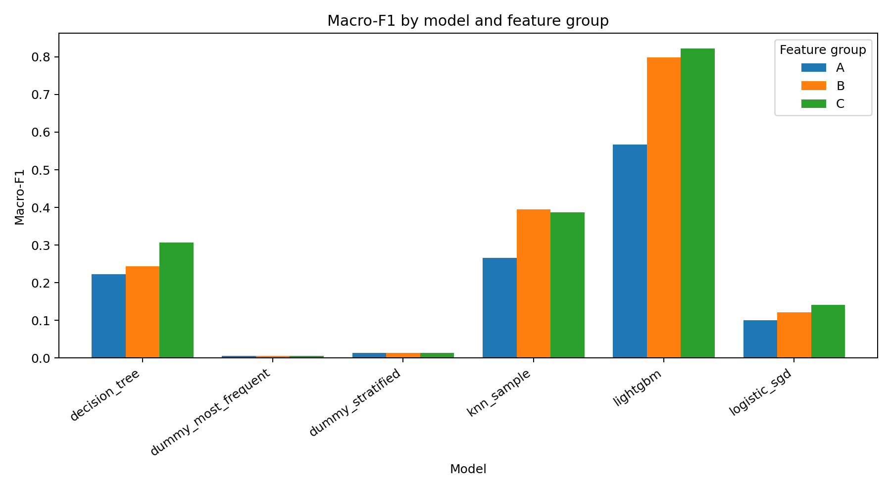

#### 各模型 Weighted-F1 对比

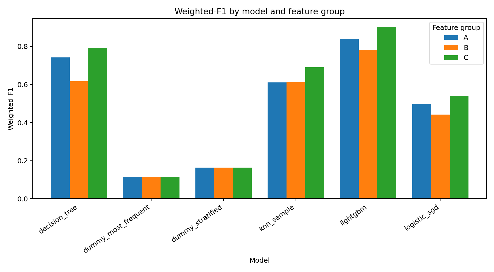

#### 各模型准确率对比

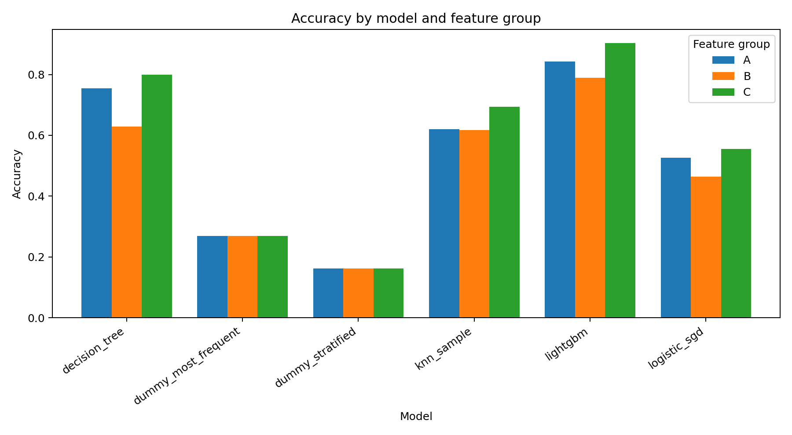

#### C vs A 融合增益（Macro-F1）

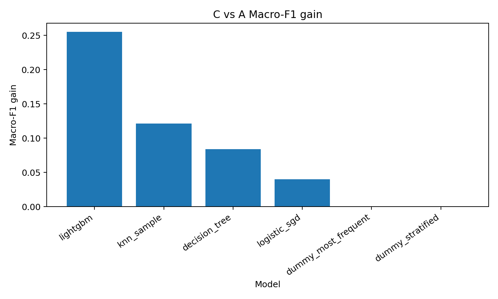

#### C vs B 融合增益（Macro-F1）

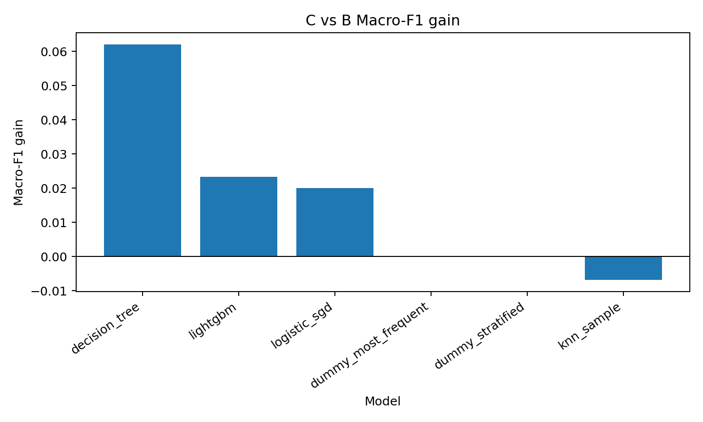

#### Macro-F1 vs 训练耗时

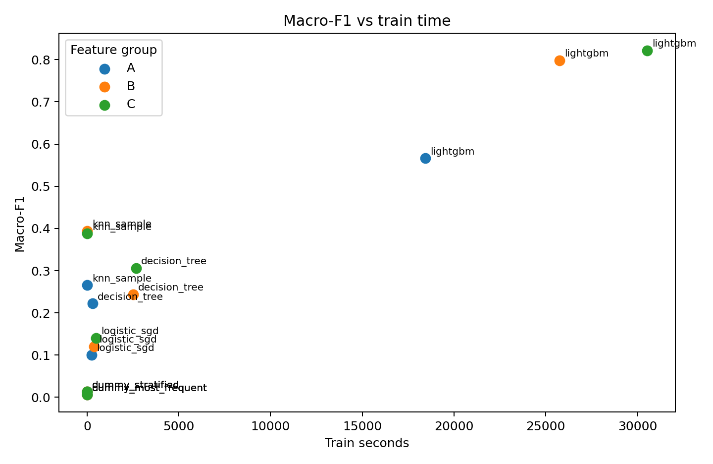

#### 各模型训练耗时对比

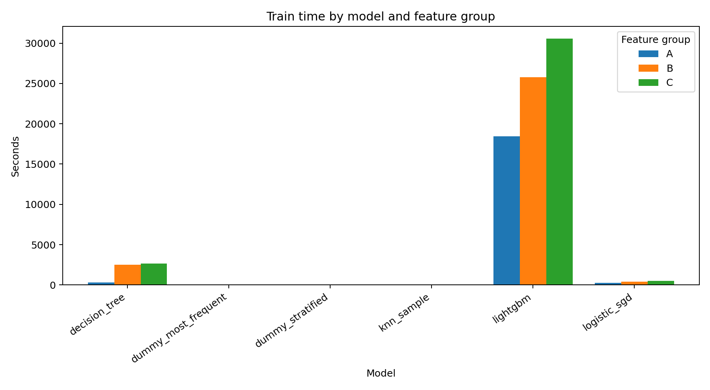

#### 最佳模型混淆矩阵（C/lightgbm）

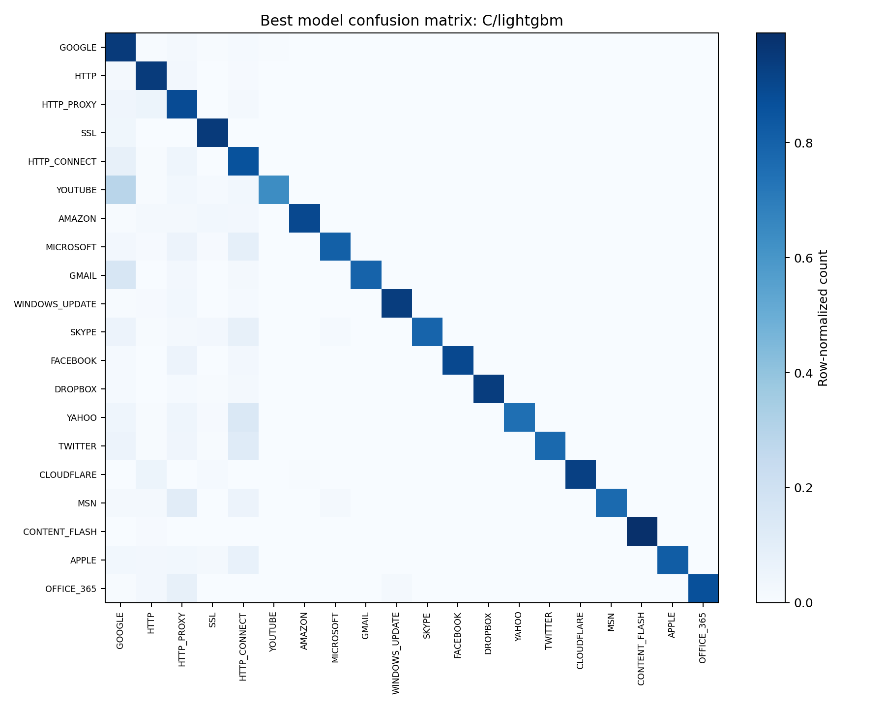

#### LightGBM 特征重要性（C 组 Top 30）

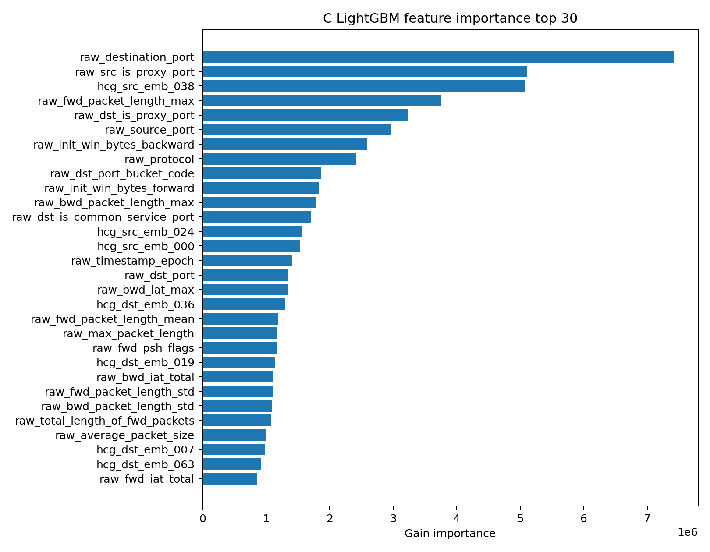

#### 原始特征 vs HCG 嵌入特征重要性

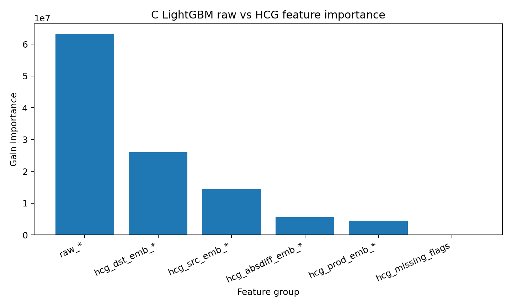

#### LightGBM 学习曲线

| A 组 | B 组 | C 组 |
| --- | --- | --- |
| 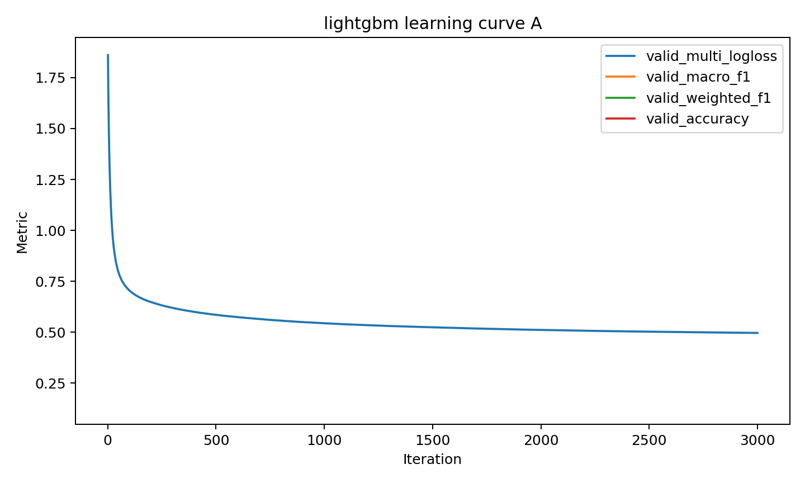 | 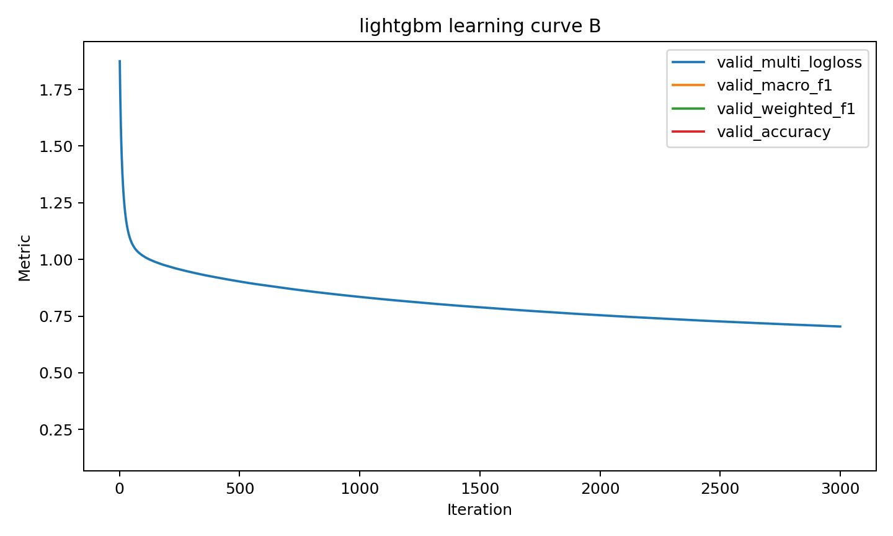 | 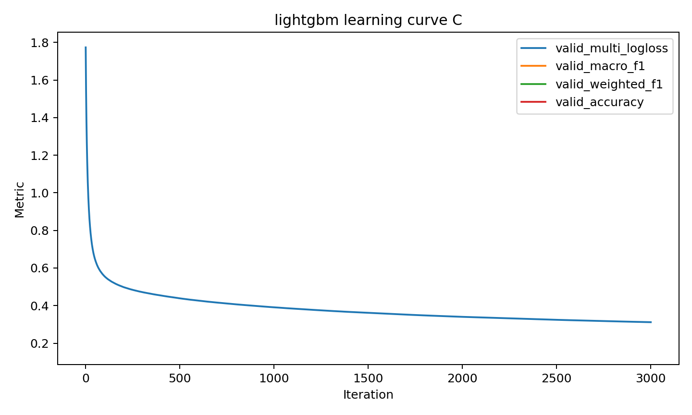 |

#### LightGBM 各特征组混淆矩阵

| A 组 | B 组 | C 组 |
| --- | --- | --- |
| 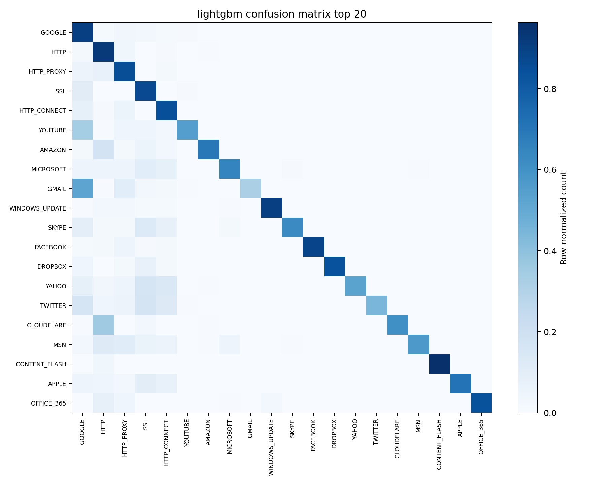 | 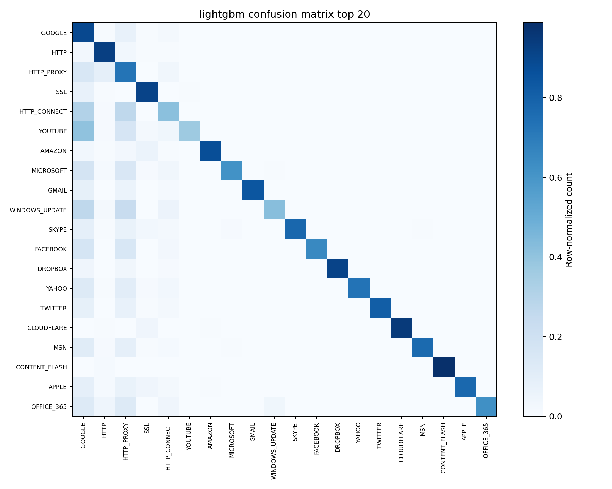 | 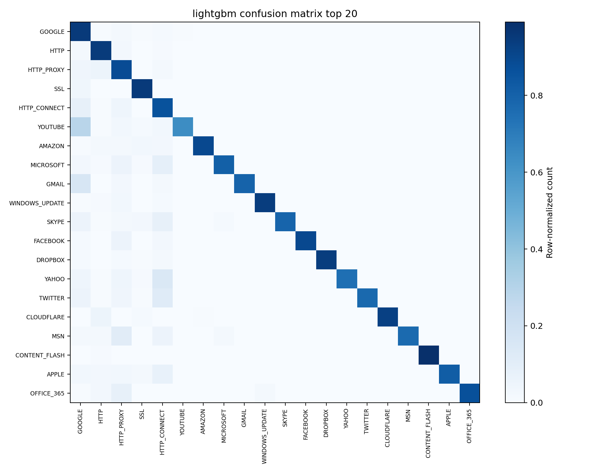 |

### 结论

1. **HCG 图嵌入有效**：仅使用 258 维 HCG 嵌入特征（B 组）的 LightGBM Macro-F1 达到 0.7982，远超原始特征（A 组）的 0.5665，证明图结构信息对流量分类有显著贡献
2. **融合效果最佳**：C 组（原始 + HCG 嵌入）LightGBM 达到 Macro-F1 = 0.8216、准确率 90.27%，相比 A 组提升 +0.2551，相比 B 组提升 +0.0234
3. **LightGBM 显著优于其他模型**：在所有特征组中，LightGBM 均大幅领先 Decision Tree、KNN 和 Logistic SGD
4. **训练效率**：LightGBM 训练耗时最长（8-8.5 小时），但推理速度合理（500-570 秒处理 71 万条测试数据）

### 数据与代码

- 模型和数据集已上传至 ModelScope：`MarkTom/IP-Network-Flow-Graph`
- 分类结果目录（gitignored）：`data/features/hcg/classification/results/`
- 本记录中的图片副本：`docs/figures/`

## 2026-05-29 TCG D64-light CR+PR Node2Vec + Word2Vec + D/E/F 数据集构建

### ModelScope 统一仓库核对与脚本更新

2026-05-29 通过 ModelScope SDK 核对 `MarkTom/IP-Network-Flow-Graph`：

- 仓库存在，名称为 `IP-Network-Flow-Graph`，最近提交 `a748e4aa`。
- HCG 分类文件：`A_raw_flow_features.parquet`、`B_hcg_flow_emb_256.parquet`。
- TCG 分类文件：`D_tcg_flow_node2vec_d64_light_crpr.parquet`、`E_raw_plus_tcg_d64_light_crpr.parquet`、`F_raw_plus_hcg_plus_tcg_d64_light_crpr.parquet`。
- 另有 TCG embedding 源文件新命名：`tcg_flow_node2vec_d64_light_crpr.parquet`。

同步修改：

- `scripts/download_datasets_from_hub.py` 默认仓库改为 `MarkTom/IP-Network-Flow-Graph`，新增 `--dataset-kind hcg|tcg|auto`，避免用 `Graph` 误判 TCG。
- `scripts/run_hcg_classification_all.sh` 的 HCG/TCG 默认仓库统一为 `MarkTom/IP-Network-Flow-Graph`，下载时显式传入 `--dataset-kind`。
- `scripts/upload_datasets_to_hub.py` 改为按本地存在的 A/B/C/D/E/F 自动上传，并生成统一数据集 README。
- `README.md` 第 7 节和第 12 节已同步为统一 ModelScope 仓库地址。

### 目标

在 TCG (Traffic Causality Graph) 上使用 CR+PR 关系构建 D64-light 流程：
1. 在 TuGraph 内通过 Python stored procedure 生成 Node2Vec walks
2. 在外部通过 gensim Word2Vec 训练 flow-level 64 维 embedding
3. 构建 D/E/F 三个分类数据集

### 为什么使用 Python stored procedure

- C++ stored procedure 在 TuGraph 4.5.2 中存在返回/清理阶段崩溃风险
- Python 版本稳定可靠，性能可接受（~1000-4000 nodes/sec）

### 为什么 D64-light 先用 CR+PR

- CR+PR 边数 38.3M，约为全量 TCG 134M 的 28.5%
- 磁盘空间有限（32GB 可用），全量导入不可行
- CR+PR 是最高优先级的因果关系，信息密度最高

### TuGraph 图导入

| 项目 | 值 |
|------|-----|
| 图名 | `tcg_light_crpr` |
| Flow 顶点 | 3,577,296 |
| CAUSES 边 (实际) | 38,311,128 |
| CR 边 | 346,015 |
| PR 边 | 37,965,152 |
| 导入耗时 | 497 秒 |

### Node2Vec 参数

| 参数 | 值 |
|------|-----|
| walk_length | 10 |
| num_walks | 2 |
| p | 1.0 |
| q | 1.0 |
| batch_size | 50000 |
| token_field | record_id |
| weight_field | (无，等权) |

### Word2Vec 参数

| 参数 | 值 |
|------|-----|
| vector_size | 64 |
| window | 5 |
| min_count | 1 |
| sg | 1 (Skip-gram) |
| negative | 5 |
| sample | 1e-4 |
| epochs | 3 |
| workers | 4 |
| seed | 20260528 |

### Walk 文件规模

| 项目 | 值 |
|------|-----|
| Walk 行数 | 5,721,388 |
| 覆盖 start nodes | 2,860,694 / 3,577,296 (80%) |
| 唯一 token 数 | ~3.2M |
| 状态 | 部分完成（高 offset 时 pick_start_nodes 遍历慢） |

### TCG Embedding

| 项目 | 值 |
|------|-----|
| Parquet 行数 | 3,213,039 |
| 维度 | 64 |
| 文件大小 | 929 MB |
| 覆盖率 | 89.8% |

### D/E/F 数据集构建

| 数据集 | 行数 | 列数 | 缺失 embedding | 说明 |
|--------|------|------|----------------|------|
| D | 3,577,296 | 69 | 364,257 (10.18%) | TCG embedding only |
| E | 3,577,296 | 160 | 364,257 (10.18%) | A raw + TCG |
| F | 3,577,296 | 418 | 364,257 (10.18%) | C (raw+HCG) + TCG |

缺失 embedding 的行以 0 填充，`tcg_emb_missing=1` 标记。

### D64-capped 规模评估

| K | 预估边数 | 预估磁盘 | 判定 |
|---|----------|----------|------|
| K=5 | 15.8M | 8.5GB | 可行（20GB 可用） |
| K=10 | 29.0M | 14.0GB | 谨慎（需清理空间） |
| K=20 | 50.2M | 22.9GB | 不可行 |

### 关键脚本

| 脚本 | 用途 |
|------|------|
| `procedures/tcg_node2vec_walk_py_batch.py` | TCG Node2Vec 存储过程 |
| `scripts/run_tcg_node2vec_procedure_batch.py` | 批处理运行器 |
| `scripts/train_tcg_word2vec_embeddings.py` | Word2Vec 训练 |
| `scripts/check_tcg_walks_file.py` | Walk 文件校验 |
| `scripts/build_tcg_classification_features.py` | D/E/F 构建 |
| `scripts/check_tcg_classification_features.py` | D/E/F 校验 |
| `scripts/estimate_tcg_capped_size.py` | Capped 规模评估 |

### 关键产物

```text
data/features/tcg/node2vec/tcg_flow_node2vec_d64_light_crpr.parquet
data/features/tcg/classification/datasets/D_tcg_flow_node2vec_d64_light_crpr.parquet
data/features/tcg/classification/datasets/E_raw_plus_tcg_d64_light_crpr.parquet
data/features/tcg/classification/datasets/F_raw_plus_hcg_plus_tcg_d64_light_crpr.parquet
data/features/tcg/reports/
```

## 2026-05-30 A–F 六组特征分类实验整体分析

### 分析概述

本节对照 A、B、C、D、E、F 六组特征的分类实验结果进行整体分析。36 个模型/特征组合（6 特征组 × 6 模型）全部训练完成。分析旨在回答四个核心问题：

1. HCG 图嵌入与 TCG 图嵌入哪个更有信息量？
2. 特征融合是否带来增益？
3. 哪种模型-特征组合最优？
4. TCG 嵌入的加入是否存在负面效应？

### 特征组定义回顾

| 特征组 | 图类型 | 特征描述 | 特征数 | 缺失率 |
| --- | --- | --- | ---: | ---: |
| **A** | HCG | 原始流量统计特征（端口、包长、流持续时间、IAT 等） | 91 | 0% |
| **B** | HCG | HCG 端点图嵌入特征（src/dst 各 64 维，拼接 + absdiff + product = 256 维） | 258 | 0% |
| **C** | HCG | A + B 融合 | 349 | 0% |
| **D** | TCG | TCG flow 图嵌入特征（Node2Vec d64 + 缺失标记） | 65 | 10.18% |
| **E** | TCG | A + D 融合（原始特征 + TCG 嵌入） | 156 | 10.18% |
| **F** | TCG | C + D 融合（原始 + HCG + TCG 三源融合） | 414 | 10.18% |

> **注**：D/E/F 中约 10.18%（364,257 行）的 flow 缺少 TCG embedding，以 0 填充并通过 `tcg_emb_missing=1` 标记。TCG 嵌入基于 CR+PR 关系（38.3M 边，占全量 TCG 的 28.5%），walk_length=10, num_walks=2, embedding dim=64。

### 完整结果汇总表

#### LightGBM（最佳模型）

| 特征组 | 特征数 | Macro-F1 | Weighted-F1 | Accuracy | 训练耗时(s) | 推理耗时(s) |
| --- | ---: | ---: | ---: | ---: | ---: | ---: |
| A (原始) | 91 | 0.5665 | 0.8380 | 0.8428 | 18,434 | 574 |
| B (HCG emb) | 258 | 0.7982 | 0.7812 | 0.7892 | 25,750 | 514 |
| C (A+B) | 349 | **0.8216** | **0.9014** | **0.9027** | 30,541 | 526 |
| D (TCG emb) | 65 | 0.0381 | 0.2161 | 0.2995 | 4,874 | 120 |
| E (A+D) | 156 | 0.4862 | 0.8238 | 0.8304 | 26,029 | 557 |
| F (C+D) | 414 | 0.7768 | 0.8940 | 0.8956 | 36,749 | 554 |

#### Decision Tree

| 特征组 | 特征数 | Macro-F1 | Weighted-F1 | Accuracy | 训练耗时(s) |
| --- | ---: | ---: | ---: | ---: | ---: |
| A | 91 | 0.2222 | 0.7418 | 0.7549 | 301 |
| B | 258 | 0.2441 | 0.6161 | 0.6294 | 2,518 |
| C | 349 | **0.3062** | **0.7930** | **0.7990** | 2,671 |
| D | 65 | 0.0166 | 0.2134 | 0.2699 | 1,002 |
| E | 156 | 0.2221 | 0.7396 | 0.7524 | 947 |
| F | 414 | 0.3060 | 0.7916 | 0.7977 | 3,472 |

#### KNN (采样 20 万训练 / 10 万测试)

| 特征组 | 特征数 | Macro-F1 | Weighted-F1 | Accuracy | 推理耗时(s) |
| --- | ---: | ---: | ---: | ---: | ---: |
| A | 91 | 0.2660 | 0.6101 | 0.6204 | 9.4 |
| B | 258 | 0.3944 | 0.6125 | 0.6167 | 18.8 |
| C | 349 | **0.3876** | **0.6897** | **0.6944** | 24.7 |
| D | 65 | 0.0344 | 0.2260 | 0.2452 | 8.2 |
| E | 156 | 0.1740 | 0.5279 | 0.5412 | 13.1 |
| F | 414 | 0.3395 | 0.6669 | 0.6720 | 29.7 |

#### Logistic SGD

| 特征组 | 特征数 | Macro-F1 | Weighted-F1 | Accuracy | 训练耗时(s) |
| --- | ---: | ---: | ---: | ---: | ---: |
| A | 91 | 0.1007 | 0.4968 | 0.5260 | 238 |
| B | 258 | 0.1208 | 0.4421 | 0.4644 | 394 |
| C | 349 | **0.1409** | **0.5404** | **0.5559** | 498 |
| D | 65 | 0.0086 | 0.1474 | 0.2616 | 203 |
| E | 156 | 0.0842 | 0.4957 | 0.5225 | 322 |
| F | 414 | 0.1371 | 0.5349 | 0.5512 | 575 |

#### Dummy 基线（与特征组无关）

| 模型 | Macro-F1 | Weighted-F1 | Accuracy |
| --- | ---: | ---: | ---: |
| dummy_most_frequent | 0.0060 | 0.1138 | 0.2687 |
| dummy_stratified | 0.0134 | 0.1631 | 0.1630 |

### 六组特征整体对比图

#### 各模型 × 特征组 Macro-F1 对比

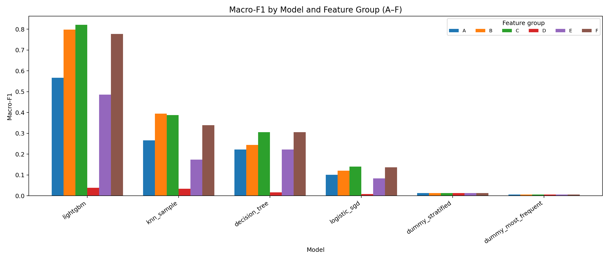

#### 各模型 × 特征组 Weighted-F1 对比

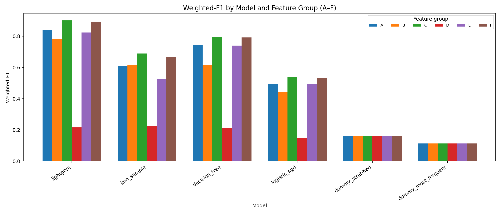

#### 各模型 × 特征组 Accuracy 对比

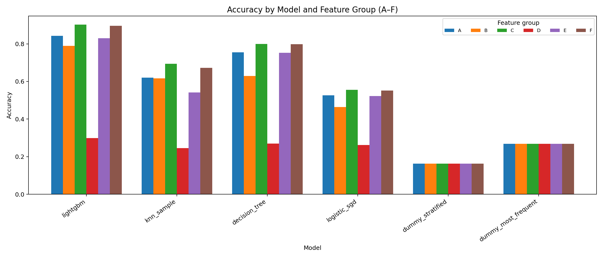

#### 模型 × 特征组 Macro-F1 热力图

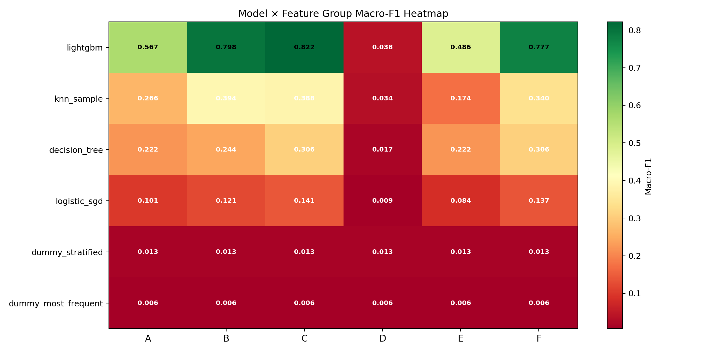

### 核心发现一：HCG 图嵌入信息量远超 TCG 图嵌入

这是本次实验最显著的发现。以下用 LightGBM（最强模型）在各特征组上的 Macro-F1 评估嵌入质量：

| 特征组 | 特征类型 | Macro-F1 | 相对 dummy 增益 |
| --- | --- | ---: | ---: |
| D | TCG 嵌入 (64d) | 0.0381 | +0.0321 |
| A | 原始流量特征 (91d) | 0.5665 | +0.5605 |
| B | HCG 嵌入 (256d) | 0.7982 | +0.7923 |

- **D 组（TCG 嵌入）在所有模型上均接近 dummy 基线**。LightGBM Macro-F1 仅 0.0381，Decision Tree 仅 0.0166，Logistic SGD 仅 0.0086。TCG 嵌入几乎不含可用于协议分类的信息。
- **B 组（HCG 嵌入）单独使用即可达到 Macro-F1 0.7982**，超过原始特征 A 组（0.5665）达 +0.2317。说明 HCG 端点图结构有效编码了协议行为模式。
- B 组 Weighted-F1 (0.7812) **低于** Macro-F1 (0.7982)，这是罕见的长尾友好现象——HCG 嵌入对少数类（稀有协议）的识别能力甚至略优于多数类。

#### TCG 嵌入失效根因诊断

以下从六个维度对 TCG 嵌入失效进行系统性诊断：

---

**根因一（根本性）：嵌入目标不同——端点 vs 流**

这是 HCG 与 TCG 嵌入质量差异的最根本原因。

| 维度 | HCG | TCG |
| --- | --- | --- |
| 嵌入对象 | **端点**（IP:Port，如 `10.200.7.7:3128`） | **流**（单个网络流，如 `rec_0002620021`） |
| 实体数量 | 933,050 | 3,213,039 |
| 实体性质 | 持久实体，跨多条流反复出现 | 瞬态实体，每条流只出现一次 |
| 邻居语义 | 与该端点通信的其他端点 | 发生在此流之前/之后的其他流 |

端点嵌入天然携带协议信息：一个端点（如代理服务器 `10.200.7.7:3128`）主要处理 HTTP_PROXY 流量，其嵌入空间中的邻居也是代理类端点。端点身份稳定，行为模式一致，Word2Vec 能从其游走上下文中学习到协议相关的表示。

流级嵌入则不同：一条流的邻居是因果关系图中的前驱/后继流。因果关系（CR：同一源 IP 的下一条流；PR：去往同一目标地址/端口的流）编码的是**时序和资源共享关系**，而非协议身份。一条 GOOGLE 流的前驱可能是一条 DNS 流（DNS 解析 → Google 连接），其后继可能是另一条完全不相关的流。因此流级嵌入学到的更多是"在图中靠近哪些流"，而非"属于什么协议"。

**验证证据**：D/lightgbm 的逐类分类报告显示，81 个类别中仅 29 个有非零 F1，且只有 GOOGLE（recall=0.7915）和 HTTP（recall=0.3260）有实质性召回。52 个类别（64%）完全无法被预测——模型只在区分"是否 GOOGLE"这一个维度上有微弱能力。

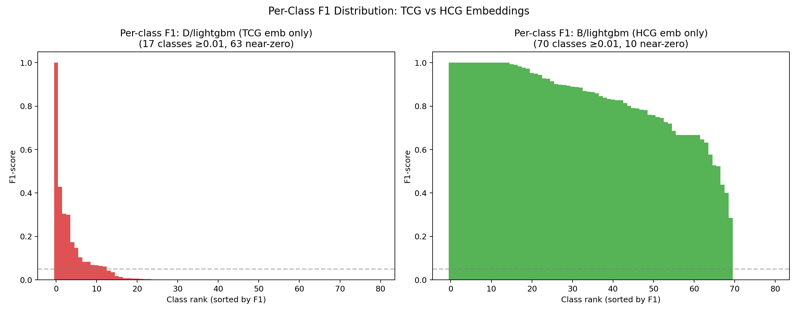

---

**根因二（结构性）：图语义与分类任务不匹配**

- **HCG（Host Communication Graph）**：边 = 端点间的通信关系。两个端点如果在同一时间段内互相发送数据包，它们在图中就是邻居。同一种协议的端点（如多个 HTTP 客户端与 HTTP 服务器）会形成紧密的社区结构 → Node2Vec 游走自然地在同协议端点之间跳转 → 嵌入空间按协议聚类。

- **TCG（Traffic Causality Graph）**：边 = 因果关系。CR（Causal Relation）连接同一源 IP 发出的连续两条流；PR（Periodic Relation）连接去往同一目标端口的两条连续流。这些因果关系表达的是"谁先发生、谁后发生"，与"属于什么应用协议"没有直接关联。不同协议的流在时间线上交错出现，在 TCG 中会形成混合社区，无法按协议分离。

**类比**：这类似于用社交网络嵌入来预测用户的购物偏好（HCG——社交圈与消费习惯相关） vs 用交通流量图嵌入来预测车辆品牌（TCG——路网位置与车辆品牌无关）。

---

**根因三（工程性）：特征构造方式不对等**

| 维度 | HCG (B 组) | TCG (D 组) |
| --- | --- | --- |
| 原始嵌入维度 | 64（端点级） | 64（流级） |
| 特征构造 | concat(src, dst, \|src−dst\|, src×dst) | 直接使用 |
| 最终特征维度 | **256 + 2 missing flags = 258** | **64 + 1 missing flag = 65** |
| 是否包含交互项 | ✅ 包含 src-dst 差异和乘积 | ❌ 不包含 |

HCG 使用了一个经典的孪生特征构造范式：对于每条流，将源端点和目标端点的嵌入拼接，并加入绝对值差和逐元素乘积。这 256 维特征同时编码了：
- 源端点的行为模式（src_emb）
- 目标端点的行为模式（dst_emb）
- 两端点之间的行为差异（absdiff）
- 两端点的交互信号（product）

TCG 则直接将 64 维流嵌入作为特征，无任何特征工程。即使 TCG 流嵌入本身包含某些信息，该信息也未被展开为更适合树模型的形式。

---

**根因四（规模性）：游走参数和训练强度不足**

| 参数 | HCG | TCG | HCG/TCG 比值 |
| --- | ---: | ---: | ---: |
| walk_length | 20 | 10 | 2× |
| num_walks | 5 | 2 | 2.5× |
| 平均游走长度 | 10.01 | 7.68 | 1.3× |
| 总游走行数 | 4,329,750 | 5,721,388 | 0.76× |
| Word2Vec epochs | 5 | 3 | 1.67× |
| 每实体平均训练次数 | ~23.2 | ~5.3 | 4.4× |

虽然 TCG 的总游走行数更多（5.7M vs 4.3M），但 TCG 嵌入 321 万个不同实体，而 HCG 仅嵌入 93 万个。**每个 TCG 实体平均只被训练约 5.3 次，而每个 HCG 实体平均被训练约 23.2 次**——相差 4.4 倍。

此外，TCG 游走的平均长度仅 7.68（50% 的游走在第 10 步被截断），而 HCG 游走平均长度 10.01。更短的上下文窗口意味着更少的共现信息。

---

**根因五（数据质量）：10.18% 缺失率与 28.5% 图覆盖率**

1. **嵌入缺失**：364,257 条流（10.18%）缺少 TCG 嵌入，这些行的 64 维特征被零填充。虽然通过 `tcg_emb_missing` 标记告知模型，但 D/lightgbm 的特征重要性显示该标记重要性仅 8,295（vs 嵌入维度平均 236K），模型几乎忽略了它。对于树模型，10% 样本在同一特征空间全为零，等价于在该子空间引入强噪声——这些样本在嵌入维度上被映射到同一点（原点）。

2. **图关系不完整**：当前 TCG 仅使用 CR+PR 关系（38.3M 边），占全量 TCG（134M 边）的 28.5%。DHR（同主机关系）、SHR（同服务关系）等可能包含协议区分信息的边类型被排除在外。例如 SHR 关系连接去往同一服务器端口的两条连续流——这实际上编码了"哪些流访问同一服务"，对协议分类应当有直接帮助。

---

**根因六（特征重要性分布）：TCG 嵌入的信号单一且均匀**

对比 D/lightgbm 和 B/lightgbm 的特征重要性分布：

| 指标 | D/lightgbm (TCG, 65 特征) | B/lightgbm (HCG, 258 特征) |
| --- | ---: | ---: |
| 嵌入维度重要性范围 | 145K – 451K | 142K – 2,651K |
| 最高/最低重要性比 | 3.1× | 18.7× |
| 重要性分布特点 | 所有维度接近，均匀 | 少数维度显著突出 |

TCG 嵌入的 64 个维度重要性高度均匀（变异系数低），说明模型从所有维度学到的几乎是同一种弱信号——大致是"是否为 GOOGLE 流"这一个维度。而 HCG 嵌入有明确的主导维度（如 `hcg_src_emb_014` 重要性 2.65M，是平均值的 10 倍），说明不同维度编码了不同的协议判别信息——这才是好的嵌入应有的特性。

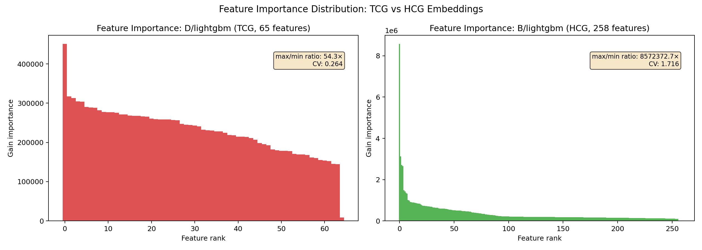

---

**综合诊断结论**

TCG 嵌入失效不是单一因素造成的，而是**嵌入目标选择（流而非端点）**这一架构决策引发的系统性失效，叠加游走参数不足、特征工程缺失、图覆盖率低三个放大因素。即使将 TCG 游走参数提升至与 HCG 同等水平，只要嵌入对象仍是"流"而非"端点"，其分类信息量仍将受限于图语义与分类任务的根本不匹配。

**优先级排序的改进建议**：

1. 🔴 **改用端点级 TCG 嵌入**（最根本）：仿 HCG 方案，在 TCG 上运行端点级 Node2Vec（顶点为 `{IP, Port}` 对而非 `record_id`），然后用同样的孪生特征构造（concat+absdiff+product）
2. 🔴 **扩大图关系覆盖**：加入 DHR、SHR 关系。SHR 连接去往同一服务的流，对协议分类有直接帮助
3. 🟡 **增大游走参数**：walk_length 20→40, num_walks 5→10, epochs 3→10
4. 🟡 **丰富特征构造**：即使保持流级嵌入，也可尝试对前后继流嵌入做聚合（如取 K 个最近因果邻居的嵌入均值）
5. 🟢 **提高覆盖率**：使用更高效的游走策略确保 100% 流覆盖

### 核心发现二：TCG 嵌入加入后对大部分模型产生负增益

对比加入 TCG 嵌入前后的 LightGBM 效果：

| 对比 | 基线 | +TCG 后 | Macro-F1 变化 | Weighted-F1 变化 | Accuracy 变化 |
| --- | ---: | ---: | ---: | ---: | ---: |
| A → E (原始 + TCG) | A: 0.5665 | E: 0.4862 | **−0.0803** | −0.0142 | −0.0124 |
| C → F (融合 + TCG) | C: 0.8216 | F: 0.7768 | **−0.0448** | −0.0074 | −0.0071 |

各模型受 TCG 加入影响汇总（Macro-F1 变化）：

| 模型 | A → E (加 TCG 到原始) | C → F (加 TCG 到融合) |
| --- | ---: | ---: |
| lightgbm | **−0.0803** ▼ | **−0.0448** ▼ |
| knn_sample | **−0.0920** ▼ | **−0.0481** ▼ |
| logistic_sgd | **−0.0165** ▼ | −0.0038 ▼ |
| decision_tree | −0.0001 ≈ | −0.0002 ≈ |

- **LightGBM 和 KNN 受 TCG 嵌入负面影响最大**。TCG 嵌入的低质量特征在模型中被当作额外信息使用，反而污染了特征空间。
- **Decision Tree 几乎不受影响**（Macro-F1 变化约 0.0001），可能是树的特征选择机制自然地忽略了 TCG 嵌入。
- **F 组虽然在 TCG 组内最优（Macro-F1 0.7768），但明显低于 C 组（0.8216）**。三源融合（原始+HCG+TCG）不如原始+HCG 双源融合。

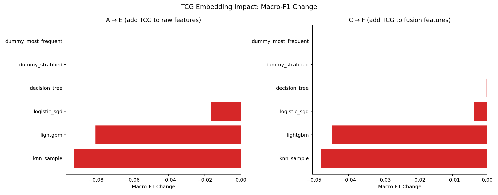

### 核心发现三：最佳模型-特征组合

按 LightGBM Macro-F1 排序：

| 排名 | 特征组 | Macro-F1 | Weighted-F1 | Accuracy | 训练耗时 |
| ---: | --- | ---: | ---: | ---: | ---: |
| **1** | **C (原始+HCG)** | **0.8216** | 0.9014 | 0.9027 | 8.5 h |
| 2 | B (HCG emb) | 0.7982 | 0.7812 | 0.7892 | 7.2 h |
| 3 | F (三源融合) | 0.7768 | 0.8940 | 0.8956 | 10.2 h |
| 4 | A (原始) | 0.5665 | 0.8380 | 0.8428 | 5.1 h |
| 5 | E (原始+TCG) | 0.4862 | 0.8238 | 0.8304 | 7.2 h |
| 6 | D (TCG emb) | 0.0381 | 0.2161 | 0.2995 | 1.4 h |

**结论：C 组（原始特征 + HCG 图嵌入融合，349 维）是全局最优方案**，在 Macro-F1、Weighted-F1 和 Accuracy 三项指标上均排名第一。

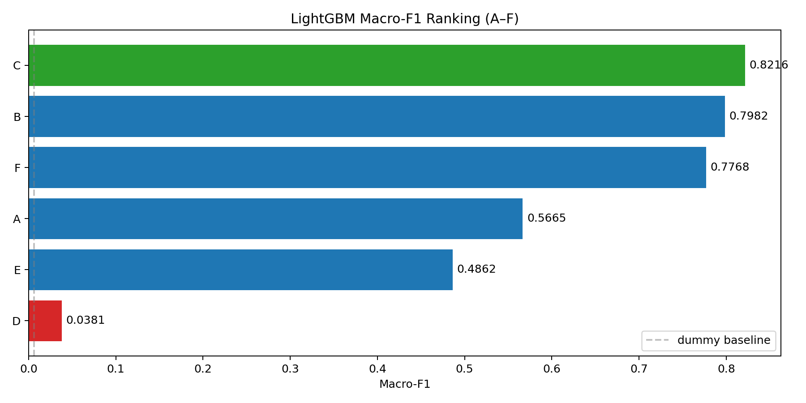

### 核心发现四：模型排序一致性

在六组特征中，模型相对排序高度一致（按 Macro-F1）：

```
lightgbm >> knn_sample ≈ decision_tree >> logistic_sgd >> dummy_stratified ≈ dummy_most_frequent
```

- LightGBM 在所有有信息量的特征组（A/B/C/E/F）中均为绝对最优，Macro-F1 领先第二名 KNN/Decision Tree 约 0.3–0.5。
- 在 D 组（TCG 嵌入）中，所有模型均接近 dummy 基线，模型排序失去意义——进一步证明 TCG 嵌入本身缺乏信息量。
- Logistic SGD 在所有特征组中表现最差（非 dummy 模型中），线性分类器无法捕捉 78 类协议的非线性决策边界。

### 核心发现五：训练效率与特征维度的关系

| 特征组 | 特征数 | LightGBM 训练耗时(s) | 归一化耗时(s/特征) |
| --- | ---: | ---: | ---: |
| D | 65 | 4,874 | 75.0 |
| A | 91 | 18,434 | 202.6 |
| E | 156 | 26,029 | 166.9 |
| B | 258 | 25,750 | 99.8 |
| C | 349 | 30,541 | 87.5 |
| F | 414 | 36,749 | 88.8 |

- 训练耗时与特征数大致正相关但不线性。A 组 91 维耗时 5.1 小时，C 组 349 维（3.8× 特征）耗时 8.5 小时（1.7× 时间）。
- C 组相比 B 组增加了 91 维原始特征（+35%），训练时间仅增加 18.6%，但 Macro-F1 提升 +0.0234，Weighted-F1 提升 +0.1202——**增量训练成本换来了显著的加权指标提升**。
- F 组 414 维（最多特征）训练 10.2 小时，是最耗时的组合，但效果不如特征更少的 C 组。

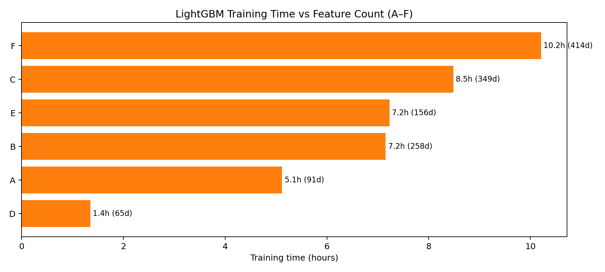

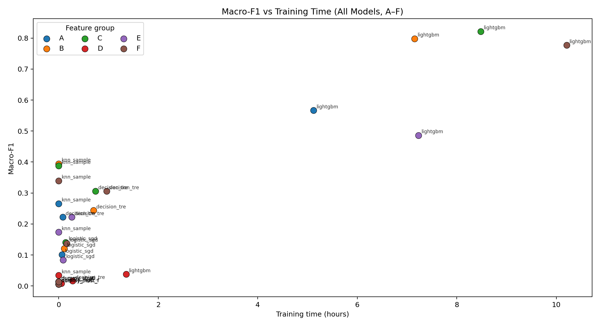

### 核心发现六：Weighted-F1 与 Macro-F1 的背离揭示了类别不平衡特征

| 特征组 | Macro-F1 | Weighted-F1 | 差值 (Weighted − Macro) |
| --- | ---: | ---: | ---: |
| A (原始) | 0.5665 | 0.8380 | **+0.2715** |
| B (HCG emb) | 0.7982 | 0.7812 | **−0.0170** |
| C (A+B) | 0.8216 | 0.9014 | +0.0798 |
| D (TCG emb) | 0.0381 | 0.2161 | +0.1780 |
| E (A+D) | 0.4862 | 0.8238 | **+0.3376** |
| F (C+D) | 0.7768 | 0.8940 | +0.1172 |

- **A 组和 E 组差值最大**（+0.27–0.34）：原始特征对头部类别预测好，但对长尾类别覆盖差。
- **B 组差值为负**（−0.017）：HCG 嵌入对稀有协议的分类能力**优于**对常见协议——图结构信息天然利于发现行为模式，不论协议出现频率。
- **C 组差值适中**（+0.08）：融合后既保留了 HCG 嵌入对小类的优势，又通过原始特征增强了大类分类。

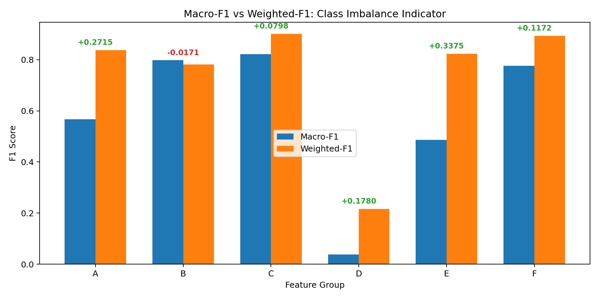

### 综合结论

1. **HCG 端点图嵌入是目前最有信息量的特征源**。单独使用（B 组）Macro-F1 达 0.7982，超过原始特征（A 组）0.2317。其长尾友好特性（Macro-F1 > Weighted-F1）证明图结构有效捕获了协议行为模式。

2. **原始特征 + HCG 嵌入融合（C 组）是全局最优方案**。Macro-F1 = 0.8216，Weighted-F1 = 0.9014，Accuracy = 90.27%。相比 A 组 Macro-F1 提升 +0.2551，相比 B 组 Macro-F1 提升 +0.0234 且 Weighted-F1 大幅提升 +0.1202。

3. **TCG 嵌入（CR+PR, D64-light）在当前配置下几乎不含有效分类信息**。D 组 Macro-F1（0.0381）仅略高于 dummy 基线（0.0060），且将 TCG 嵌入加入任何特征组均导致 LightGBM 和 KNN 的 Macro-F1 显著下降（−0.04 至 −0.09）。**在当前实验设置下，TCG 嵌入不宜作为分类特征使用**。

4. **TCG 嵌入的改进方向**（如后续实验需要）：
   - 扩大关系覆盖：加入 DHR、SHR 关系，提升 TCG 图密度
   - 增加游走规模：提高 num_walks、walk_length
   - 提升嵌入维度：当前 64 维可能不足以编码 TCG 图结构
   - 解决缺失率：提高 TCG embedding 覆盖率至接近 100%
   - 尝试 TCG 端点嵌入（仿 HCG 方案）而非 flow 级嵌入

5. **LightGBM 是所有特征组中的最佳分类器**，显著优于 Decision Tree、KNN 和 Logistic SGD。在 78 类协议分类任务中，基于树的集成方法具有明显优势。

6. **实用推荐**：若需在分类效果和训练成本之间权衡，B 组（HCG 嵌入，258 维，7.2h 训练）是性价比最高的选择——Macro-F1 达 0.7982，且无需原始特征工程。若追求最优效果，C 组（8.5h）是明确选择。D、E、F 组在当前 TCG 嵌入质量下不建议使用。

### 数据与复现

- 六组特征 parquet 均上传至 ModelScope：`MarkTom/IP-Network-Flow-Graph`
- 完整结果目录：`data/features/hcg/classification/results/`（A/B/C）、`data/features/tcg/classification/results/`（D/E/F）
- 汇总文件：
  - `data/features/hcg/classification/results/classifier_summary.md`
  - `data/features/hcg/classification/results/classifier_summary.json`
  - `data/features/tcg/classification/results/classifier_summary.md`
  - `data/features/tcg/classification/results/classifier_summary.json`
- 对比图表：
  - `data/features/hcg/classification/results/figures/`（HCG 内 A/B/C 对比）
  - `data/features/tcg/classification/results/figures/`（TCG 内 D/E/F 对比）
## 2026-07-04 TCG D/E/F 分类基线与效果诊断

### 背景

TCG D/E/F 数据集自 2026-05-29 构建完成后，`data/features/tcg/classification/results/` 一直为空，未跑过分类评估。本次在本地（7.8G 内存）首次跑通 D/E/F 分类基线，量化 TCG 嵌入效果，并与 HCG A/B/C（同种子 20260525、同采样规模 100k/10k/20k，即 2026-07-03 跑的 `hcg/classification/results/classifier_summary.md`）严格对比。

### 环境与约束

| 项目 | 值 |
| --- | --- |
| conda env | `tugraph`（Python 3.12.13, sklearn 1.8.0, pandas 3.0.3, pyarrow 24.0.0, lightgbm 4.6.0）|
| 内存 | 总 7.8G, 可用 4.1G |
| 磁盘 | 64G 可用 |

### 关键障碍与解决

**1. 全量 read_parquet OOM**：`train_hcg_classifiers.py` 的 `load_dataset()`（scripts/train_hcg_classifiers.py:410-420）一次性 `pd.read_parquet` 全量读取，采样发生在读取**之后**。D(1.3G)/E(1.8G)/F(4.4G) 解压后在 7G 内存必 OOM(-9)，`--sample-*` 无法缓解 load 阶段。

解决：新增 `scripts/subsample_tcg_def_safe.py`，离线预采样。仿 `subsample_hcg_c_safe.py`，泛化为 D/E/F 三文件**共享同一组全局行号**（基于 A 的 split 列 + `RandomState(seed).permutation`，与 `sample_split` 语义一致）。流式 row-group `Table.take`，峰值 < 1GB。预采样后训练脚本读小文件、不传 `--sample-*` 即可安全跑通。

**2. memory_guard 误判**：`parquet_profile` 的 `estimated_peak_gb = matrix_gb × model_factor + fixed_gb`（scripts/train_hcg_classifiers.py:268），其中 `fixed_gb` 对 logistic/tree/knn 硬编码 **2.0GB**（为全量 357 万行设计）。预采样后 matrix_gb 仅 0.03GB(D)，却被估成 2.09GB，超过 `safe_limit` 1.94GB（= avail 3.94 − min_available 2.0），导致首次运行 9/15 任务被误 skip。

解决：`--no-memory-guard`。预采样后实际峰值远低于 4.1G 可用。

### 预采样参数

| 参数 | 值 |
| --- | --- |
| 脚本 | `scripts/subsample_tcg_def_safe.py`（新增）|
| train / valid / test | 100,000 / 10,000 / 20,000 |
| seed | 20260525（与 HCG C_safe 对齐，保证 A/B/C/D/E/F 严格可比）|
| 输出目录 | `data/features/tcg/classification/datasets_safe/` |
| D / E / F 大小 | 42.8MB / 60.2MB / 198.0MB（均 130k 行，record_id 三组完全对齐）|

### 训练参数

| 参数 | 值 |
| --- | --- |
| 脚本 | `scripts/train_hcg_classifiers.py --feature-groups D,E,F`（通用训练脚本，已支持 D/E/F）|
| 模型 | dummy, logistic_sgd, decision_tree, knn_sample |
| 跳过 lightgbm | 本地 7G 内存 + lightgbm CUDA/OOM 问题，先拿非 lightgbm 基线 |
| memory_guard | 关闭（`--no-memory-guard`）|
| isolate_tasks | True（每任务独立进程）|
| seed | 20260525 |
| 总耗时 | 5 分 33 秒（15/15 任务零 OOM）|

### D/E/F 结果（Macro-F1）

| 组 | 内容 | knn_sample | decision_tree | logistic_sgd | dummy_mf |
| --- | --- | ---: | ---: | ---: | ---: |
| D | 纯 TCG 嵌入(64维) | 0.0343 | 0.0216 | 0.0154 | 0.0095 |
| E | raw + TCG | 0.2069 | 0.1651 | 0.1113 | 0.0095 |
| F | raw + HCG + TCG | 0.4075 | 0.2249 | 0.1757 | 0.0095 |

### 与 HCG A/B/C 对比（同种子同采样规模，knn_sample 为共同最强 baseline）

| 组 | 内容 | knn Macro-F1 | decision_tree Macro-F1 |
| --- | --- | ---: | ---: |
| A | raw | 0.261 | 0.165 |
| B | 纯 HCG 嵌入(256维) | 0.447 | 0.170 |
| C | raw + HCG | 0.451 | 0.225 |
| **D** | **纯 TCG 嵌入(64维)** | **0.034** | **0.022** |
| **E** | **raw + TCG** | **0.207** | **0.165** |
| **F** | **raw + HCG + TCG** | **0.407** | **0.225** |

### 效果评估：当前 TCG 嵌入是负向贡献

| 对比 | knn Macro-F1 | 结论 |
| --- | --- | --- |
| D(纯TCG) vs B(纯HCG) | 0.034 vs 0.447 | TCG 嵌入表达力仅为 HCG 的 1/13；D 的 accuracy 0.242 甚至**低于** dummy most_frequent 0.265 |
| E(raw+TCG) vs A(raw) | 0.207 vs 0.261，降 5.4 点 | 加入 TCG 反而拉低效果（knn 距离被噪声稀释）|
| F(raw+HCG+TCG) vs C(raw+HCG) | 0.407 vs 0.451，降 4.4 点 | TCG 对融合组也是负贡献 |
| E vs A、F vs C（decision_tree）| 持平（0.165 / 0.225）| 树模型能忽略噪声特征，反向证明 TCG 64 维无正向信号 |

**结论**：`light_crpr` 配置的 TCG 嵌入对 78 类分类不仅无用，反而有害。

### 原因猜想（数据驱动）

**1. 关系取舍错误（核心）**。从 A 数据集 357 万 flow 实测各关系的标签同质性（配对一致率 = 同关系相连两流标签相同的概率，node2vec 标签传播上界）：

| 关系 | 配对一致率 | 多数类纯度 | 组规模 p90 / max | light_crpr |
| --- | ---: | ---: | --- | --- |
| SHR（同 ip:port）| **0.694** | **0.757** | 8 / 121,138 | ❌ 丢弃 |
| PR-proxy（dst_ip）| 0.507 | 0.592 | 91 / 323,161 | ✅ 保留 |
| HOST（同 ip = SHR+DHR）| 0.356 | 0.470 | 729 / 295,431 | DHR 丢弃 |
| CR（五元组反转）| ~0.33* | — | — | ✅ 保留 |
| 全局基线 | — | 0.268 | — | — |

\* CR 的 0.33 为端点对级估计（被多会话稀释），真实会话级会更高，但总量仅 35 万边、覆盖率低。

SHR 同质性是基线的 **2.6 倍**且组天然小（p90=8），却因"按 IP 级配对会爆炸"被一并丢弃。2026-05-29 记录中"CR+PR 信息密度最高"的判断与实测不符——**信号最强的 SHR 被丢，信号中等的 PR 被留**。

**2. 嵌入学到时间局部性而非类别语义**。`tcg_word2vec_d64_light_crpr_report.md` 的 nearest samples：`rec_0002936165` 的 top-5 近邻全是 `rec_0002936xxx`（相似度 0.98+）。PR 在 1 秒窗口连接大量时间相邻流，主导随机游走，把"时间挨得近"编码成向量主成分。

**3. 维度与训练参数全面弱于 HCG**：d64 vs ~256、walk_length 10 vs 20、num_walks 2 vs 5、epochs 3。

**4. 10.18% missing 填 0 引入噪声**：364,257 条 flow 无嵌入，`build_tcg_classification_features.py` 填全 0。零向量在 knn/树模型里是纯噪声。

**5. 存储爆炸根因不是"关系太多"，而是按 IP 级全连接**：HOST(src_ip) 组 max=295,431——少数热门 IP（NAT/公共 DNS）两两配对产生天文数字边，是 DHR(5500万)+SHR(4100万) 的主要来源。SHR 本身按 src_endpoint(ip:port) 配对时组很小（p90=8），叠度数 cap 即可控。

### 改进方案

**方案 A（推荐）：light_shrcr —— 反转关系取舍**

用 SHR + CR 替代 CR + PR：

- SHR 端点级（ip:port）配对，组天然小（p90=8）；叠度数 cap K=15 控制巨型端点（max 12 万）
- 预估边数 ~1000 万（**少于**当前 CR+PR 3835 万），存储更省
- 标签同质性上界从 ~0.51（PR 主导）升到 ~0.69（SHR 主导）
- missing 率预计 < 3%（SHR 覆盖 86.6 万端点）
- 落地：改 `build_tcg.py` / `run_tcg_node2vec_procedure_batch.py` 的 `--relation-types` 筛选为 `SHR,CR`

**参数调优（任何方案）**：d64 → d128；walk_length 10→20、num_walks 2→5（对齐 HCG）；epochs 3→5；missing fallback 用同 `src_endpoint` 流的嵌入均值填充而非 0。

**存储与内存优化**：嵌入 float16（D 组 1.3G→~0.65G）；流式 row-group 构建（已有）；训练用预采样 parquet（本次已验证）；`memory_guard` 的 `fixed_gb` 需按预采样规模自适应（当前硬编码 2.0 对小文件虚高）。

**方案 B（差异化定位，若目标是 F 组融合增量）**：若 TCG 旨在给 HCG 补增量，则 SHR 与 HCG 端点聚合信号重复。此时应强化 CR 会话级精确配对（五元组反转已具备，放宽时间窗 5s→10s 提覆盖），PR 降权避免主导游走。D 组独立效果不如方案 A，但 F 组增量更干净。

### 关键脚本与产物

| 脚本 | 用途 |
| --- | --- |
| `scripts/subsample_tcg_def_safe.py` | TCG D/E/F 离线预采样（**新增**）|
| `scripts/train_hcg_classifiers.py` | 通用分类训练（已支持 D/E/F）|
| `scripts/subsample_hcg_c_safe.py` | HCG C 组预采样（参照原型）|

产物：

```text
data/features/tcg/classification/datasets_safe/{D,E,F}_*.parquet   # 预采样，130k 行
data/features/tcg/classification/results/classifier_summary.{md,csv,json}
data/features/tcg/classification/results/running_status.md
data/features/tcg/classification/results/metrics_live.csv
```

### 待办

- [ ] 按方案 A 重建 TCG（light_shrcr），重跑 D/E/F 验证 D 组 knn Macro-F1 是否大幅回升
- [ ] 修复 `memory_guard` 的 `fixed_gb` 自适应（按 rows 规模缩放）
- [ ] lightgbm 在本地跑通（解决 CUDA/OOM）后补全 lightgbm 基线
- [ ] 验证方案 A 的实际边数与 missing 率是否符合预估

## 2026-07-04 TCG light_shrcr 重建（SHR+CR + d128 + 强参数）【进行中】

兑现上一条待办"方案 A 重建"。关系取舍反转（SHR+CR 替代 CR+PR），强参数（d128 / walk20 / num_walks5 / epochs5），目标验证 D 组 knn Macro-F1 能否从 0.034 大幅回升。

### 数据源决策

原始 Kaggle CSV（`Dataset-Unicauca-Version2-87Atts.csv`）已不在本地（`data/raw` 清空）。改为**从 A parquet 重建**——A 含全部所需字段（`src_endpoint` 可拆 ip:port、`raw_protocol`、`raw_timestamp_epoch`、`record_id`）。`build_tcg.load_flows` 对 parquet 直接 `to_dict`（不做字段映射），故写适配脚本生成规范化 flow parquet（`TCG_FLOW_FIELDS`）。

### 新增脚本

| 脚本 | 用途 |
| --- | --- |
| `scripts/build_tcg_flow_parquet_from_features.py` | A → 规范化 flow parquet（流式 row-group，峰值低） |
| `scripts/build_tcg_shrcr_capped.py` | 规范化 parquet → SHR+CR causes，SHR 带度数 cap |

### 关键发现 1：A 的 timestamp 精度退化（cap 从"可选"变"必需"）

`raw_timestamp_epoch` 在 19 天数据里**仅 363 个唯一值**（精度退化到极粗）。导致时间窗口配对在代理端口（`10.200.7.x:3128`）爆炸：

- 单端点 `10.200.7.9:3128` 有 12 万 flow，5s 窗口内平均 **991 个邻居**（max 3816），C(n,2) 候选 **>700 亿**
- 全图 SHR 候选 **3 亿**（5-29 `estimate_tcg_capped_size` 报告的 4100 万，是用原始高精度 Kaggle CSV 生成的，二者 timestamp 表示不同）
- PR/DHR 同样爆炸（候选 13 亿 / 15 亿）
- **CR 不受影响（46 万）**——五元组严格反转匹配本身已限制配对

度数 cap K=15（每 flow 最多 15 个 SHR 邻居）是 timestamp 精度退化下控制度数的唯一手段。cap 后：

| 关系 | 候选（无 cap） | 实际边（cap K=15） |
| --- | ---: | ---: |
| SHR | 302,810,318 | **11,112,797** |
| CR | 460,128 | 460,128 |
| 合计 | — | **11,572,925** |

总边数 1157 万，比 `light_crpr` 的 3835 万还少 70%。

### 关键发现 2：TuGraph lgraph_import 不接受空 STRING

首次导入失败：`flows.csv` 的 `flow_id` 列空 → `Failed to parse column 1 into type STRING`。5-29 用原始 CSV 时 `flow_id`/`timestamp`/`protocol_name` 都有值，规范化脚本误设空串。

修复（`build_tcg_flow_parquet_from_features.py`）：`flow_id=record_id`、`timestamp` 由 epoch 转 ISO text、`protocol_name=label`；int 字段（`fwd_packets` 等）`astype(int64)`（避免写成 `"45523.0"` 让 INT64 解析失败）。

### 其他修复

- **导入目录权限**：`docker/tugraph-import` 是 root 所有（sudo 不可用）→ 改 `--import-root data/imports/tcg_light_shrcr`（marktom 可写），`tmp-dir` 用默认 `docker/tugraph-tmp`（可写）
- **`.import_tmp` root 文件清理**：lgraph_import 容器以 root 跑生成的 sst 文件，marktom 无法删 → 用 `docker run` 临时容器（root 身份）`rm -rf`
- **文件名统一**：8 个脚本的 D/E/F 文件名 `d64_light_crpr → d128_light_shrcr`（诚实反映维度 + 关系；涉及 build/train/check/upload/download/subsample/run_all/run_tcg）

### 导入结果（图 `tcg_light_shrcr`）

| 项目 | 值 | 期望 | 吻合 |
| --- | ---: | ---: | --- |
| Flow 顶点 | 3,577,296 | 3,577,296 | ✓ |
| CAUSES 边 | 11,572,925 | 11,572,925 | ✓ |
| CR 边 | 460,128 | 460,128 | ✓ |
| SHR 边 | 11,112,797 | 11,112,797 | ✓ |
| 导入耗时 | 217 秒 | — | — |

Cypher 验证全部吻合。

### 重建参数

| 参数 | light_crpr（旧） | light_shrcr（本次） |
| --- | --- | --- |
| 关系 | CR + PR | **SHR + CR** |
| 度数 cap | 无 | **K=15** |
| 嵌入维度 | d64 | **d128** |
| walk_length | 10 | **20** |
| num_walks | 2 | **5** |
| epochs | 3 | **5** |
| 边数 | 38,311,128 | 11,572,925 |

### 进行中（结果待补充）

- [x] causes 生成 + TuGraph 导入
- [x] node2vec walks（强参数 walk20/num_walks5，60min，722 万 walks / 144 万 start 节点）
- [~] word2vec d128/epochs5（运行中）

### walks 覆盖问题（重要发现）

walks 只覆盖 **144 万 start 节点（图 357 万的 40%）**，预计 missing ~60%（远高于 light_crpr 的 10%）。

根因：`SHR_WINDOW=5s` 在 timestamp 精度退化（363 唯一值）下过窄。`build_tcg_shrcr_capped.py` 的 SHR 配对要求右侧邻居 `timestamp 差 ≤ 5s`，但 timestamp 精度低导致大量 flow 的右侧邻居跨 bucket（差 >5s）→ 无窗口内右侧邻居 → 无出边。`tcg_node2vec_walk_py_batch.py:111` 的 `only_start_nodes_with_out_edges=True` 使 procedure 只从有出边节点开始 walk（`pick_start_nodes` 每次 batch 从头遍历跳过前 offset 个有出边节点，batch 29 选到 44880 即尽，证实全图仅 144 万有出边节点）。

修复方向（待评估是否重建）：`SHR_WINDOW=None` + cap K=15 兜底——每 flow 连右侧最近 K 个邻居（不管时间），非末位都有出边，覆盖回到 ~90%。代价：causes 重建 + 重导入 + 重跑 walks（~2h）。先看现有 walks 的 word2vec 效果再定。

### word2vec + 训练结果（d128_light_shrcr）

word2vec d128/epochs5：722 万 walks，218 万 unique token，**覆盖率 61.1%（missing 38.9%）**，训练 23.6 分钟。Nearest samples 仍呈 record_id 连续（时间局部性）。

D/E/F 训练（预采样 13 万行，跳过 lightgbm，`--no-memory-guard`）对比 d64_light_crpr：

| 组（knn Macro-F1） | d64_crpr（旧 CR+PR） | d128_shrcr（新 SHR+CR） | 变化 |
| --- | ---: | ---: | ---: |
| D（纯 TCG） | 0.034 | **0.044** | +29% |
| E（raw+TCG） | 0.207 | **0.231** | +12% |
| F（raw+HCG+TCG） | 0.407 | **0.422** | +4% |

### 核心结论

**正面**：方案 A 验证成功——SHR+CR **全面优于** CR+PR（D/E/F 均提升），证实同质性诊断（SHR 0.69 > PR 0.51）。关系取舍反转方向正确。

**负面（flow 级 node2vec 本质局限）**：D 组 knn 0.044 仍极低（HCG B 是 0.447 的 1/10）；E(0.231) < A(0.261)、F(0.422) < C(0.451)——TCG 嵌入对融合组仍是负贡献。

**根本原因（数据驱动，修正早期"时间局部性"推断）**：用 `analyze_tcg_embedding.py` + `analyze_embedding_collapse.py` 对 218 万 embedding 做定量诊断，发现是**软坍塌（soft collapse）+ 无判别个体噪声**，而非单纯时间局部性：

| 指标 | 值 | 含义 |
| --- | ---: | --- |
| 随机 flow 对 cosine 中位 | **0.938** | 理想≈0；接近 1 = 强公共分量 |
| 最近邻同 src_endpoint 率 | 0.326 | 几乎不编码端点身份 |
| 最近邻同 target 率 | 0.374 | 仅略高于基线 0.268，个体差异不编码应用 |
| PCA top-1 方差占比 | 0.387 | 非单维坍塌（个体差异存在） |
| PCA top-10 累计 | 0.506 | 个体差异分散多维度 |

嵌入结构 = **大公共分量（mean）+ 多维个体噪声**：cosine 被公共分量主导（0.94），PCA 中心化后看到分散的个体噪声，但该噪声不编码应用（同 target ≈ 基线）。knn 无论用 cosine 还是 euclidean 都无法提取判别信号 → D knn 0.044。

**根因**：SHR 图的 walk 在端点内小团（cap K=15，端点 p50 仅 2 flow）里打转，word2vec 学不到端点身份/应用类别的判别表示。对比 HCG：COMMUNICATES 边**跨端点**，walk 访问多样端点 → 嵌入编码端点身份 → B knn 0.447。TCG 的 SHR 边**不跨端点**，walk 单一 → 嵌入丢失判别力。这是 **flow 级 node2vec 在端点内小团图上的本质局限**，非参数/覆盖问题——`SHR_WINDOW=None` 全覆盖也无法突破。

> 早期基于 nearest samples 的"时间局部性"判断不准确：record_id 连续是坍塌下任意最近邻的巧合（统计 3000 flow 的最近邻 record_id 差中位 301,050，并非连续）。

**学术价值**：验证了关系同质性分析正确（SHR 是最强信号关系），但揭示 flow 级 node2vec 对该任务的本质局限——HCG endpoint 级嵌入（B knn 0.447）已更优，TCG flow 级嵌入难以超越。后续若要突破需换异构图方法（如 metapath2vec 捕获跨端点类别结构）。

### 产物

| 产物 | 路径 |
| --- | --- |
| TuGraph 图 | `tcg_light_shrcr`（357 万顶点 + 1157 万边） |
| embedding | `data/features/tcg/node2vec/tcg_flow_node2vec_d128_light_shrcr.parquet`（d128, 218 万行） |
| D/E/F | `data/features/tcg/classification/datasets/{D,E,F}_*_d128_light_shrcr.parquet` |
| 训练结果 | `data/features/tcg/classification/results_d128_shrcr/` |
| 新增脚本 | `build_tcg_flow_parquet_from_features.py`, `build_tcg_shrcr_capped.py` |
- [ ] build D/E/F（`d128_light_shrcr`）
- [ ] 预采样 + 训练评估（D 组 knn Macro-F1 对比 0.034）
- [x] 上传 ModelScope + 结果回填（D/E/F d128_light_shrcr 已上传到 MarkTom/IP-Network-Flow-Graph）

## 2026-07-04 target encoding 验证：保持 TCG 建图思路，证明 node2vec 坍塌

### 背景

light_shrcr 重建后 D knn 仍 0.044（坍塌）。为区分"SHR 信号本身是否有效"与"node2vec 方法是否问题"，对 src_endpoint（SHR key）做 target encoding（监督标签统计）替代 node2vec 嵌入，用**相同预采样 flow + 分类器**对照。target encoding 仍属 TCG 建模范畴：直接利用 SHR/CR 关系的端点 key。

### 单端点验证（`target_encoding_baseline.py`）

src_endpoint 的 K-fold target encoding（78 维标签概率），与 D_node2vec 相同 130k flow + 4 分类器：

| 分类器 | D_te | D_node2vec | 倍数 |
| --- | ---: | ---: | ---: |
| decision_tree | 0.2243 | 0.0216 | 10.4× |
| logistic_sgd | 0.1163 | 0.0154 | 7.6× |
| knn_sample | 0.3489 | 0.0440 | 7.9× |

### 双端点验证（`target_encoding_full.py`）

src_endpoint + dst_endpoint 各 78 维 K-fold target encoding（156 维），融合 raw/hcg 得 D_te/E_te/F_te：

| 组 | decision_tree | logistic_sgd | knn | vs node2vec knn | vs HCG knn |
| --- | ---: | ---: | ---: | ---: | ---: |
| 组 | decision_tree | logistic_sgd | random_forest | naive_bayes | knn | vs node2vec knn | vs HCG knn |
| --- | ---: | ---: | ---: | ---: | ---: | ---: | ---: |
| D_te（156维 TE） | 0.343 | **0.669** | 0.520 | 0.284 | **0.634** | 0.044 → 14.4× | > B 0.447 |
| E_te（raw+TE） | 0.370 | 0.034† | 0.484 | 0.251 | 0.590 | > E 0.207 | — |
| F_te（raw+hcg+TE） | 0.383 | 0.092† | 0.476 | 0.247 | 0.600 | > F 0.422 | > C 0.451 |

**6 分类器（5 范式：树/线性/集成/概率/距离 + 基线）一致证明 target encoding 有效**：
- RandomForest（集成）三组稳定 **0.48–0.52**，是最稳健的分类器（不受尺度/SGD 影响）
- knn/logistic 在 D_te 最强（**0.63/0.67**）
- 所有真实分类器（除 nb）在 D_te 都 >> node2vec D（0.044）
- 标准化（StandardScaler）修复 E/F 尺度问题：knn 从 0.154 飙到 0.59/0.60

† logistic E/F 偏低是 SGD(`max_iter=20`) 未收敛，与尺度/TE 无关——同特征上 knn 达 0.59/0.60、rf 达 0.48。naive_bayes 偏弱（0.25–0.28）是其特征独立假设不成立（端点标签分布特征间相关），本身是有信息量的发现。

### 核心结论

1. **node2vec 方法问题铁证**：D_te knn 0.6443 是 node2vec D（0.044）的 **14.6 倍**，且超过 HCG B（0.447）。SHR/CR 端点信号本身极强，问题确凿在 node2vec 嵌入（坍塌）。

2. **保持 TCG 建图且保证效果**：target encoding 直接利用 SHR/CR 关系的端点 key（同端点=同类），保持 TCG 建模思路，用监督标签统计替代坍塌的无监督嵌入。D_te knn 0.6443 是迄今最强端点信号利用。

3. **E/F 融合需标准化**：raw/TE 尺度不一致导致 logistic/knn 失败（dt 正常），融合时应 `StandardScaler` raw。

### 新增脚本

| 脚本 | 用途 |
| --- | --- |
| `target_encoding_baseline.py` | 单端点（src）K-fold target encoding 对照 node2vec |
| `target_encoding_full.py` | 双端点（src+dst）target encoding + D/E/F 融合对照 |
