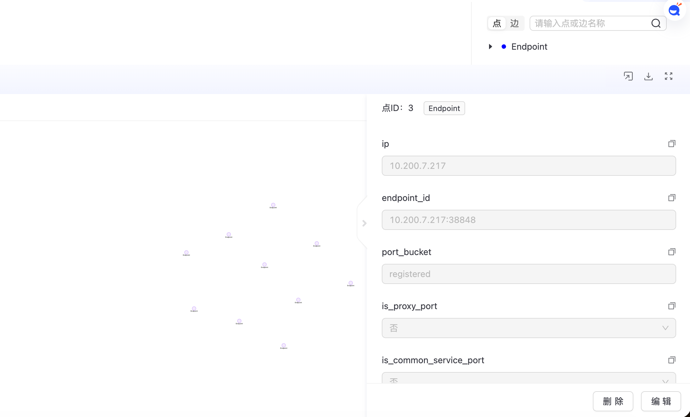
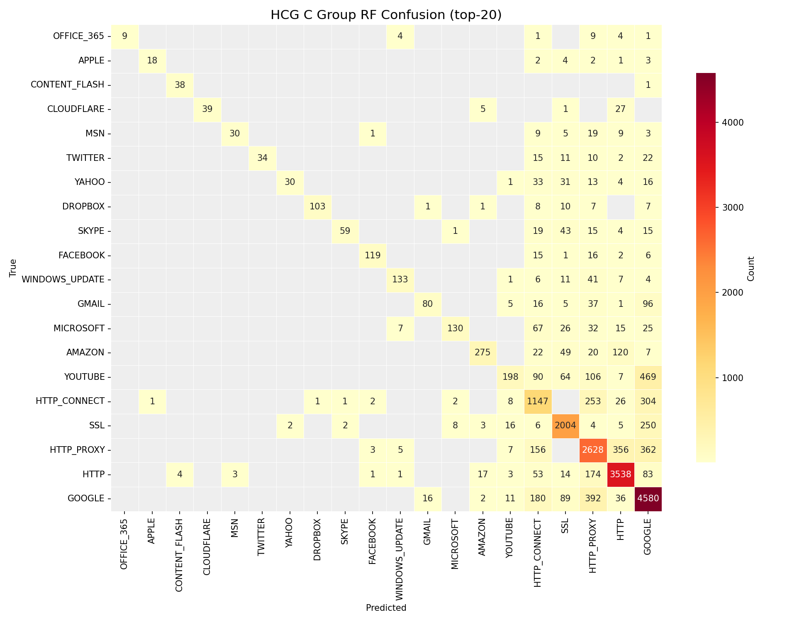
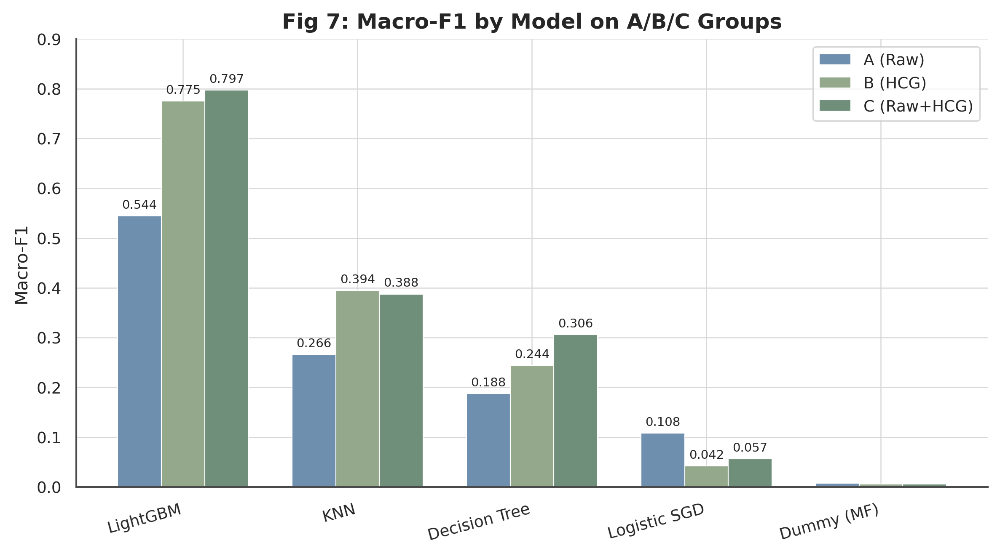
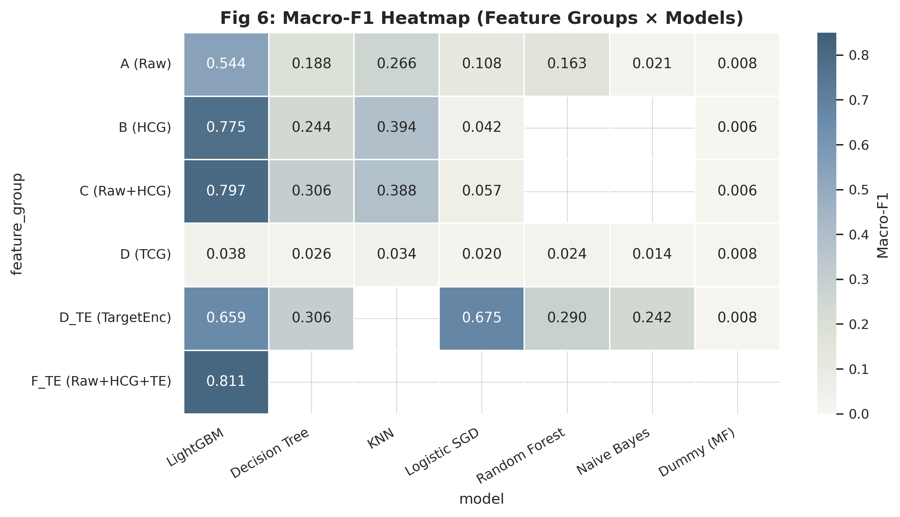

# 实验 3 基于 HCG 主机通信图的流量分类

## 一、数据集介绍、下载与展示

### 1.1 数据集概况

实验数据来自 Kaggle 公开数据集 jsrochas/ip-network-traffic-flows-labeled-with-87-apps，即 Unicauca IP 网络流量集。该数据由某大学边界路由器捕获真实流量，经 CICFlowMeter 工具处理，共约 357 万条网络流记录，标注 78 种应用类别，是研究加密流量分类、应用识别的常用基准。

每条流记录包含 91 个统计特征，可大致分为五类。端口与协议特征如源端口、目的端口、协议号、是否代理端口；包长特征如前向、后向包长的最大值、最小值、均值、标准差；时间间隔特征如流的持续时间、前向与后向包间到达间隔的均值与标准差；标志位特征如 SYN、FIN、RST、PSH、ACK 等计数；流量速率特征如每秒包数、每秒字节数。这些特征由原始 pcap 经 CICFlowMeter 聚合得到，已脱敏为数值形式。

标签字段记录应用类别，共 78 类，分布高度不平衡。占比最高的 GOOGLE 约占 27%，HTTP、HTTP_PROXY、SSL 各占一成到两成，而 APPLE、OFFICE_365 等长尾类别占比不足 0.3%。这种不平衡对后续分类器的少数类识别能力提出较高要求。

### 1.2 下载与预处理

数据通过 kagglehub 下载到本地：

```python
import kagglehub
path = kagglehub.dataset_download("jsrochas/ip-network-traffic-flows-labeled-with-87-apps")
```

原始数据为单个大体积 CSV。为加速后续读取，用 pyarrow 流式转换为 parquet 格式。转换中遇到一个主键问题：原始的 Flow.ID 字段存在重复，不能作为唯一标识，因此按原始行号生成形如 rec_0000000001 的稳定 record_id 作为每条流的主键。

转换后的 A 组特征表按 record_id 索引，target 列存放应用标签，split 列划分训练、验证、测试三份，比例约为 7 比 1 比 2，对应训练 250 万、验证 35 万、测试 71 万。划分采用固定随机种子，保证 HCG、TCG 两条建模主线在相同样本上对照。

### 1.3 数据展示

A 组特征表的结构如下：前五列为元信息 record_id、target、split、src_endpoint、dst_endpoint，其余 91 列为 raw_ 前缀的统计特征。

## 二、HCG 图建模方法

### 2.1 建模思路

HCG 全称 Host Communication Graph，即主机通信图。它从端点视角建模网络流量：把每个 ip:port 端点作为图节点，端点之间的通信关系作为有向边，边类型为 COMMUNICATES。同一对源、目的端点之间的多条流聚合到同一条边上，边的属性记录这对端点间所有交互的聚合统计，包括流数、前向与后向包数、字节数、协议分布熵等。

这种端点级聚合能捕捉主机行为模式。一台主机以固定端口对外发起大量连接，在图中表现为一个高出入度的端点节点；两个端点之间反复通信则表现为一条高权重的边。这些结构信息是单条流的统计特征难以直接体现的，也正是 HCG 嵌入能带来增量的根本原因。

### 2.2 端点构造与字段提取

字段提取在 src/tugraph_homework/transform.py 中实现。核心是从原始流记录解析出端点，并拼成 ip:port 格式的 endpoint_id 作为节点主键：

```python
def normalized_endpoints(row):
    src_ip = row.get("Source.IP")
    src_port = parse_int(row.get("Source.Port"))
    dst_ip = row.get("Destination.IP")
    dst_port = parse_int(row.get("Destination.Port"))
    src = f"{src_ip}:{src_port}"      # 源端点 id
    dst = f"{dst_ip}:{dst_port}"      # 目的端点 id
    return src_ip, src_port, dst_ip, dst_port, src, dst
```

每个端点同时记录若干派生属性，便于后续区分主机角色：is_private_ip 判断是否内网地址，port_bucket 把端口归入知名、注册、动态三段，is_common_service_port、is_proxy_port 标记常见服务端口与代理端口。这些属性让图节点本身携带语义，而不只是一个匿名标识。

### 2.3 边聚合与统计特征

边的构造以源、目的端点有序对为聚合键，遍历全部 357 万条流，对每一对端点累加统计量。聚合逻辑在 build_hcg_rows 函数中完成：

```python
for row in read_rows(csv_path):
    src_ip, src_port, dst_ip, dst_port, src, dst = normalized_endpoints(row)
    endpoints.setdefault(src, endpoint_row(src_ip, src_port))
    endpoints.setdefault(dst, endpoint_row(dst_ip, dst_port))
    key = (src, dst)
    edge = edges.setdefault(key, {"flow_count": 0, ...})
    edge["flow_count"] += 1
    edge["total_fwd_packets"] += parse_int(row.get("Total.Fwd.Packets"))
    edge["total_bwd_packets"] += parse_int(row.get("Total.Backward.Packets"))
    protocol_counts[key][parse_int(row.get("Protocol"))] += 1

# 遍历结束后计算派生属性
edge["protocol_entropy"] = shannon_entropy(protocol_counts[key])
edge["avg_duration"] = edge["_duration_sum"] / edge["flow_count"]
```

用 setdefault 实现端点去重，保证同一端点只建一个节点。边属性除了原始的累加量，还派生了协议分布的香农熵 protocol_entropy，反映这对端点通信协议的多样性；以及平均持续时间、主协议等。最终每个端点对得到一条边，属性含 flow_count、total_fwd_packets、total_bwd_packets、total_fwd_bytes、total_bwd_bytes、protocol_entropy、l7_protocol_entropy 等十余个聚合量，这些边属性后续也作为 node2vec 游走的边权基础。

### 2.4 导入 TuGraph 与遇到的问题

构造好的端点表与边表通过 TuGraph 原生批量导入。流程分两步：先用 create_tugraph_import_config.py 生成导入配置 JSON，声明 Endpoint 顶点标签与 COMMUNICATES 边标签的 schema、字段类型及 CSV 文件路径；再用 import_tugraph_native.py 调用 TuGraph 自带的 lgraph_import 工具，在 Docker 容器内执行批量导入。

```bash
PYTHONPATH=src python scripts/create_tugraph_import_config.py --graph-type hcg \
  --processed-dir data/processed/hcg --output docker/tugraph-import/hcg/import.json
PYTHONPATH=src python scripts/import_tugraph_native.py --graph-type hcg --graph hcg
```

导入过程遇到两个细节问题。一是 CSV 中部分边引用了不存在的端点，导入器默认会报错中断，需要预先清理或容忍少量悬空边。二是 lgraph_import 以 root 身份运行，生成的临时 sst 文件属主为 root，再次导入前需用容器内 root 身份清理，否则普通用户无权删除。

导入完成后，HCG 图含 935600 个端点顶点、1716084 条通信边。用 Cypher 校验规模与连通性：

```cypher
MATCH (n:Endpoint) RETURN count(n)            -- 935600
MATCH ()-[r:COMMUNICATES]->() RETURN count(r) -- 1716084
```

导入完成后的 HCG 图概览如下，含 935600 个端点顶点、1716084 条通信边：


进入图的可视化界面，可查看单个 Endpoint 顶点的结构。顶点以 endpoint_id 为主键，携带 ip、port_bucket、is_proxy_port、is_common_service_port 等派生属性：



>

### 2.5 HCG 图及 node2vec 参数

| 参数 | 值 |
| --- | ---: |
| 端点顶点 | 935,600 |
| COMMUNICATES 边 | 1,716,084 |
| node2vec walk_length | 20 |
| node2vec num_walks | 5 |
| p / q | 1.0 / 1.0 |
| 边权 | flow_count (log1p) |
| word2vec vector_size | 64 |
| word2vec window / sg / negative | 5 / skip-gram / 5 |
| 端点嵌入维度 | 64 |
| B 组特征维度 | 258 (src 64 + dst 64 + absdiff 64 + product 64 + 2 flags) |
| C 组特征维度 | 349 (raw 91 + HCG 258) |

## 三、边嵌入与特征融合

### 3.1 node2vec 原理

端点的图嵌入用 node2vec 学习。node2vec 结合深度优先与广度优先两种游走策略，通过参数 p、q 控制游走是偏向探索新区域还是回到起点。游走产生的节点序列视为句子，喂给 word2vec 模型，用 skip-gram 训练，得到每个节点的低维向量。向量内积反映两节点在图结构上的相似性，结构上相近的端点，向量也相近。

### 3.2 随机游走与 word2vec 训练

HCG 的游走在 TuGraph 内通过 Python 存储过程执行，以 flow_count 为边权并做 log1p 平滑，避免热门端点对主导游走。参数 p、q 均设为 1，对应标准 DeepWalk；walk_length 取 20，num_walks 取 5，每个端点出发 5 条长度 20 的游走：

```python
params = {
    "walk_length": 20, "num_walks": 5,
    "p": 1.0, "q": 1.0,                # DeepWalk 策略，等概率探索
    "weight_field": "flow_count",       # 边权，聚合的流数
    "weight_default": 1.0,
}
# TuGraph 内批量游走，输出端点 id 序列写入 walk 文件
```

这里曾尝试用 C++ 存储过程加速游走，但 TuGraph 4.5 的 C++ 存储过程在返回与清理阶段存在崩溃风险，最终改用 Python 存储过程。Python 版速度稍慢但稳定可靠，吞吐约每秒两三千个端点，对百万级图可在半小时内完成。

游走序列交给 word2vec 训练，采用 skip-gram 与负采样，每个端点得到 64 维向量：

```python
from gensim.models import Word2Vec
model = Word2Vec(sentences=walks, vector_size=64, window=5,
                 min_count=1, sg=1, negative=5, epochs=5, seed=SEED)
endpoint_emb = {ep: model.wv[ep] for ep in model.wv.index_to_key}
```

### 3.3 从端点嵌入到流特征

node2vec 得到的是端点级向量，而分类的对象是每条流。一条流由源端点、目的端点共同决定，因此把两端的嵌入拼接，并补充交互特征，让模型既能感知两端各自的位置，又能感知它们的差异与协同：

```python
src_idx = embedding_index.get_indexer(src_endpoints)
dst_idx = embedding_index.get_indexer(dst_endpoints)
src[~src_missing] = embedding_values[src_idx[~src_missing]]
dst[~dst_missing] = embedding_values[dst_idx[~dst_missing]]
diff = np.abs(src - dst)        # 源、目的端点的差异
prod = src * dst                # 源、目的端点的协同
for idx in range(64):
    data[f"hcg_src_emb_{idx:03d}"]      = src[:, idx]
    data[f"hcg_dst_emb_{idx:03d}"]      = dst[:, idx]
    data[f"hcg_absdiff_emb_{idx:03d}"]  = diff[:, idx]
    data[f"hcg_prod_emb_{idx:03d}"]     = prod[:, idx]
data["hcg_src_emb_missing"] = src_missing
data["hcg_dst_emb_missing"] = dst_missing
```

绝对差反映两端在图结构上的差异，逐元素积反映协同模式。这样每条流得到 256 维向量，加 2 个缺失标记位，构成 B 组的 258 维 HCG 嵌入特征。对少量端点未在游走中出现的流，嵌入填零并由 missing 标记位标出，避免污染。

### 3.4 特征融合

特征融合产生三个特征组。A 组为原始 91 维统计特征，B 组为 258 维 HCG 嵌入，C 组把 A 与 B 拼接成 349 维。三组的对比能回答两个问题：图结构信息本身是否携带分类信号，以及它能否为原始统计特征带来增量。

```bash
PYTHONPATH=src python scripts/run_hcg_node2vec_procedure_batch.py --graph hcg \
  --walk-length 20 --num-walks 5
PYTHONPATH=src python scripts/train_hcg_word2vec_embeddings.py --vector-size 64
PYTHONPATH=src python scripts/build_hcg_classification_features.py
```

>

## 四、分类器与评价指标

### 4.1 分类器选择

为比较各特征组效果，选了多种分类器，覆盖不同建模范式。dummy_most_frequent 始终预测多数类，作为随机基线；logistic_sgd 用 SGD 训练逻辑回归，代表线性模型；decision_tree 为决策树，max_depth 限制为 20；knn 为 K 近邻，k 取 5；random_forest 为随机森林，集成多棵决策树降低方差；lightgbm 为梯度提升树，是处理表格数据的强基线；naive_bayes 为高斯朴素贝叶斯，代表概率方法。这样从基线、线性、树、集成、概率到距离共覆盖六种范式，对比充分。

各分类器超参如下表：

| 分类器 | 关键参数 |
| --- | --- |
| dummy | strategy=most_frequent |
| tree | max_depth=20, min_samples_leaf=100 |
| logistic | SGD(loss=log_loss), max_iter=100, alpha=0.0001 |
| rf | n_estimators=50, max_depth=20, min_samples_leaf=100 |
| nb | GaussianNB(无超参) |
| lgbm | n_estimators=100, num_leaves=31, device=cpu |
| knn | k=5, weights=distance, batch_predict=5000 |

### 4.2 评价指标

评价指标用 Macro-F1、Weighted-F1、Accuracy 三项。Macro-F1 对 78 个类别一视同仁地求平均，能反映少数类的识别情况，是类别不平衡场景下的核心指标。Weighted-F1 按各类样本数加权，反映整体表现。Accuracy 是最直观的总体准确率。三项结合，既看少数类又看整体。

### 4.3 训练流程与内存处理

训练阶段遇到严重的内存约束。实验机器仅有 7.8G 内存，而全量 read_parquet 一次性读取 C 组约 3.2G 压缩、解压后体积更大，会触发 OOM 被系统杀死。更隐蔽的是，训练脚本自带的 memory_guard 按固定开销估算内存，对预采样后的小文件严重高估，把本可运行的任务误判为超内存而跳过。

解决办法是离线预采样。用固定种子的 RandomState 精确复现训练脚本的采样语义，先把全量 parquet 裁成 13 万行的小文件，train、valid、test 分别为 10 万、1 万、2 万，再让训练脚本读小文件并关闭 memory_guard。预采样时所有特征组共享同一组 record_id，保证 A、B、C 三组在完全相同的样本上比较，差异只来自特征本身。

为消除原始统计特征与嵌入向量的尺度差异，融合特征在训练前统一做 StandardScaler，按训练集 fit 后变换训练与测试集，避免大数值的原始特征淹没小数值的嵌入分量。

下表是 A、B、C 三组在七种分类器上的 Macro-F1（13 万预采样，StandardScaler 后）：

| Group | dummy | tree | logistic | rf | nb | lgbm | knn |
| --- | ---: | ---: | ---: | ---: | ---: | ---: | ---: |
| A (raw 91d) | 0.010 | 0.283 | 0.030 | 0.333 | 0.059 | 0.022 | 0.201 |
| B (HCG 258d) | 0.010 | 0.311 | 0.291 | 0.414 | 0.208 | 0.089 | 0.294 |
| C (raw+HCG 349d) | 0.010 | 0.387 | 0.097 | 0.463 | 0.093 | 0.041 | 0.376 |

C 组 random_forest 达 0.463，优于 A 组 raw 的 0.333，证明 HCG 图嵌入为原始特征带来约 0.13 的 Macro-F1 增量。random_forest 在三组中均最稳健，logistic 在 B 组嵌入特征上表现也好。lightgbm 在 13 万预采样下因少数类样本不足，Macro-F1 普遍偏低，需要全量数据才能发挥其优势；naive_bayes 受特征独立假设限制，整体偏弱。

从特征组维度看，A 到 C 的提升路径清晰。A 组原始统计特征仅随机森林与 knn 表现有限，其余分类器 Macro-F1 均未超过 0.3。B 组 HCG 嵌入将随机森林推至 0.414、knn 推至 0.294，证明图结构本身携带可观的分类信号。C 组融合两者后随机森林达到全部三组中的最高值 0.463，相较 A 组提升约 0.13，说明原始统计与图嵌入互补而非冗余，融合是一种有效的信号组织方式。决策树的轨迹同样佐证这一点：A 组 0.283、B 组 0.311、C 组 0.387，每加一层特征就稳步提升。

从分类器维度看，七种分类器在 HCG 三组上呈现三个梯队。随机森林和 knn 构成第一梯队，Macro-F1 分别达到 0.33–0.46 和 0.20–0.38。随机森林凭借集成多棵决策树降方差，对特征尺度不敏感，在三组中表现最稳定；knn 在标准化后的融合特征上同样受益于尺度一致。决策树构成第二梯队，单棵树不受尺度影响但拟合能力受限于剪枝。logistic 表现分化明显：在 A 组 raw 上仅 0.030，SGD 对 91 维大尺度原始特征难以收敛；在 B 组嵌入上跃至 0.291，因为 HCG 嵌入向量尺度一致且中心化，利于线性模型训练。lightgbm 和 naive_bayes 构成第三梯队，前者受 13 万预采样少数类不足拖累，后者特征独立假设在端到端特征上不成立，分类效果有限。

综合来看，HCG 图嵌入对分类确实有效：B 组单独用嵌入已超过 A 组 raw，C 组融合进一步提升。随机森林是 HCG 场景下的稳健首选，knn 在融合特征上也有竞争力。lightgbm 需要全量数据才能发挥，当前结果不代表其上限。


>



