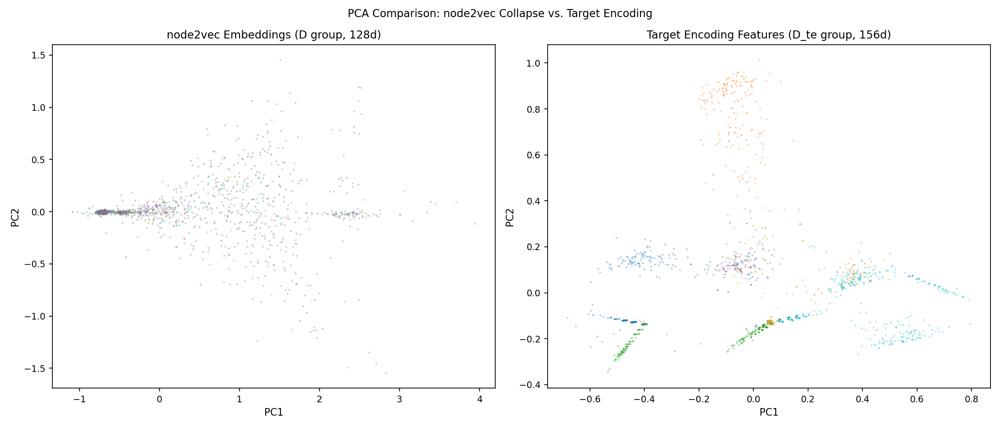
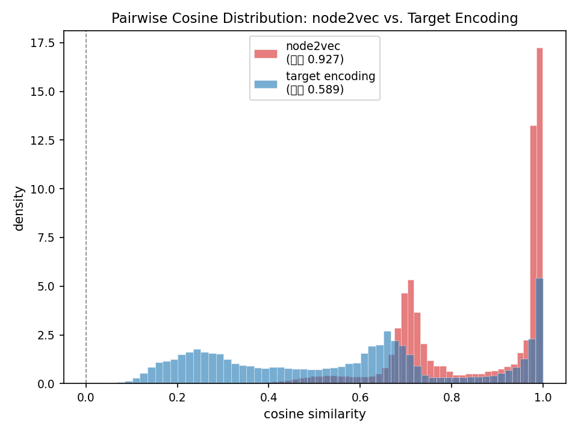
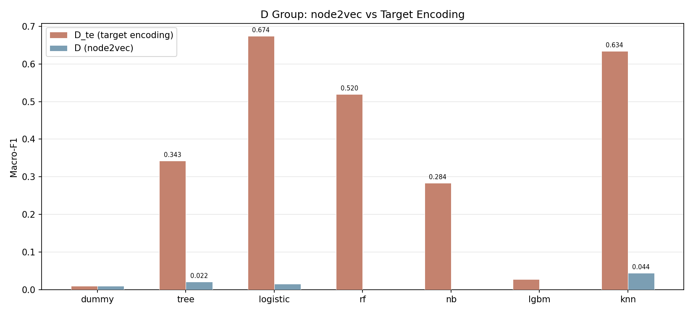
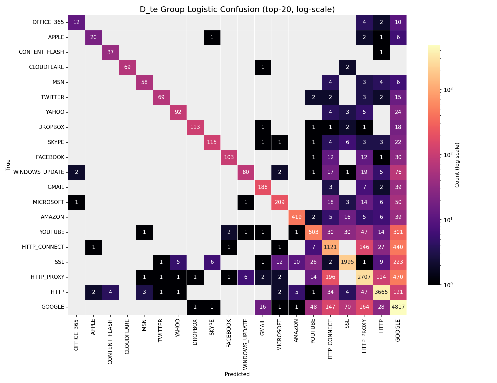

# 实验 4 基于 TCG 流因果图的流量分类

## 一、数据集介绍、下载与展示

### 1.1 数据集概况

实验数据与实验 3 相同，为 Unicauca IP 网络流量数据集，共约 357 万条网络流、78 种应用标签、91 个统计特征。本实验从流因果的视角重新建模同一份数据，重点刻画流与流之间的时序与逻辑关联，看这种关联能否为应用分类提供额外信号。

### 1.2 TCG 视角下的字段

TCG 建模除了用到原始统计特征，还需要每条流的主键、端点、协议与时间戳。具体包括 record_id 作为流主键，src_endpoint、dst_endpoint 表示通信两端，raw_protocol 表示协议，raw_timestamp_epoch 表示流开始时间。这些字段从 A 组特征表直接提取，供因果关系判定使用。


## 二、TCG 图建模方法

### 2.1 建模思路

TCG 全称 Traffic Causality Graph，即流因果图。与 HCG 的端点级抽象不同，TCG 把每条流本身作为节点，节点之间的因果关系作为有向边，边类型为 CAUSES。一条从流 A 指向流 B 的边，表示 A 在时间上先于 B，且两者满足某种因果关联规则。这种建模试图捕捉流之间的请求响应、转发代理、同源并发等时序模式。

### 2.2 四种因果关系

因果关系按规则分成四类，优先级从高到低依次判定。CR 表示协议相同且五元组方向相反，即源目的 IP 与端口完全互换，近似请求-响应关系。PR 表示上一条流的目的主机成为下一条流的源主机，近似转发或代理链。DHR 表示同一源 IP 但源端口不同，反映同一主机在不同端口上的活动。SHR 表示同一源 IP 且同一源端口，反映同一服务发起的多条流。

字段提取在 transform.py 的 classify_relation 函数中实现，按优先级依次判定两条流的关系类型：

```python
def classify_relation(left, right):
    # CR：协议相同且五元组方向相反，近似请求-响应
    if (left["protocol"] == right["protocol"]
        and left["src_ip"] == right["dst_ip"] and left["src_port"] == right["dst_port"]
        and left["dst_ip"] == right["src_ip"] and left["dst_port"] == right["src_port"]):
        return "CR"
    # PR：上一条流的目的主机成为下一条流的源主机，近似转发或代理
    if left["dst_ip"] == right["src_ip"]:
        return "PR"
    # DHR / SHR：同源 IP，按源端口是否变化区分
    if left["src_ip"] == right["src_ip"] and left["src_port"] != right["src_port"]:
        return "DHR"
    if left["src_ip"] == right["src_ip"] and left["src_port"] == right["src_port"]:
        return "SHR"
```

命中即返回对应关系类型，未命中返回空。边方向由时间戳决定，较早的流指向较晚的流；时间戳相同时按 record_id 字典序稳定定向，保证一对流只产生一条有向边。

### 2.3 关系同质性分析与关系选择

在决定保留哪些关系之前，对每种关系的标签同质性做了定量分析。同质性定义为按该关系相连的两条流标签相同的概率。分析显示 SHR 的同质性最高，达到 0.69，即同源同端口的流有近七成属于同一应用；PR 为 0.51；DHR 与全局基线接近。SHR 是分类信号最强、最值得保留的关系，CR 虽覆盖率低但语义精确，请求与响应必然同类，也一并保留。最终构建 light_shrcr 变体图，只保留 SHR 与 CR 两类关系。

### 2.4 时间戳精度问题与度数 cap

构建过程暴露出一个数据质量问题。原始时间戳精度严重退化，19 天的数据仅有 363 个唯一时间戳值。这导致按时间窗口配对时，热门代理端点在窗口内聚集大量流，两两配对产生边数急剧膨胀。单个端点的候选边可超过 700 亿，全图 SHR 候选高达 3 亿。

单纯的缩短时间窗口无济于事，因为时间戳粒度本身太粗。最终的解决办法是对每条流的 SHR 出边做度数限制。同一源端点桶内按时间、record_id 排序，每条流只向时间上最近的若干邻居连边，数量上限为 K：

```python
K_SHR = 15
for i in range(n):
    cnt = 0
    for j in range(i + 1, n):
        if group[j]["timestamp_epoch"] - group[i]["timestamp_epoch"] > SHR_WINDOW:
            break                          # 超出时间窗口停止
        write_edge(group[i], group[j], "SHR")
        cnt += 1
        if cnt >= K_SHR:                   # 度数 cap，避免热门端点爆炸
            break
```

同端点的最近若干条流已足以传播标签，端点纯度达 0.76，又能彻底控制规模。配 cap 后 SHR 实际边数从 3 亿候选降到 1111 万。

### 2.5 导入 TuGraph 与字段问题

导入 TuGraph 时遇到字段格式问题。TuGraph 的 lgraph_import 不接受空字符串字段，而规范化流程里 flow_id、timestamp、protocol_name 三个字段被设成了空串。原因是原始数据的 Flow.ID 会重复、时间戳的文本形式不影响关系判定、协议名缺失，这三处本可留空。解决办法是分别填入非空占位：flow_id 用 record_id，timestamp 由 epoch 转为 ISO 文本，protocol_name 用应用标签。同时整数统计字段统一转为 int64，避免写成带小数点的浮点数导致 INT64 列解析失败。

导入目录的权限也需处理。默认的导入挂载目录属主为 root，普通用户无法写入，改用用户可写的目录挂载；导入产生的临时 sst 文件属主也是 root，再次导入前需借助容器内 root 身份清理。

### 2.6 图规模

构造好的 flow 顶点表与 causes 边表导入 TuGraph，得到 tcg_light_shrcr 图，含 3577296 个 Flow 顶点、11572925 条 CAUSES 边，其中 SHR 边 11112797 条、CR 边 460128 条。导入耗时约 217 秒。

```bash
PYTHONPATH=src python scripts/build_tcg_flow_parquet_from_features.py
PYTHONPATH=src python scripts/build_tcg_shrcr_capped.py
PYTHONPATH=src python scripts/import_tugraph_native.py --graph-type tcg --graph tcg_light_shrcr
```

>

### 2.6 TCG 图及嵌入参数

| 参数 | 值 |
| --- | ---: |
| Flow 顶点 | 3,577,296 |
| CAUSES 边 | 11,572,925 (SHR 11,112,797 + CR 460,128) |
| 关系选择 | SHR + CR（同质性 0.69，cap K=15） |
| node2vec walk_length | 20 |
| node2vec num_walks | 5 |
| node2vec vector_size | 128 |
| 关系过滤 | CR,SHR |
| word2vec window / sg | 5 / skip-gram |
| TE 特征维度 | 156 (src 78 + dst 78, K-fold m=10) |
| 融合标准化 | StandardScaler (fit on train, with_mean=False) |

## 三、点嵌入与特征融合

### 3.1 node2vec 嵌入

点嵌入先用 node2vec 学习。在 tcg_light_shrcr 图上做随机游走，walk_length 取 20、num_walks 取 5，关系类型限定为 CR 与 SHR，再用 word2vec 训练 128 维 flow 嵌入。游走与训练的参数与 HCG 保持一致，便于横向对照。

### 3.2 嵌入坍塌的诊断

训练得到的嵌入效果很差，D 组纯嵌入的 knn 仅有 0.044。为查清原因，对嵌入做了定量诊断。随机两条流的 cosine 相似度中位数高达 0.94，理论上互不相关的向量相似度应接近 0，这一数值说明几乎所有 flow 的向量都指向相近方向。PCA 进一步显示，首主成分只解释 38.7% 的方差，前 10 个主成分累计才占 50%，个体差异虽然存在但分散且微弱。再看最近邻的标签一致性，以嵌入相似度找最近邻，邻居与查询流属于同一应用的比例为 0.374，几乎等于随机基线 0.268。

综合来看，嵌入呈现软坍塌形态：所有向量共享一个大的公共分量，个体差异部分不携带应用类别信息。node2vec 在 SHR 这种端点内小团图上游走，walk 局限在端点内部、不跨端点，word2vec 学到的共现模式高度相似，最终退化为无判别力的表示。

### 3.3 target encoding 验证

为确认问题出在 node2vec 而非 SHR 关系本身，改用 target encoding 直接利用端点信号。对 src_endpoint、dst_endpoint 分别做 K-fold target encoding：在训练集上统计每个端点的标签分布，用平滑后的 78 维概率向量作为该端点的特征，两端口拼接得 156 维。为防止标签泄漏，训练集内部按 5 折划分，每折用其余折的统计；验证、测试集则用全训练集的统计。

target encoding 仍属于 TCG 建模范畴，它直接利用 SHR、CR 关系的核心即端点身份，只是用监督标签统计替代了坍塌的无监督嵌入。验证结果是 D_te 组的 knn 达到 0.634，是 node2vec D 组 0.044 的 14 倍。这一对照证明 SHR、CR 的端点信号本身很强，瓶颈确实在 node2vec 嵌入方法，而非关系选择或图建模思路。

### 3.4 特征融合

特征融合沿用 A、B、C 框架。D 组为 TCG 嵌入，E 组把 A 原始特征与 D 拼接，F 组把 C 即 raw、HCG、TCG 三源融合。融合前对所有特征做 StandardScaler，按训练集 fit，消除原始统计特征的大数值尺度淹没嵌入的概率向量。

```bash
PYTHONPATH=src python scripts/run_tcg_node2vec_procedure_batch.py --graph tcg_light_shrcr \
  --walk-length 20 --num-walks 5 --relation-types CR,SHR
PYTHONPATH=src python scripts/train_tcg_word2vec_embeddings.py --vector-size 128
PYTHONPATH=src python scripts/target_encoding_full.py
```

>

>


## 四、分类器与评价指标

### 4.1 分类器选择

分类器配置与评价指标与实验 3 一致，并补充了 random_forest 与 naive_bayes，连同 lightgbm 共七种分类器、五种范式，覆盖基线、树、线性、集成、概率、距离，确保对比充分。

各分类器超参与实验3一致，汇总如下：

| 分类器 | 关键参数 |
| --- | --- |
| dummy | strategy=most_frequent |
| tree | max_depth=20, min_samples_leaf=100 |
| logistic | SGD(loss=log_loss), max_iter=100 |
| rf | n_estimators=50, max_depth=20 |
| nb | GaussianNB |
| lgbm | n_estimators=100, num_leaves=31, device=cpu |
| knn | k=5, weights=distance, batch_predict=5000 |

### 4.2 评价指标

用 Macro-F1、Weighted-F1、Accuracy 三项指标，在相同的 13 万预采样上比较。Macro-F1 对 78 类求平均，能反映少数类识别情况，是核心指标。

### 4.3 lightgbm 在预采样规模下的局限

lightgbm 在本实验表现偏弱，A 至 F 组的 Macro-F1 仅 0.022 到 0.089。原因是 13 万预采样下少数类样本严重不足，78 类里多数长尾类只剩几十条，lightgbm 这类提升树难以学出稳定判别。曾尝试加 class_weight 平衡少数类，反而因权重过大进一步拖垮整体，去掉后依然偏低，说明瓶颈在样本量而非权重配置。因此 lightgbm 结果参考价值有限，主要对比以 decision_tree、knn、random_forest 等稳定分类器为准。

下表是 D、E、F 三组（target encoding 版）在七种分类器上的 Macro-F1，最后一列对照 node2vec 版的 knn：

| Group | dummy | tree | logistic | rf | nb | lgbm | knn | n2v knn |
| --- | ---: | ---: | ---: | ---: | ---: | ---: | ---: | ---: |
| D_te (TE 156d) | 0.010 | 0.343 | 0.674 | 0.520 | 0.284 | 0.028 | 0.634 | 0.044 |
| E_te (raw+TE 247d) | 0.010 | 0.370 | 0.089 | 0.484 | 0.251 | 0.041 | 0.590 | 0.207 |
| F_te (raw+HCG+TE 505d) | 0.010 | 0.382 | 0.175 | 0.476 | 0.247 | 0.029 | 0.600 | 0.422 |

target encoding 三组的 knn 均超过 0.59，远高于 node2vec 版的 0.044、0.207、0.422。D_te 的 logistic 与 knn 分别达 0.674 与 0.634，是全部实验中的最优值，证明 SHR、CR 端点信号本身很强，node2vec 嵌入坍塌是方法瓶颈而非关系选择问题。lightgbm 同样受 13 万预采样少数类不足拖累，naive_bayes 受独立假设限制偏弱。

从嵌入方式维度看，target encoding 带来的提升是显著的。D_te 组直接取代 node2vec D 组后，knn 从 0.044 升至 0.634，logistic 从 0.015 升至 0.674，随机森林也达到 0.520。这意味着同样的 src_endpoint、dst_endpoint 端点信号，用监督标签统计替代无监督节点嵌入后，最差分类器的表现也远超 node2vec 最好分类器。node2vec 嵌入的坍塌问题在这里被彻底绕过，SHR 与 CR 关系的端点纯度被直接转化成特征，不需要图游走与词向量训练。

E_te 与 F_te 融合了原始统计与 TCG 特征后，knn 与随机森林仍有提升。E_te 的 knn 达 0.590，相较 A 组 raw 仅 0.201 是本质改善，说明 target encoding 为原始特征补充了端点级的标签信息。F_te 的 knn 达 0.600、随机森林达 0.476，与 C 组 HCG 融合版对比，TCG target encoding 进一步进一步提升了效果。logistic 在 E_te 与 F_te 上仍偏低，原因与 HCG 侧一致，原始统计特征的大尺度让 SGD 难以收敛，而非 TE 特征无效——全量数据下可增加迭代次数或改用其他线性模型来改善。

从分类器维度看，target encoding 场景下 logistic 与 knn 在 D_te 组表现最突出。TE 特征天然概率分布、维度一致、中心化，恰好是 logistic 回归最擅长的输入格式，因此 D_te logistic 0.674 成为全局最优。knn 在标准化后的全部六组中均超过 0.59，因为 StandardScaler 消除了 raw、HCG、TE 之间的尺度差异，距离计算不再被大数值特征淹没。随机森林继续发挥稳健优势，在 D_te 0.520、E_te 0.484、F_te 0.476 的稳定区间内，是融合场景的可靠选项。

HCG 与 TCG target encoding 的对比也值得注意。C 组 knn 0.376 对比 F_te knn 0.600，差距达 0.224。F_te 在 C 的基础上仅补充了 156 维 TE 特征，就把 knn 显著提升，说明 TCG 端点信号包含 HCG 端点嵌入没有捕获的信息。HCG 嵌入是端点结构的无监督表示，TE 是端点类别的监督统计，两种信息互补。


>

