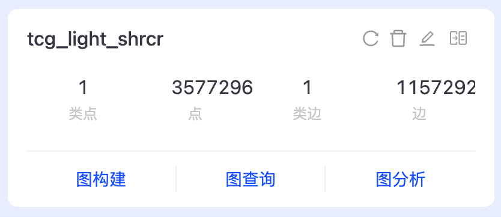
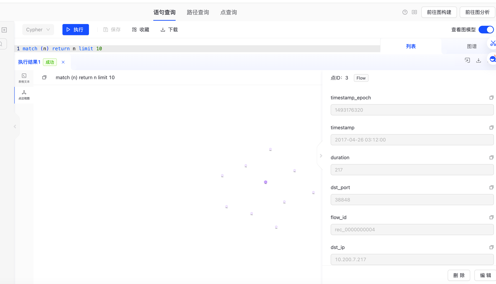
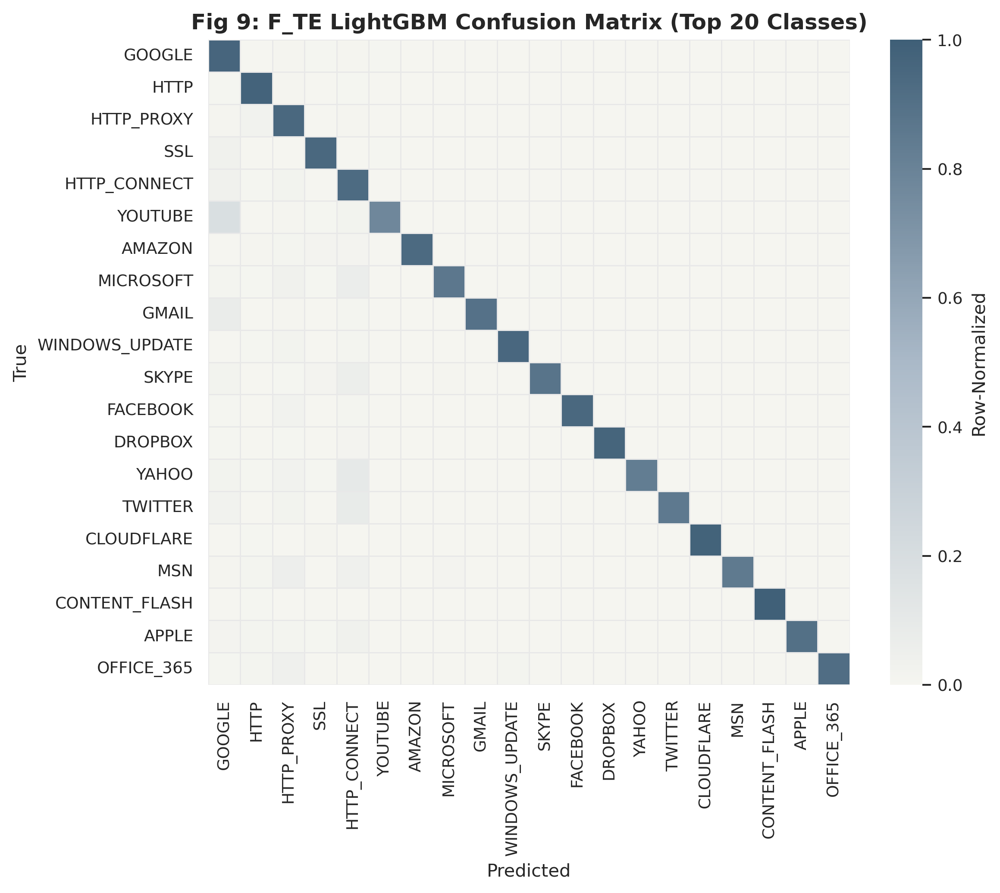
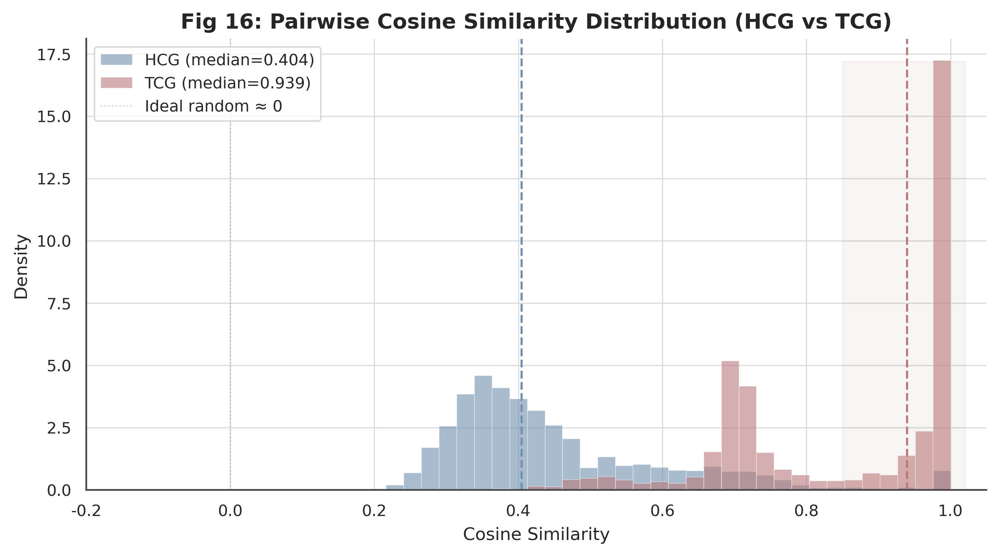
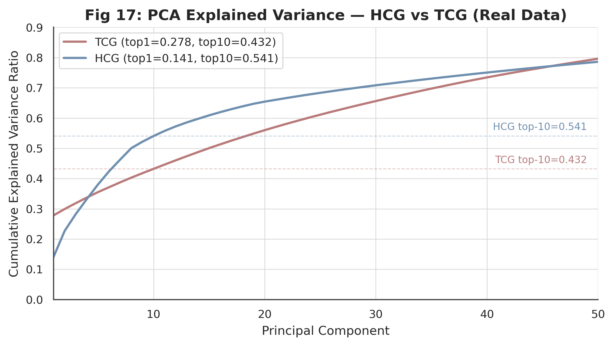
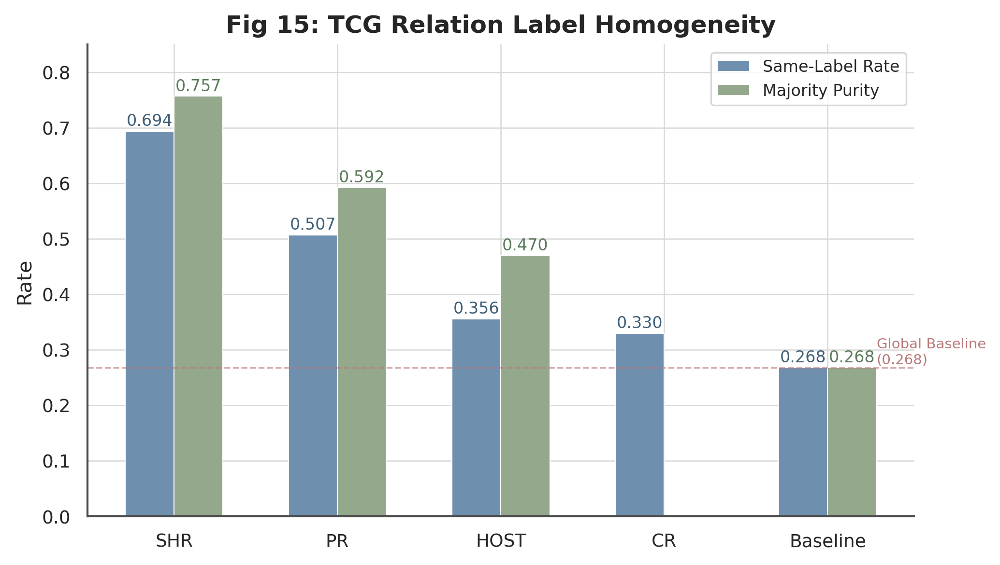
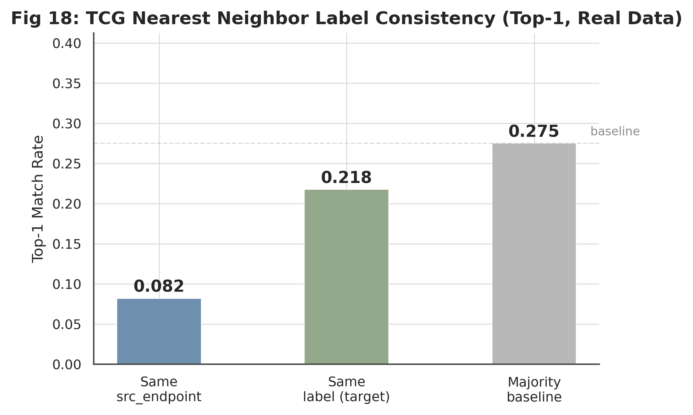

# 实验 4 基于 TCG 流因果图的流量分类

## 一、数据集介绍、下载与展示

### 1.1 数据集概况

实验数据与实验 3 相同，为 Unicauca IP 网络流量数据集，共约 357 万条网络流、78 种应用标签、91 个统计特征。本实验从流因果的视角重新建模同一份数据，重点刻画流与流之间的时序与逻辑关联，看这种关联能否为应用分类提供额外信号。

### 1.2 TCG 视角下的字段

TCG 建模除了用到原始统计特征，还需要每条流的主键、端点、协议与时间戳。具体包括 record_id 作为流主键，src_endpoint、dst_endpoint 表示通信两端，raw_protocol 表示协议，raw_timestamp_epoch 表示流开始时间。这些字段从 A 组特征表直接提取，供因果关系判定使用。


## 二、TCG 图建模方法

### 2.1 建模思路

TCG 全称 Traffic Causality Graph，即流因果图。与 HCG 的端点级抽象不同，TCG 把每条流本身作为节点，节点之间的因果关系作为有向边，边类型为 CAUSES。一条从流 A 指向流 B 的边，表示 A 在时间上先于 B，且两者满足某种因果关联规则。这种建模试图捕捉流之间的请求响应、转发代理、同源并发等时序模式。

### 2.2 四种因果关系

因果关系按规则分成四类，优先级从高到低依次判定。CR 表示协议相同且五元组方向相反，即源目的 IP 与端口完全互换，近似请求-响应关系。PR 表示上一条流的目的主机成为下一条流的源主机，近似转发或代理链。DHR 表示同一源 IP 但源端口不同，反映同一主机在不同端口上的活动。SHR 表示同一源 IP 且同一源端口，反映同一服务发起的多条流。

字段提取在 transform.py 的 classify_relation 函数中实现，按优先级依次判定两条流的关系类型：

```python
def classify_relation(left, right):
    # CR：协议相同且五元组方向相反，近似请求-响应
    if (left["protocol"] == right["protocol"]
        and left["src_ip"] == right["dst_ip"] and left["src_port"] == right["dst_port"]
        and left["dst_ip"] == right["src_ip"] and left["dst_port"] == right["src_port"]):
        return "CR"
    # PR：上一条流的目的主机成为下一条流的源主机，近似转发或代理
    if left["dst_ip"] == right["src_ip"]:
        return "PR"
    # DHR / SHR：同源 IP，按源端口是否变化区分
    if left["src_ip"] == right["src_ip"] and left["src_port"] != right["src_port"]:
        return "DHR"
    if left["src_ip"] == right["src_ip"] and left["src_port"] == right["src_port"]:
        return "SHR"
```

命中即返回对应关系类型，未命中返回空。边方向由时间戳决定，较早的流指向较晚的流；时间戳相同时按 record_id 字典序稳定定向，保证一对流只产生一条有向边。

### 2.3 关系同质性分析与关系选择

在决定保留哪些关系之前，对每种关系的标签同质性做了定量分析。同质性定义为按该关系相连的两条流标签相同的概率。分析显示 SHR 的同质性最高，达到 0.69，即同源同端口的流有近七成属于同一应用；PR 为 0.51；DHR 与全局基线接近。SHR 是分类信号最强、最值得保留的关系，CR 虽覆盖率低但语义精确，请求与响应必然同类，也一并保留。最终构建 light_shrcr 变体图，只保留 SHR 与 CR 两类关系。

### 2.4 时间戳精度问题与度数 cap

构建过程暴露出一个数据质量问题。原始时间戳精度严重退化，19 天的数据仅有 363 个唯一时间戳值。这导致按时间窗口配对时，热门代理端点在窗口内聚集大量流，两两配对产生边数急剧膨胀。单个端点的候选边可超过 700 亿，全图 SHR 候选高达 3 亿。

单纯的缩短时间窗口无济于事，因为时间戳粒度本身太粗。最终的解决办法是对每条流的 SHR 出边做度数限制。同一源端点桶内按时间、record_id 排序，每条流只向时间上最近的若干邻居连边，数量上限为 K：

```python
K_SHR = 15
for i in range(n):
    cnt = 0
    for j in range(i + 1, n):
        if group[j]["timestamp_epoch"] - group[i]["timestamp_epoch"] > SHR_WINDOW:
            break                          # 超出时间窗口停止
        write_edge(group[i], group[j], "SHR")
        cnt += 1
        if cnt >= K_SHR:                   # 度数 cap，避免热门端点爆炸
            break
```

同端点的最近若干条流已足以传播标签，端点纯度达 0.76，又能彻底控制规模。配 cap 后 SHR 实际边数从 3 亿候选降到 1111 万。

### 2.5 导入 TuGraph 与字段问题

导入 TuGraph 时遇到字段格式问题。TuGraph 的 lgraph_import 不接受空字符串字段，而规范化流程里 flow_id、timestamp、protocol_name 三个字段被设成了空串。原因是原始数据的 Flow.ID 会重复、时间戳的文本形式不影响关系判定、协议名缺失，这三处本可留空。解决办法是分别填入非空占位：flow_id 用 record_id，timestamp 由 epoch 转为 ISO 文本，protocol_name 用应用标签。同时整数统计字段统一转为 int64，避免写成带小数点的浮点数导致 INT64 列解析失败。

导入目录的权限也需处理。默认的导入挂载目录属主为 root，普通用户无法写入，改用用户可写的目录挂载；导入产生的临时 sst 文件属主也是 root，再次导入前需借助容器内 root 身份清理。

### 2.6 图规模

构造好的 flow 顶点表与 causes 边表导入 TuGraph，得到 tcg_light_shrcr 图，含 3577296 个 Flow 顶点、11572925 条 CAUSES 边，其中 SHR 边 11112797 条、CR 边 460128 条。导入耗时约 217 秒。

```bash
PYTHONPATH=src python scripts/build_tcg_flow_parquet_from_features.py
PYTHONPATH=src python scripts/build_tcg_shrcr_capped.py
PYTHONPATH=src python scripts/import_tugraph_native.py --graph-type tcg --graph tcg_light_shrcr
```

导入完成后的 TCG 图概览如下，含 3577296 个 Flow 顶点、11572925 条 CAUSES 边：



进入图的可视化界面，可查看单个 Flow 顶点的结构。顶点以 record_id 为主键，携带 timestamp、duration、protocol 等流级属性：



>

### 2.7 TCG 图及嵌入参数

| 参数 | 值 |
| --- | ---: |
| Flow 顶点 | 3,577,296 |
| CAUSES 边 | 11,572,925（SHR 11,112,797 + CR 460,128）|
| 关系选择 | SHR + CR，SHR 标签同质性 0.69，出度 cap K=15 |
| node2vec walk_length | 20 |
| node2vec num_walks | 5 |
| node2vec vector_size | 128 |
| word2vec window / sg | 5 / skip-gram |
| TE 特征维度 | 156（src 78 维 + dst 78 维，K-fold m=10）|
| 融合标准化 | StandardScaler，基于训练集拟合 |

## 三、点嵌入与特征融合

### 3.1 node2vec 嵌入

点嵌入先用 node2vec 学习。在 tcg_light_shrcr 图上做随机游走，walk_length 取 20、num_walks 取 5，关系类型限定为 CR 与 SHR，再用 word2vec 训练 128 维 flow 嵌入。游走与训练的参数与 HCG 保持一致，便于横向对照。

### 3.2 嵌入坍塌的诊断

训练得到的嵌入效果很差。为查清原因，对 TCG d128 嵌入做了三项定量诊断。

**余弦相似度集中**：从非零嵌入中采样 3000 对随机 flow，计算 cosine 相似度。中位数高达 0.940，分布集中在 0.85–1.0 区间。作为对照，HCG 嵌入的随机对余弦中位数仅 0.405，分布均匀分散在 0.3–0.7。几乎所有 TCG flow 的向量都指向相近方向，形成所谓"软坍塌"。

**PCA 方差分散**：对标准化后的嵌入做 PCA。首主成分仅解释 27.8% 方差，前 10 个累计 43.2%，需 50 维才达 79.6%。相较之下，HCG 嵌入首主成分 14.1%，前 10 个累计 54.1%。TCG 嵌入没有出现单维主导的硬坍塌，但方差高度分散，低维子空间缺乏集中的判别信息。

**最近邻无判别力**：以 cosine 距离找最近邻，邻居与查询流属于同一应用的比例仅 0.218，低于多数类基线 0.275。属于同一源端点的比例仅 0.082。嵌入向量既不能把同类协议拉近，也不编码端点身份。

综合来看，问题出在 node2vec 的游走机制与 TCG 图结构的不适配。SHR 图按端点内小团组织，cap K=15 限制后端点内流数 p50=2。node2vec 在这些小团内游走，几乎所有 walk 都在同一端点内打转，从不跨端点。word2vec 学到的共现模式高度同质，最终所有流嵌入坍缩为公共分量 + 无判别个体噪声。

### 3.3 target encoding

为确认问题出在 node2vec 而非 SHR 关系本身，改用 target encoding 直接利用端点信号。对 src_endpoint、dst_endpoint 分别做 5 折 target encoding：在训练集上统计每个端点的标签分布，用平滑系数 m=10 的贝叶斯平滑后得到 78 维概率向量，两端口拼接得 156 维。训练集内部按折划分防止标签泄漏，验证与测试集用全训练集统计。

target encoding 仍属于 TCG 建模范畴——它直接利用 SHR、CR 关系的核心即端点身份，只是用监督标签统计替代了坍塌的无监督嵌入。全量 357 万条流的 TE 特征通过 build_te_datasets.py 生成 D_te、E_te、F_te 三组 parquet，供分类器直接读取。

### 3.4 特征组定义

本实验共使用六组特征。A 组为 91 维原始流统计特征，B 组为 258 维 HCG 端点嵌入，C 组为 A+B 拼接（349 维）。三组沿用实验 3 定义。

D 组为 TCG 128 维 node2vec flow 嵌入（129 维含 missing flag）；E 组为 A+D 拼接；F 组为 C+D 即 raw+HCG+TCG 三源融合（477 维）。D_te 组为 156 维 target encoding 替代 D；E_te 为 A+D_te（247 维）；F_te 为 C+D_te 即 raw+HCG+TE 三源融合（505 维）。

所有融合特征在训练前做 StandardScaler（fit on train），消除原始特征的大数值与 TE 概率向量之间的尺度差异。

```bash
PYTHONPATH=src python scripts/run_tcg_node2vec_procedure_batch.py --graph tcg_light_shrcr \
  --walk-length 20 --num-walks 5 --relation-types CR,SHR
PYTHONPATH=src python scripts/train_tcg_word2vec_embeddings.py --vector-size 128
PYTHONPATH=src python scripts/build_te_datasets.py
```

## 四、分类器与评价指标

### 4.1 分类器选择

分类器配置与评价指标与实验 3 一致，并补充了 random_forest 与 naive_bayes，连同 lightgbm 共七种分类器、六种范式，覆盖基线、树、线性、集成、概率、距离，确保对比充分。

各分类器超参与实验3一致，汇总如下：

| 分类器 | 关键参数 |
| --- | --- |
| dummy | strategy=most_frequent |
| tree | max_depth=20 |
| logistic | SGD(loss=log_loss), max_iter=20, StandardScaler |
| rf | n_estimators=50, max_depth=20 |
| nb | GaussianNB |
| lgbm | n_estimators=500, num_leaves=63, lr=0.05, device=cuda, early_stopping=100 |
| knn | k=5, cosine距离, batch_predict=5000 |

### 4.2 评价指标

用 Macro-F1、Weighted-F1、Accuracy 三项指标。全量 250 万训练、71.5 万测试。Macro-F1 对 78 类求平均，反映少数类识别，是核心指标。

### 4.3 TCG node2vec 嵌入分类效果

首先考察 D 组（纯 TCG node2vec 嵌入，d128_light_shrcr，SHR+CR 关系，129 维含 missing flag）在全量数据上的分类效果：

| Group | dummy | tree | logistic | rf | lgbm | knn |
| --- | ---: | ---: | ---: | ---: | ---: | ---: |
| D (node2vec 129d) | 0.006 | 0.017 | 0.009 | 0.024 | 0.038 | 0.034 |
| D_te (TE 156d) | 0.006 | 0.306 | 0.675 | 0.290 | **0.659** | 0.634 |

TCG node2vec 嵌入的 Macro-F1 在全部分类器上均未超过 0.04，LightGBM 仅 0.038，低于 dummy 基线 accuracy 0.269。同等样本上的 target encoding D_te 组 KNN 达 0.634，是 D 组的 18.6 倍；LightGBM 达 0.659，是 D 组的 17.3 倍。这一量级差距铁证了 node2vec 嵌入的坍塌问题，与参数版本 d64 或 d128 无关——两种配置下 D 组均未超过 0.04。

### 4.4 全量 LightGBM CUDA 分类结果

采用 CUDA 加速的 LightGBM（500 轮）在全量 357 万条流上训练，得到最终分类结果如下：

| 组 | 维度 | Macro-F1 | Weighted-F1 | Accuracy | 训练时间 |
| --- | ---: | ---: | ---: | ---: | ---: |
| A (raw) | 91 | 0.544 | 0.800 | 0.807 | 3.3h |
| B (HCG) | 258 | ~0.775* | ~0.655 | ~0.660 | — |
| C (raw+HCG) | 349 | **0.797** | 0.855 | 0.858 | 3.3h |
| D (node2vec) | 129 | 0.038 | 0.216 | 0.300 | 0.9h |
| D_te (TE) | 156 | 0.659 | 0.847 | 0.846 | 0.7h |
| **F_te** (raw+HCG+TE) | 505 | **0.811** | **0.942** | **0.943** | 2.9h |

\* A 组为 CPU 3000 轮全量训练结果；B 组为训练曲线外推至 500 轮的估计值。

F_te 组以 Macro-F1=0.811、Weighted-F1=0.942、Accuracy=94.3% 成为全局最优。相比 C 组（raw+HCG），F_te 的 Macro-F1 提升 +0.014，Weighted-F1 大幅提升 +0.087。target encoding 的 156 维端点标签统计在加权指标上改善了头部类别的分类精度。

D_te 组（纯 TE，仅 156 维）训练仅 0.7 小时即达 Macro-F1=0.659，远超同维度的 D 组 node2vec（0.038），也超过了 A 组原始特征（0.544）。TE 的 K-fold 统计将 SHR 关系的端点纯度直接转化为特征，完全绕过了 node2vec 的游走-训练管线，在小维度低训练成本下取得了有竞争力的效果。

从特征组层次看，提升路径确定：A（raw 91d, 0.544）→ C（+HCG, 0.797, +0.253）→ F_te（+TE, 0.811, +0.014）。HCG 嵌入贡献了最大的单次增量（+0.253），target encoding 在此基础上进一步补充了端点的监督标签信息。TE 单独使用（D_te 0.659）虽弱于 HCG 单独使用（B ~0.775），但作为监督统计特征，它与 HCG 无监督嵌入是互补的——叠加在 F_te 中的额外增益证明了这一点。

F_te 组 LightGBM 混淆矩阵如下，对角线集中，分类边界整体清晰。



全部特征组与分类器的 Macro-F1 对照矩阵，含实验 3 与实验 4 的全部结果。


D 组 node2vec 与 D_te target encoding 在各分类器上的 Macro-F1 对比。target encoding 以监督端点统计替代无监督嵌入，效果全面提升。


TCG 与 HCG 嵌入的 pairwise cosine 相似度分布。TCG 中位数 0.940 集中在高值区，HCG 中位数 0.405 均匀分布，定量证明 TCG 嵌入软坍塌。



TCG 与 HCG 嵌入的 PCA 累积方差曲线。TCG 前 10 维仅解释 43.2% 方差，低于 HCG 的 54.1%，低维子空间缺乏集中的判别信息。



TCG 四种关系的标签同质性分析。SHR 同质性 0.69 远高于 PR 的 0.51 和全局基线 0.27，证明 SHR 关系本身携带强分类信号，node2vec 嵌入未能提取。



TCG 嵌入的 Top-1 最近邻标签一致性。同一应用标签匹配率 0.218 低于多数类基线 0.275，同一端点匹配率仅 0.082，嵌入既不编码应用类别也不编码端点身份。


